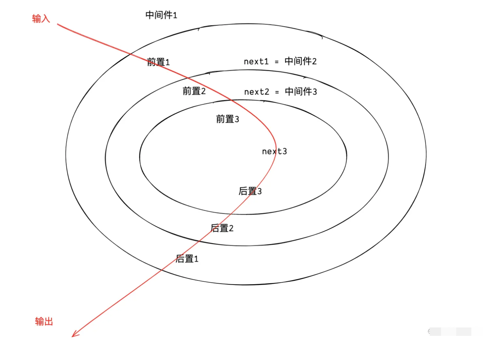

## 实现 redux


#### redux 的核心 createStore


```js
createStore(reducer, preloadedState, enhancer)
```

createStore 接收三个参数：

- reducer：根据 action 类型对 store 状态进行派发更新
- preloadedState：预存储的 store 状态
- enhancer：对 store 的功能进行增强，比如中间件


当调用 createStore 的时候，会返回一个对象，这个对象有三个参数：

- getState：获取 store 状态
- dispatch：派发 action
- subscribe：订阅 store 变更


#### 实现 createStore

实现：

- reducer：根据 action 类型对 store 状态进行派发更新
- preloadedState：预存储的 store 状态

返回值：

- getState：获取 store 状态
- dispatch：派发 action
- subscribe：订阅 store 变更

```js
function createStore(reducer, preloadedState) {
  let currentState = preloadedState
  const listeners = []

  // 获取 state
  // store.getState()
  function getState() {
    return currentState
  }

  // 触发 action
  // const action = { type: 'xxx' }
  // store.dispatch(action)
  function dispatch(action) {
    currentState = reducer(currentState, action)

    // 当状态发生改变时，调用所有的订阅函数
    listeners.forEach(listener => listener())
  }

  // 订阅 state 的变化
  // store.subscribe(() => {})
  function subscribe(listener) {
    listeners.push(listener)
  }

  return {
    getState,
    dispatch,
    subscribe
  }
}

module.exports = {
  createStore
}
```


#### 约束参数类型

- 约束 reducer 必须是一个函数
- 约束 dispatch 的参数
  - 约束 action 必须是对象
  - 约束 action 必须要有 type 属性
- 约束订阅 subscribe 的参数 listener 必须是函数

```js
// 判断是否是对象类型
function isPlainObject(obj) {
  // 排除掉 null 和基本数据类型
  if (typeof obj !== 'object' || obj === null) return false

  // 区分数组和对象
  let proto = obj
  while (Object.getPrototypeOf(proto) !== null) {
    proto = Object.getPrototypeOf(proto)
  }
  return Object.getPrototypeOf(obj) === proto
}


function createStore(reducer, preloadedState) {
  // 约束 reducer 参数类型
  if (typeof reducer !== 'function') throw new Error('reducer 必须是一个函数')

  let currentState = preloadedState
  const listeners = []

  // 获取 state
  // store.getState()
  function getState() {
    return currentState
  }

  // 触发 action
  // const action = { type: 'xxx' }
  // store.dispatch(action)
  function dispatch(action) {
    // 约束 action 必须是一个对象
    if(!isPlainObject(action)) throw new Error('action 必须是一个对象')
    // action 必须有 type 属性
    if(typeof action.type === 'undefined') throw new Error('action 必须有 type 属性')

    currentState = reducer(currentState, action)

    // 当状态发生改变时，调用所有的订阅函数
    listeners.forEach(listener => listener())
  }

  // 订阅 state 的变化
  // store.subscribe(() => {})
  function subscribe(listener) {
    if (typeof listener !== 'function') throw new Error('listener 必须是一个函数')
    listeners.push(listener)
  }

  return {
    getState,
    dispatch,
    subscribe
  }
}

module.exports = {
  createStore
}
```


#### 实现 createStore 的 enhancer

通过 enhancer 可以让 createStore 的调用者对返回的对象进行增强


**enhancer 的使用：**

```js
function enhancer(createStore) {
  return function (reducer, preloadedState) {
    const store = createStore(reducer, preloadedState)

    const dispatch = store.dispatch

    function _dispatch(action) {
      // 如果 action 是一个函数，那么是异步代码
      if (typeof action === 'function') {
        return action(dispatch)
      }

      dispatch(action)
    }

    return {
      ...store,
      dispatch: _dispatch,
    }
  }
}

const store = createStore(reducer, initState, enhancer)
```

可以看到，enhancer 作为 createStore 的第三个参数被传入，最后通过执行返回  store，这个 store 的 dispatch 增强过的


**实现 enhancer：**

```js
function createStore(reducer, preloadedState, enhancer) {
  // 约束 reducer 参数类型
  if (typeof reducer !== 'function') throw new Error('reducer 必须是一个函数')

  // 判断 enhancer 有没有传，并且是不是一个函数
  if (typeof enhancer !== 'undefined') {
    if (typeof enhancer !== 'function') {
      throw new Error('enhancer 必须是一个函数')
    }

    // 调用 enhancer 函数, 并且把 createStore 作为参数传递给 enhancer
    // 返回一个新的经过增强的 store，后面的逻辑不需要再执行
    return enhancer(createStore)(reducer, preloadedState)
  }

  let currentState = preloadedState
  const listeners = []

  // 获取 state
  // store.getState()
  function getState() {
    return currentState
  }

  // 触发 action
  // const action = { type: 'xxx' }
  // store.dispatch(action)
  function dispatch(action) {
    // 约束 action 必须是一个对象
    if(!isPlainObject(action)) throw new Error('action 必须是一个对象')
    // action 必须有 type 属性
    if(typeof action.type === 'undefined') throw new Error('action 必须有 type 属性')

    currentState = reducer(currentState, action)

    // 当状态发生改变时，调用所有的订阅函数
    listeners.forEach(listener => listener())
  }

  // 订阅 state 的变化
  // store.subscribe(() => {})
  function subscribe(listener) {
    if (typeof listener !== 'function') throw new Error('listener 必须是一个函数')
    listeners.push(listener)
  }

  return {
    getState,
    dispatch,
    subscribe
  }
}

module.exports = {
  createStore
}
```

所以这里：

- 判断是否有 anhancer 函数，如果有，就执行 enhancer 返回一个新的经过增强的 store，后面的逻辑不需要再执行


> 测试文件：enhancer.test.js

```js
const { createStore } = require('../cRedux.js')

const initState = {
  name: 'zhangsan',
}

const reducer = (state = initState, action) => {
  switch (action.type) {
    case 'change_name':
      return {
        ...state,
        name: action.payload,
      }
    default:
      return state
  }
}

function enhancer(createStore) {
  return function (reducer, preloadedState) {
    const store = createStore(reducer, preloadedState)

    const dispatch = store.dispatch

    function _dispatch(action) {
      // 如果 action 是一个函数，那么是异步代码
      if (typeof action === 'function') {
        return action(dispatch)
      }

      dispatch(action)
    }

    return {
      ...store,
      dispatch: _dispatch,
    }
  }
}

const store = createStore(reducer, initState, enhancer)

store.subscribe(() => {
  console.log(store.getState());
})

// 经过 enhancer 增强之后的 dispatch 可以支持异步代码
const action = (dispatch) => {
  setTimeout(() => {
    dispatch({
      type: 'change_name',
      payload: 'lisi',
    })
  }, 1000)
}

store.dispatch(action)
```


#### 实现 applyMiddleware

当触发 action 的时候，在正常 redux 流程中，会被 reducer 接收到，但是当加入了中间件之后，action 会先被中间件接收到，当一个个中间件执行完之后，这个 action 才会被传递给 reducer。也就是说，中间件就是允许在 action 发出之后，被 reducer 接受之前做一些事情。本质上，redux 中间件就是对 dispatch 这个方法进行加强。

在 redux 中，提供了一个 api：applyMiddleware，这个 api 最核心的功能就是对 dispatch 进行增强。通过增强 dispatch，使得中间件按照传入顺序依次执行 `applyMiddleware(middleware1, middleware2, middleware3)`


**applymiddleware 的使用：**

```js
const enhancer = applyMiddleware(logger, thunk)

const store = createStore(reducer, initState, enhancer)
```

可以看出，applyMiddleware 的作用就是结合中间件，生成一个 enhancer 函数


applyMiddleware 的执行顺序，是洋葱模型



**洋葱模型**

- **进入阶段（Before `next`）**：从外到内（`middleware1` → `middleware2` → `dispatch`）。
- **返回阶段（After `next`）**：从内到外（`dispatch` → `middleware2` → `middleware1`）。


**中间件的定义：**

> logger.js

```js
function logger(store) {
    // next 实际上就是下一个中间件函数，当是最后一个中间件的时候，next 就是 dispatch
    return function(next) {
        return function(action) {
            console.log('logger')
            next(action)
        };
    };
}

module.exports = logger;
```


> Thunk.js

```js
function thunk(store) {
  // next 实际上就是下一个中间件函数，当是最后一个中间件的时候，next 就是 dispatch
  return function(next) {
      return function(action) {
          console.log('thunk')
          next(action)
      };
  };
}

module.exports = thunk;
```


**实现 applyMiddleware**

```js
applyMiddleware(logger, thunk)

执行循序：logger --> thunk --> dispatch

根据上面，中间件实际上是最里的函数，即：
return function(action) {
  console.log('thunk')
  next(action)
};
```


```js
function compose(...funcs) {
  return function (dispatch) {
    // 逆序遍历，这里[logger, thunk] 两个中间件，最后返回的 dispatch 就是 logger 中间件，logger 中间件中执行的 next 就是 thunk 中间件，这就符合洋葱模型了
    for (let i = funcs.length - 1; i >= 0; i--) {
      dispatch = funcs[i](dispatch)
    }
    return dispatch
  }
}

function applyMiddleware(...middlewares) {
  // 这个函数就相当于 enhancer 了
  return function(createStore) {
    return function(reducer, preloadedState) {
      const store = createStore(reducer, preloadedState)

      // 传给中间件的 store 阉割版的 store
      const middlewareAPI = {
        getState: store.getState,
        dispatch: store.dispatch,
      }

      const chain = middlewares.map(middleware => middleware(middlewareAPI))

      const dispatch = compose(...chain)(store.dispatch)

      return {
        ...store,
        dispatch,
      }
    }
  }
}
```

这里最核心的就是，要区分 next 是什么：

- 对于前面的中间件，next 表示下一个中间件
- 对于最后一个中间件，next 表示 dispatch


#### 实现 bindActionCreators

`bindActionCreators` 是 Redux 提供的一个工具函数，用于将 **Action Creators**（创建 Action 的函数）自动绑定到 `dispatch` 方法上，避免手动调用 `dispatch`。它的主要作用是简化组件中 Action 的分发逻辑，尤其在需要将多个 Action Creators 传递给子组件时非常有用。


**bindActionCreators 的使用对比：**

```jsx
// 未使用 bindActionCreators：每次调用 Action 都需要手动写 dispatch
import { increment, decrement } from './actions';
import { useDispatch } from 'react-redux';

function Counter() {
  const dispatch = useDispatch();
  return (
    <div>
      <button onClick={() => dispatch(increment())}>+</button>
      <button onClick={() => dispatch(decrement())}>-</button>
    </div>
  );
}


// 使用了 bindActionCreators：直接调用 actions.increment()，无需显式写 dispatch
import { bindActionCreators } from 'redux';
import { increment, decrement } from './actions';
import { useDispatch } from 'react-redux';

function Counter() {
  const dispatch = useDispatch();
  const actions = bindActionCreators({ increment, decrement }, dispatch);
  // actions.increment() 等价于 dispatch(increment())

  return (
    <div>
      <button onClick={actions.increment}>+</button>
      <button onClick={actions.decrement}>-</button>
    </div>
  );
}
```


**实现bindActionCreators：**

```js
function bindActionCreators(creators, dispatch) {
  const boundCreators = {}
  for (const key in creators) {
    boundCreators[key] = function(...args) {
      dispatch(creators[key](...args))
    }
  }

  return boundCreators
}
```

