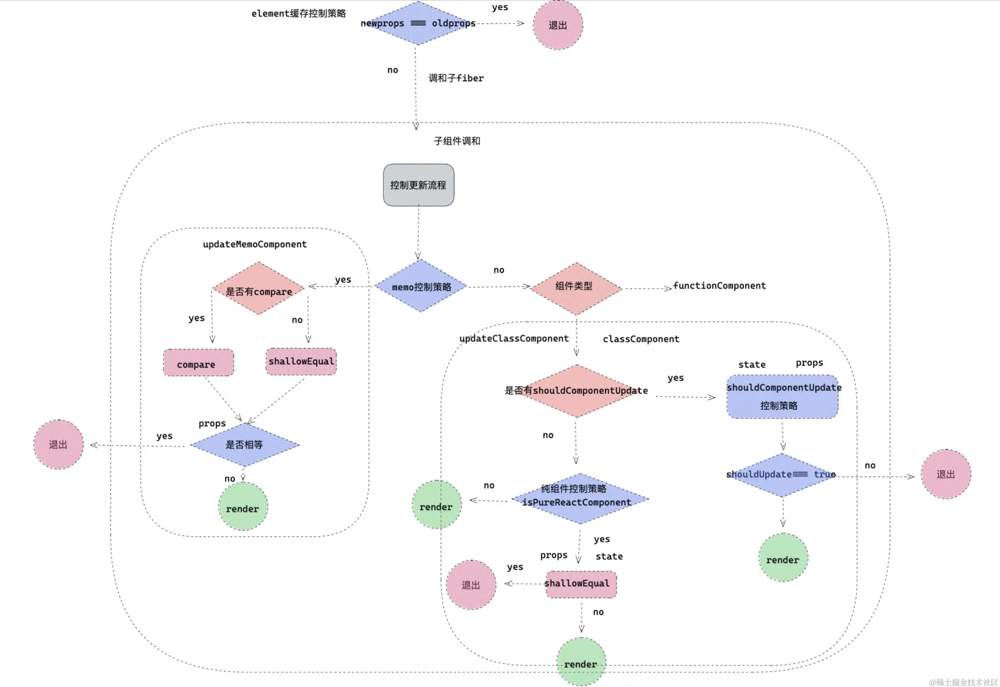
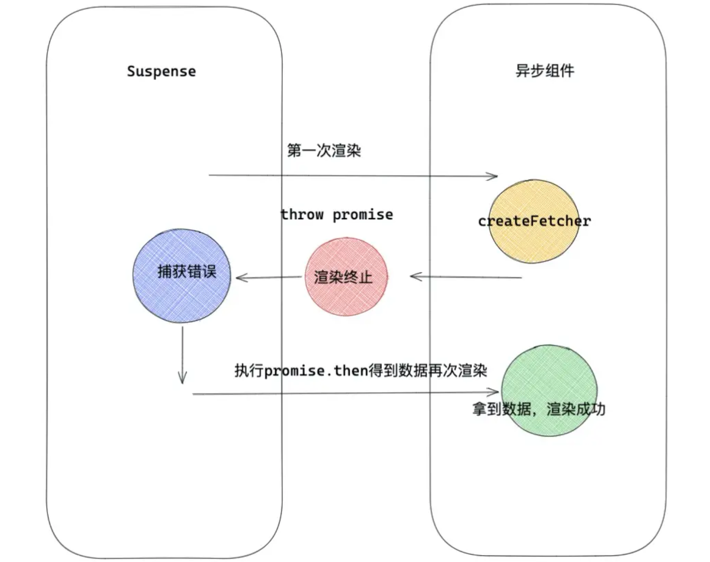
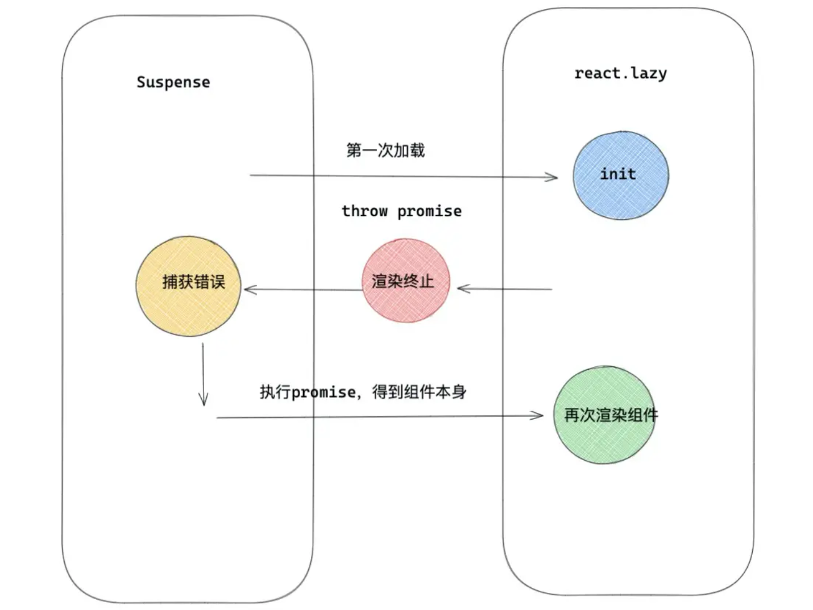
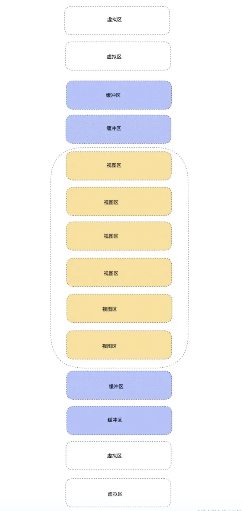

# react 相关的优化


常见的一些优化手段：

- 复用组件：遵循 DIFF 的同层级、type相同、key 相同的可复用原则
- 避免不必要的渲染：shouldComponentUpdate、PureComponent、memo
- 缓存/较少运算：useMemo、useCallback


## 渲染控制

从调度更新任务到调和 fiber，再到浏览器渲染真实 DOM，每一个环节都是渲染的一部分，至于对于每个环节的性能优化，React 在底层已经处理了大部分优化细节，包括设立任务优先级、异步调度、diff算法、时间分片都是 React 为了提高性能，提升用户体验采取的手段。开发者只需要告诉 React 哪些组件需要更新，哪些组件不需要更新。React 提供了 PureComponent，shouldComponentUpdated，memo 等优化手段。


优秀文章

- https://juejin.cn/post/7269232113793974283


### render 阶段作用

**render的作用**是根据一次更新中产生的新状态值，通过 React.createElement ，替换成新的状态，得到新的 React element 对象，新的 element 对象上，保存了最新状态值。 createElement 会产生一个全新的props。

> 注意：render 阶段没有真实渲染了 DOM，真实 DOM 是在 commit 阶段挂载的


### react 控制 render 的几种方式

React 对 render 的控制，究其本质，主要有以下两种方式：

- 第一种就是从父组件直接隔断子组件的渲染，经典的就是 memo，缓存 element 对象。
- 第二种：组件从自身来控制是否 render ，比如：PureComponent ，shouldComponentUpdate。


#### 第一种：缓存 React.element 对象

对 React.element 对象的缓存。这是一种父对子的渲染控制方案，父组件 render ，子组件有没有必要跟着父组件一起 render ，如果没有必要，则就需要阻断更新流

如下代码：

```jsx
// ------------------------- 父组件
const RenderFather = () => {
  const [num, setNum] = useState(1)
  const [title, setTitle] = useState('title')

  const handleAdd = () => {
    setNum(num + 1)
  }

  const handleChange = () => {
    setTitle('title变了')
  }

  console.log('父组件渲染');

  return (
    <div>
      <RenderSon title={title} />
      <p>num: {num}</p>
      <button onClick={handleAdd}>加一</button>
      <button onClick={handleChange}>修改title</button>
    </div>
  )
}


// ------------------------- 子组件
const RenderSon = (props) => {
  console.log('子组件渲染了');

  return (
    <div>
      <p>RenderSon</p>
      <p>{props.title}</p>
    </div>
  )
}
```

父组件每次点击，num 值加一，但是对于子组件，只有 title 的值才是有用的，但是此时，num 变化也造成了子组件重新渲染

此时，就可以使用缓存 element 来避免 children 没有必要的更新。此时可以使用 useMemo

父组件修改如下：

```jsx
const RenderFather = () => {
  const [num, setNum] = useState(1)
  const [title, setTitle] = useState('title')

  const handleAdd = () => {
    setNum(num + 1)
  }

  const handleChange = () => {
    setTitle('title变了')
  }

  console.log('父组件渲染');

  return (
    <div>
      <h1>------------------------------------------------------------------</h1>
      
      // 变更这里，将子组件放在 useMemo 中
      { useMemo(() => <RenderSon title={title} />, [title]) }
      <RenderSon title={title} />
      <p>num: {num}</p>
      <button onClick={handleAdd}>加一</button>
      <button onClick={handleChange}>修改title</button>
    </div>
  )
}
```


##### 缓存 element 的原理

每次执行 render 本质上 createElement 会产生一个新的 props，这个 props 将作为对应 fiber 的 `pendingProps` ，在此 fiber 更新调和阶段，React 会对比 fiber 上老 oldProps 和新的 newProp （ pendingProps ）是否相等，如果相等函数组件就会放弃子组件的调和更新，从而子组件不会重新渲染；如果上述把 element 对象缓存起来，上面 props 也就和 fiber 上 oldProps 指向相同的内存空间，也就是相等，从而跳过了本次更新。


##### useMemo 使用

```jsx
const cacheSomething = useMemo(create,deps)
```

- `create`：第一个参数为一个函数，函数的返回值作为缓存值，如上 demo 中把 Children 对应的 element 对象，缓存起来。
- `deps`： 第二个参数为一个数组，存放当前 useMemo 的依赖项，在函数组件下一次执行的时候，会对比 deps 依赖项里面的状态，是否有改变，如果有改变重新执行 create ，得到新的缓存值。
- `cacheSomething`：返回值，执行 create 的返回值。如果 deps 中有依赖项改变，返回的重新执行 create 产生的值，否则取上一次缓存值。


##### useMemo 基本原理

useMemo 会记录上一次执行 create 的返回值，并把它绑定在函数组件对应的 fiber 对象上，只要组件不销毁，缓存值就一直存在，但是 deps 中如果有一项改变，就会重新执行 create ，返回值作为新的值记录到 fiber 对象上。


##### useMemo应用场景

- 可以缓存 element 对象，从而达到按条件渲染组件，优化性能的作用。
- 如果组件中不期望每次 render 都重新计算一些值,可以利用 useMemo 把它缓存起来。
- 可以把函数和属性缓存起来，作为 PureComponent 的绑定方法，或者配合其他Hooks一起使用。


#### 利用 PureComponent

当类组件继承 PureComponent ，那么会 **浅比较 state 和 props 是否相等** 来判断是否重新 render。


```jsx
// -------------------------- 父组件
class RenderFather extends Component {
  constructor() {
    super()

    this.state = {
      num: 1,
      title: 'title'
    }
  }

  handleAdd = () => {
    this.setState({
      num: this.state.num + 1
    })
  }

  handleChange = () => {
    this.setState({
      title: 'title变了'
    })
  }

  render() {
    const { title, num } = this.state
    return (
      <div>
        <button onClick={this.handleAdd}>加一</button>
        <button onClick={this.handleChange}>修改title</button>
        <RenderSon title={title} />
      </div>
    )
  }
}


// -------------------------- 子组件
class RenderSon extends PureComponent {
  constructor() {
    super()

    this.state = {
      name: 'son',
      attr: {
        sex: 1
      }
    }
  }

  handleAttr = () => {
    const { attr } = this.state
    attr.sex = 2
    this.setState({ attr })
  }

  render() {
    console.log('子组件重新渲染了')

    return (
      <div>
        <button onClick={() => this.setState({ name: 'son' })}>state相同</button>
        <button onClick={() => this.setState({ name: 'sonsub' })}>state不同</button>
        <button onClick={this.handleAttr}>引用数据类型</button>
      </div>
    )
  }
}
```

- 对于 props ，PureComponent 会浅比较 props 是否发生改变，再决定是否渲染组件

- 对于 state ，如上也会浅比较处理，当 ‘ state 相同情况’ 时，组件不会渲染。

- 浅比较只会比较基础数据类型，对于引用类型，单纯的改变 obj 下属性是不会促使组件更新的，因为浅比较两次 obj 还是指向同一个内存空间，想要解决这个问题，重新创建了一个 obj ，浅比较会不相等，组件就会更新。

  ```jsx
  // 这样，就会重新 render
  handleAttr = () => {
    const { attr } = this.state
    attr.sex = 2
    this.setState({ attr: { ...attr } })
  }
  ```


##### PureComponent 浅比较原理

当选择基于 PureComponent 继承的组件。原型链上会有 isPureReactComponent 属性。

> react/src/ReactBaseClasses.js

```jsx
/* pureComponentPrototype 纯组件构造函数的 prototype 对象，绑定isPureReactComponent 属性。 */
pureComponentPrototype.isPureReactComponent = true;
```


`isPureReactComponent` 这个属性在更新组件 `updateClassInstance` 方法中使用的，`updateClassInstance`在更新组件的时候被调用，在这个函数内部，有一个专门负责检查是否更新的函数 `checkShouldComponentUpdate` 。

> react/react-reconciler/ReactFiberClassComponent.js

```jsx
function checkShouldComponentUpdate(){
     if (typeof instance.shouldComponentUpdate === 'function') {
         return instance.shouldComponentUpdate(newProps,newState,nextContext)  /* shouldComponentUpdate 逻辑 */
     } 
    if (ctor.prototype && ctor.prototype.isPureReactComponent) {
        return  !shallowEqual(oldProps, newProps) || !shallowEqual(oldState, newState)
    }
}
```

- isPureReactComponent 就是判断当前组件是不是纯组件的，如果是 PureComponent 会浅比较 props 和 state 是否相等。
- 还有一点值得注意的就是 shouldComponentUpdate 的权重，会大于 PureComponent。


shallowEqual 的比较过程：

> shared/shallowEqual.js

```jsx
function is(x: any, y: any) {
  return (
    (x === y && (x !== 0 || 1 / x === 1 / y)) || (x !== x && y !== y) // eslint-disable-line no-self-compare
  );
}


function shallowEqual(objA: mixed, objB: mixed): boolean {
  if (is(objA, objB)) {
    return true;
  }

  if (
    typeof objA !== 'object' ||
    objA === null ||
    typeof objB !== 'object' ||
    objB === null
  ) {
    return false;
  }

  const keysA = Object.keys(objA);
  const keysB = Object.keys(objB);

  if (keysA.length !== keysB.length) {
    return false;
  }

  // Test for A's keys different from B.
  for (let i = 0; i < keysA.length; i++) {
    if (
      !hasOwnProperty.call(objB, keysA[i]) ||
      !is(objA[keysA[i]], objB[keysA[i]])
    ) {
      return false;
    }
  }

  return true;
}
```

- 第一步：首先会直接比较新老 props 或者新老 state 是否相等。如果相等那么不更新组件。
- 第二步：判断新老 state 或者 props ，有不是对象或者为 null 的，那么直接返回 false ，更新组件。
- 第三步：通过 Object.keys 将新老 props 或者新老 state 的属性名 key 变成数组，判断数组的长度是否相等，如果不相等，证明有属性增加或者减少，那么更新组件。
- 第四步：遍历老 props 或者老 state ，判断对应的新 props 或新 state ，有没有与之对应并且相等的（这个相等是浅比较），如果有一个不对应或者不相等，那么直接返回 false ，更新组件。 到此为止，浅比较流程结束， PureComponent 就是这么做渲染节流优化的。


##### PureComponent 注意事项

PureComponent 可以让组件自发的做一层性能上的调优，但是，父组件给是 PureComponent 的子组件绑定事件要格外小心，避免两种情况发生：


**第一种情况：**

避免使用箭头函数。不要给是 PureComponent 子组件绑定箭头函数，因为父组件每一次 render ，如果是箭头函数绑定的话，都会重新生成一个新的箭头函数， PureComponent 对比新老 props 时候，因为是新的函数，所以会判断不想等，而让组件直接渲染，PureComponent 作用终会失效。

```jsx
// --------------------- 子组件
class RenderSon extends React.PureComponent{}


// --------------------- 父组件
class RenderFather extends Component {

  render() {
    return (
      // 绑定了箭头函数
      <RenderSon callback={() => {}}/>
    )
  }
}
```


**第二种情况：**

PureComponent 的父组件是函数组件的情况，绑定函数要用 useCallback 或者 useMemo 处理。在用 class + function 组件开发项目的时候，如果父组件是函数，子组件是 PureComponent ，那么绑定函数要小心，因为函数组件每一次执行，会声明一个新的函数， PureComponent 对比同样会失效

```jsx
// --------------------- 子组件
class RenderSon extends React.PureComponent{}


// --------------------- 父组件
const RenderFather = () => {
  
  const callback = () => {}

  return (
    // 绑定了箭头函数
    <RenderSon callback={callback}/>
  )
}
```


要解决这个问题，可以使用 useCallback 对函数进行缓存，useCallback 初衷就是为了解决这种情况的：

```jsx
// --------------------- 子组件
class RenderSon extends React.PureComponent{}


// --------------------- 父组件
const RenderFather = () => {

  const callback = useCallback(() => {}, [])

  return (
    // 绑定了箭头函数
    <RenderSon callback={callback}/>
  )
}
```


#### 利用 shouldComponentUpdate

有的时候，把控制渲染，性能调优交给 React 组件本身处理显然是靠不住的，React 需要提供给使用者一种更灵活配置的自定义渲染方案，使用者可以自己决定是否更新当前组件，shouldComponentUpdate 就能达到这种效果。

```jsx
shouldComponentUpdate(newProp, newState, newContext): boolean
```

shouldComponentUpdate 可以根据传入的新的 props 和 state ，或者 newContext 与原来的进行对比，从而确定是否更新组件，返回 true 表示要更新，返回 false 表示不更新


但是有一种情况就是如果子组件的 props 是引用数据类型，比如 object ，还是不能直观比较是否相等。`immutable.js` 可以解决此问题，immutable.js 不可变的状态，对 Immutable 对象的任何修改或添加删除操作都会返回一个新的 Immutable 对象。鉴于这个功能，所以可以把需要对比的 props 或者 state 数据变成 Immutable 对象，通过对比 Immutable 是否相等，来证明状态是否改变，从而确定是否更新组件。


#### 利用函数组件的 memo

```jsx
memo(Component, compare)
```

memo 接受两个参数

- 第一个参数 Component 原始组件本身

- 第二个参数 compare 是一个函数，可以根据一次更新中 props 是否相同决定原始组件是否重新渲染。

  > 提示：一般情况下不要试图组件通过第二个参数直接返回 true 来阻断渲染。这样可能会造成很多麻烦。


memo 可作为一种容器化的控制渲染方案，可以对比 props 变化，来决定是否渲染组件

> 注意，memo 是只对比 prop，不对比 state。PureComponent 会对比 state 和 prop


memo的几个特点是：

- React.memo: 第二个参数 返回 true 组件不渲染 ， 返回 false 组件重新渲染。和 shouldComponentUpdate 相反，shouldComponentUpdate : 返回 true 组件渲染 ， 返回 false 组件不渲染。
- memo 当二个参数 compare 不存在时，会用**浅比较原则**处理 props ，相当于仅比较 props 版本的 pureComponent 。
- memo 同样**适合类组件和函数组件**。


被 memo 包裹的组件，element 会被打成 `REACT_MEMO_TYPE` 类型的 element 标签，在 element 变成 fiber 的时候， fiber 会被标记成 MemoComponent 的类型。

> react/src/ReactMemo.js

```jsx
function memo(type,compare){
  const elementType = {
    $$typeof: REACT_MEMO_TYPE, 
    type,  // 我们的组件
    compare: compare === undefined ? null : compare,  //第二个参数，一个函数用于判断prop，控制更新方向。
  };
  return elementType
}
```

> react-reconciler/src/ReactFiber.js

```jsx
switch (key) {
  case REACT_MEMO_TYPE:
    fiberTag = MemoComponent;
}
```


接着看下 MemoComponent React 内部是如何处理的。React 对 MemoComponent 类型的 fiber 有单独的更新处理逻辑 updateMemoComponent

> react-reconciler/src/ReactFiberBeginWork.js

```jsx
function updateMemoComponent(){
    if (updateExpirationTime < renderExpirationTime) {
         let compare = Component.compare;
         compare = compare !== null ? compare : shallowEqual //如果 memo 有第二个参数，则用二个参数判定，没有则浅比较props是否相等。
        if (compare(prevProps, nextProps) && current.ref === workInProgress.ref) {
            return bailoutOnAlreadyFinishedWork(current,workInProgress,renderExpirationTime); //已经完成工作停止向下调和节点。
        }
    }
    // 返回将要更新组件,memo包装的组件对应的fiber，继续向下调和更新。
}
```

memo 主要逻辑是

- 通过 memo 第二个参数，判断是否执行更新，如果没有那么第二个参数，那么以浅比较 props 为 diff 规则。如果相等，当前 fiber 完成工作，停止向下调和节点，所以被包裹的组件即将不更新。
- memo 可以理解为包了一层的高阶组件，它的阻断更新机制，是通过控制下一级 children ，也就是 memo 包装的组件，是否继续调和渲染，来达到目的的。


#### 打破渲染限制

- **forceUpdate**：类组件更新如果调用的是 forceUpdate 而不是 setState ，会跳过 PureComponent 的浅比较和 shouldComponentUpdate 自定义比较。其原理是组件中调用 forceUpdate 时候，全局会开启一个 hasForceUpdate 的开关。当组件更新的时候，检查这个开关是否打开，如果打开，就直接跳过 shouldUpdate 。
- **context穿透**：上述的几种方式，都不能本质上阻断 context 改变而带来的渲染穿透，所以在使用 Context 时要格外小心，既然选择了消费 context ，就要承担 context 改变带来的更新作用。


#### 渲染控制流程图




### 对于 render 的思考


#### 有没有必要在乎组件不必要渲染

在正常情况下，无须过分在乎 React 没有必要的渲染，要理解执行 render 不等于真正的浏览器渲染视图，render 阶段执行是在 js 当中，js 中运行代码远快于浏览器的 Rendering 和 Painting 的，更何况 React 还提供了 diff 算法等手段，去复用真实 DOM 。


#### 什么时候需要注意渲染节流

对于以下情况，需要考虑私用渲染节流：

- 第一种：数据可视化的模块组件（展示了大量的数据），这种一次更新，可能伴随大量的 diff ，数据量越大也就越浪费性能，所以对于数据展示模块组件，有必要采取 memo，shouldComponentUpdate 等方案控制自身组件渲染。
- 第二种：含有大量表单的页面，React 一般会采用受控组件的模式去管理表单数据层，表单数据层完全托管于 props 或是 state ，而用户操作表单往往是频繁的，需要频繁改变数据层，所以很有可能让整个页面组件高频率 render 。
- 第三种：越是靠近 app root 根组件越值得注意，根组件渲染会波及到整个组件树重新 render ，子组件 render ，一是浪费性能，二是可能执行 useEffect ，componentWillReceiveProps 等钩子，造成意想不到的情况发生。


#### 实际开发细节

- 开发过程中对于大量数据展示的模块，开发者有必要用 shouldComponentUpdate ，PureComponent来优化性能。
- 对于表单控件，最好办法单独抽离组件，独自管理自己的数据层，这样可以让 state 改变，波及的范围更小。
- 如果需要更精致化渲染，可以配合 immutable.js 。
- 组件颗粒化，配合 memo 等 api ，可以制定私有化的渲染空间。


## 渲染调优

渲染调优的一些细节和手段


### 懒加载和异步渲染


#### 异步渲染

Suspense 是 React 提出的一种同步的代码来实现异步操作的方案。Suspense 让组件‘等待’异步操作，异步请求结束后在进行组件的渲染，也就是所谓的异步渲染。（react 18 开始不再是实验性，正式可用）


##### Suspense 用法

Suspense 是组件，有一个 fallback 属性，用来代替当 Suspense 处于 loading 状态下渲染的内容，Suspense 的 children 就是异步组件。多个异步组件可以用 Suspense 嵌套使用。


有如下异步渲染例子：

```jsx
const UserInfo = () => {
  const { list } = getData()

  return (
    <div>
      {list.map(item => (
        <div key={item.id}>名字: {item.name}</div>
      ))}
    </div>
  )
}


const SuspenseCom = () => {

  return (
    <Suspense fallback={<Loading />}>
      <UserInfo />
    </Suspense>
  )
}
```

Suspense 包裹异步渲染组件 UserInfo ，当 UserInfo 处于数据加载状态下，展示 Suspense 中 fallback 的内容。

异步渲染的 UserInfo 组件可以直接通过 getData 请求数据，直接用数据 user 进行渲染，很显然这份代码是做不到的。

目前的异步请求方式比较繁琐，主要是是通过类组件 componentDidMount 或者函数组件 useEffect 进行数据交互，获得数据后通过调用 setState 或 useState 改变 state 触发视图的更新。


传统模式：挂载组件-> 请求数据 -> 再渲染组件。
异步模式：请求数据-> 渲染组件。


那么异步渲染相比传统数据交互相比好处就是：

- 不再需要 componentDidMount 或 useEffect 配合做数据交互，也不会因为数据交互后，改变 state 而产生的二次更新作用。
- 代码逻辑更简单，清晰。


#### 动态加载（懒加载）

Suspense 配合 React.lazy 可以实现动态加载功能。


##### React.lazy 用法

```jsx
const LazyComponent = React.lazy(()=>import('./xxxCom'))
```

React.lazy 接受一个函数，这个函数需要动态调用 `import()` 。它必须返回一个 Promise ，该 Promise 需要 resolve 一个 default export 的 React 组件。

> 动态import的文件，需要export default一个组件。webpack 中规定的


基本使用：

```jsx
const LazyTest = lazy(() => import('./test.jsx'))

const LazyCom = () => {
  return (
    <Suspense fallback={<div>loading...</div>}>
      <LazyTest />
    </Suspense>
  )
}
```

用 React.lazy 动态引入 test.js 里面的组件，配合 Suspense 实现动态加载组件效果。**这样很利于代码分割，不会让初始化的时候加载大量的文件。**


#### React.lazy + Susponse 模拟异步组件功能

**实现效果：**

- 异步组件要实现的功能，异步请求数据，请求完数据再挂载组件。没有加载完数据显示 loading 效果。
- 可量化生产。


**主要思路：**

可以使用 React.lazy 实现动态加载，那么可以先请求数据，然后再加载组件，这时候以 props 形式将数据传递给目标组件，实现异步效果。


> AysncComponent.jsx

```jsx
import React, { lazy } from "react";

const AysncComponent = (Component, api) => {
  const AysncComponentPromise = () => new Promise(async (resolve) => {
    const data = await api()

    resolve({
      default: (props) => <Component data={data} {...props} />
    })
  })

  return lazy(AysncComponentPromise)
}

export default AysncComponent
```

- 用 AysncComponent 作为一个 HOC 包装组件，接受两个参数，第一个参数为当前组件，第二个参数为请求数据的 api 。
- 声明一个函数给 React.lazy 作为回调函数，React.lazy 要求这个函数必须是返回一个 Promise 。在 Promise 里面通过调用 api 请求数据，然后根据返回来的数据 rdata 渲染组件，别忘了接受并传递 props 。


**使用**

```jsx
import React, { Suspense, useState } from "react";
import AysncComponent from './AysncComponent';

const fetchData = () => {
  return new Promise((resolve) => {
    setTimeout(() => {
      resolve({
        name: 'jack',
        type: '1'
      })
    }, 1000)
  })
}

const TestCom = ({ data }) => {

  const { name } = data

  return (
    <div>名字：{name}</div>
  )
}

const LazySuspense = () => {
  const [open, setOpen] = useState(false)

  const handleClick = () => {
    setOpen(true)
  }

  const LazyTest = AysncComponent(TestCom, fetchData)

  return (
    <div>
      <h1>-------------- React.lazy + Susponse模拟异步组件功能 -------------- </h1>
      <div style={{ padding: '40px' }}>
        <button onClick={handleClick}>渲染</button>
        {
          open && (
            <Suspense fallback={<div>loading...</div>}>
              <LazyTest />
            </Suspense>
          )
        }
      </div>
    </div>
  )
}

export default LazySuspense
```


#### 原理揭秘


推荐阅读：https://cloud.tencent.com/developer/article/2190722


整个 render 过程都是同步执行一气呵成的，但是在 Suspense 异步组件情况下允许**调用 Render => 发现异步请求 => 悬停，等待异步请求完毕 => 再次渲染展示数据**。


##### suspense 原理

Suspense 在执行内部可以通过 `try{}catch{}` 方式捕获异常，这个异常通常是一个 `Promise` ，可以在这个 Promise 中进行数据请求工作，Suspense 内部会处理这个 Promise ，Promise 结束后，Suspense 会再一次重新 render 把数据渲染出来，达到异步渲染的效果。简化就是：

1. 抛出异常
2. react 捕获，添加回调
3. 展示 fallback
4. 加载完成，执行回调
5. 展示加载完成后的组件




##### React.lazy 原理

lazy 内部模拟一个 promiseA 规范场景。即 React.lazy 用 Promise 模拟了一个请求数据的过程，但是请求的结果不是数据，而是一个动态的组件。下一次渲染就直接渲染这个组件，所以是 React.lazy 利用 Suspense **接收 Promise ，执行 Promise ，然后再渲染**这个特性做到动态加载的。

> react/src/ReactLazy.js

```jsx
function lazy(ctor){
    return {
         $$typeof: REACT_LAZY_TYPE,
         _payload:{
            _status: -1,  //初始化状态
            _result: ctor,
         },
         _init:function(payload){
             if(payload._status===-1){ /* 第一次执行会走这里  */
                const ctor = payload._result;
                const thenable = ctor();
                payload._status = Pending;
                payload._result = thenable;
                thenable.then((moduleObject)=>{
                    const defaultExport = moduleObject.default;
                    resolved._status = Resolved; // 1 成功状态
                    resolved._result = defaultExport;/* defaultExport 为我们动态加载的组件本身  */ 
                })
             }
            if(payload._status === Resolved){ // 成功状态
                return payload._result;
            }
            else {  //第一次会抛出Promise异常给Suspense
                throw payload._result; 
            }
         }
    }
}
```


Suspense 是一个加载数据的标准，lazy 只是该标准下实现的一个工具方法。那么 Suspense 除配合了 lazy 还可以有其他应用场景。而 lazy 是 Suspense 标准下的一个工具方法，因此无法脱离 Suspense 使用。


总结下整个流程：

React.lazy 包裹的组件会标记 `REACT_LAZY_TYPE` 类型的 element，在调和阶段会变成 LazyComponent 类型的 fiber ，React 对 LazyComponent 会有单独的处理逻辑：

- 第一次渲染首先会执行 init 方法，里面会执行 lazy 的第一个函数，得到一个Promise，绑定 Promise.then 成功回调，回调里得到将要渲染组件 `defaultExport` ，这里要注意的是，如上面的函数当第二个 if 判断的时候，因为此时状态不是 Resolved ，所以会走 else ，抛出异常 Promise，抛出异常会让当前渲染终止。
- 这个异常 Promise 会被 Suspense 捕获到，Suspense 会处理 Promise ，Promise 执行成功回调得到 defaultExport（将想要渲染组件），然后 Susponse 发起第二次渲染，第二次 init 方法已经是 Resolved 成功状态，那么直接返回 result 也就是真正渲染的组件。这时候就可以正常渲染组件了。




### 从diff children看key的合理使用

对于列表中的 key 的问题，合理的使用 key 有助于能精准的找到用于新节点复用的老节点。

下面来解读下 react 的 diff children。


#### diff children流程

diff children 流程的源码都在：

> react-reconciler/src/ReactChildFiber.js


##### 第一步：遍历新 children ，复用 oldFiber

```jsx
function reconcileChildrenArray(){
    /* 第一步  */
    for (; oldFiber !== null && newIdx < newChildren.length; newIdx++) {  
        if (oldFiber.index > newIdx) {
            nextOldFiber = oldFiber;
            oldFiber = null;
        } else {
            nextOldFiber = oldFiber.sibling;
        }
        const newFiber = updateSlot(returnFiber,oldFiber,newChildren[newIdx],expirationTime,);
        if (newFiber === null) { break }
        // ..一些其他逻辑
        }  
        if (shouldTrackSideEffects) {  // shouldTrackSideEffects 为更新流程。
            if (oldFiber && newFiber.alternate === null) { /* 找到了与新节点对应的fiber，但是不能复用，那么直接删除老节点 */
                deleteChild(returnFiber, oldFiber);
            }
        }
    }
}
```

- 第一步对于 React.createElement 产生新的 child 组成的数组，首先会遍历数组，因为 fiber 对于同一级兄弟节点是用 sibling 指针指向，所以在遍历 children，sibling 指针同时移动，找到与 child 对应的 oldFiber 。
- 然后通过调用 updateSlot ，updateSlot 内部会判断当前的 tag 和 key 是否匹配，如果匹配复用老 fiber 形成新的 fiber ，如果不匹配，返回 null ，此时 newFiber 等于 null 。
- 如果是处于更新流程，找到与新节点对应的老 fiber ，但是不能复用 `alternate === null `，那么会删除老 fiber 。


##### 第二步：统一删除oldfiber

```jsx
if (newIdx === newChildren.length) {
    deleteRemainingChildren(returnFiber, oldFiber);
    return resultingFirstChild;
}
```

第二步适用于以下情况，当第一步结束完 `newIdx === newChildren.length` 此时证明所有 newChild 已经全部被遍历完，那么剩下没有遍历 oldFiber 也就没有用了，那么调用 deleteRemainingChildren 统一删除剩余 oldFiber 。


例子：节点删除

- **oldChild: A B C D**
- **newChild:  A B**

 A , B 经过第一步遍历复制完成，那么 newChild 遍历完成，此时 C D 已经没有用了，那么可以统一删除 C D。 


##### 第三步：统一创建newFiber

```jsx
if(oldFiber === null){
   for (; newIdx < newChildren.length; newIdx++) {
       const newFiber = createChild(returnFiber,newChildren[newIdx],expirationTime,)
       // ...
   }
}
```

第三步适合如下的情况，当经历过第一步，oldFiber 为 null ， 证明 oldFiber 复用完毕，那么如果还有新的 children ，说明都是新的元素，只需要调用 createChild 创建新的 fiber 。


例子：节点增加

- **oldChild:  A B**
- **newChild:  A B C D**

A B 经过第一步遍历复制完，oldFiber 没有可以复用的了，那么直接创建 C D。


##### 第四步：针对发生移动和更复杂的情况

```jsx
const existingChildren = mapRemainingChildren(returnFiber, oldFiber);
for (; newIdx < newChildren.length; newIdx++) {
    const newFiber = updateFromMap(existingChildren,returnFiber)
    /* 从mapRemainingChildren删掉已经复用oldFiber */
}
```

- mapRemainingChildren 返回一个 map ，map 里存放剩余的老的 fiber 和对应的 key (或 index )的映射关系。
- 接下来遍历剩下没有处理的 Children ，通过 updateFromMap ，判断 mapRemainingChildren 中有没有可以复用 oldFiber ，如果有，那么复用，如果没有，新创建一个 newFiber 。
- 复用的 oldFiber 会从 mapRemainingChildren 删掉。


例子：节点位置改变

- **oldChild: A B C D**
- **newChild:  A B D C**

如上 A B 在第一步被有效复用，第二步和第三步不符合，直接进行第四步，C D 被完全复用，existingChildren 为空。


##### **第五步：删除剩余没有复用的oldFiber**

```jsx
if (shouldTrackSideEffects) {
    /* 移除没有复用到的oldFiber */
    existingChildren.forEach(child => deleteChild(returnFiber, child));
}
```

最后一步，对于没有复用的 oldFiber ，统一删除处理。


例子：复杂情况(删除 + 新增 + 移动)

- **oldChild: A B C D**
- **newChild: A E D B**

首先 A 节点，在第一步被复用，接下来直接到第四步，遍历 newChild ，E被创建，D B 从 existingChildren 中被复用，existingChildren 还剩一个 C 在第五步会删除 C ，完成整个流程。


#### diffChild 思考和 key 的使用

- React diffChild 时间复杂度 O(n^3) 优化到 O(n)。
- React key 最好选择唯一性的id，如上述流程，如果选择 Index 作为 key ，如果元素发生移动，那么从移动节点开始，接下来的 fiber 都不能做得到合理的复用。 index 拼接其他字段也会造成相同的效果。
- diff 组件复用的前提：同一层级（同一父节点的同一层级子节点）、同一类型、同一 key 值
  > 为什么限制在同一层级呢？如果垮了父节点层级，那么需要回溯去比较，那么就会又遍历多一次整个 DOM 树，这会增加时间复杂度。大部分场景是不会跨层级的，为了个别比较极端的场景，每次都跨父节点比较带来的性能损耗得不偿失


key = Math.random() 有什么问题？

> 每次更新，Math.random() 都会生成是一个新的值，那么在 diff 比较的时候，key 不一致，那么就会重新协调生成新 Fiber，没法做到组件复用，当组件很复杂的时候·，性能会变差


### 渲染错误边界

React 组件渲染过程如果有一个环节出现问题，就会导致整个组件渲染失败，那么整个组件的 UI 层都会显示不出来，这样造成的危害是巨大的，如果越靠近 APP 应用的根组件，渲染过程中出现问题造成的影响就越大，有可能直接造成白屏的情况。

为了防止如上的渲染异常情况 React 增加了 `componentDidCatch` 和 `getDerivedStateFromError()` 两个额外的生命周期，去挽救由于渲染阶段出现问题造成 UI 界面无法显示的情况。


#### componentDidCatch

componentDidCatch 可以捕获异常，它接受两个参数：

- 1 error —— 抛出的错误。
- 2 info —— 带有 componentStack key 的对象，其中包含有关组件引发错误的栈信息。

componentDidCatch 中可以再次触发 setState，来降级UI渲染，componentDidCatch() 会在commit阶段被调用，因此允许执行副作用。

```jsx
 class ErrorBoundary extends React.Component{
   constructor(props) {
     super(props);
     this.state = { hasError: false };
   }

   componentDidCatch(...arg){
       uploadErrorLog(arg)  /* 上传错误日志 */

       this.setState({  /* 降级UI */
           hasError: true
       })
   }

   render(){  
      const { hasError } =this.state
      
      if (hasError) {
        // 显示降级 UI
        return <h1>Something went wrong.</h1>
      }
     
      return this.props.children
   }
}
```

componentDidCatch 作用：

- 可以调用 setState 促使组件渲染，并做一些错误拦截功能。
- 监控组件，发生错误，上报错误日志。


然后，可以将子组件（支持类组件和函数组件）包裹在 ErrorBoundary 中进行错误处理 

```jsx
<ErrorBoundary>
  <MyChild />
</ErrorBoundary>
```


####getDerivedStateFromError

React 更推荐用 getDerivedStateFromError 代替 componentDidCatch 用于处理渲染异常的情况。getDerivedStateFromError 是静态方法，内部不能调用 setState。getDerivedStateFromError 返回的值可以合并到 state，作为渲染使用。比如上面的可以改为

```jsx
class ErrorBoundary extends React.Component{
   constructor(props) {
     super(props);
     this.state = { hasError: false };
   }

   static getDerivedStateFromError(){
       return { hasError: true }
   }

   render(){  
      const { hasError } =this.state
      
      if (hasError) {
        // 显示降级 UI
        return <h1>Something went wrong.</h1>
      }
     
      return this.props.children
   }
}
```


## 海量数据

项目中大量数据通常存在两种情况：

- 第一种就是数据可视化，比如像热力图，地图，大量的数据点位的情况。
- 第二种情况是长列表渲染。


### 时间分片


#### 什么是时间分片

时间分片主要解决：初次加载，一次性渲染大量数据造成的卡顿现象。**浏览器执行 js 速度要比渲染 DOM 速度快的多。**时间分片，并没有本质减少浏览器的工作量，而是把一次性任务分割开来，给用户一种流畅的体验效果。就像造一个房子，如果一口气完成，那么会把人累死，所以可以设置任务，每次完成任务一部分，这样就能有效合理地解决问题。


#### 时间分片实践

例子：一次性加载 20000 个元素块，元素块的位置和颜色是随机的。没有优化的版本如下：

色块组件：

```jsx
import React, { useMemo } from "react"

const ColorCircle = ({ position }) => {
  // 随机颜色
  const getColor = () => {
    const r = Math.floor(Math.random() * 255)
    const g = Math.floor(Math.random() * 255)
    const b = Math.floor(Math.random() * 255)

    return `rgba(${r}, ${g}, ${b}, 0.8)`
  }

  // 随机位置
  const getPostion = (position) => {
    const { width , height } = position

    const top = Math.ceil(Math.random() * height)
    const left = Math.ceil(Math.random() * width)

    return { top: `${top}px`, left: `${left}px` }
  }

  const style = useMemo(() => ({
    width: '10px',
    height: '10px',
    background : getColor(),
    position: 'absolute',
    ...getPostion(position)
  }), [])

  return (
    <div style={style}></div>
  )
}

export default ColorCircle
```


使用：

```jsx
import React, { useEffect, useRef, useState } from "react"
import ColorCircle from './ColorCircle'

const WrapCom = () => {
  const [position, setPosition] = useState({ width: 0, height: 0 })
  const [dataList, setDataList] = useState([])
  const [renderList, setRenderList] = useState([])

  const warpRef = useRef()

  useEffect(() => {
    const { offsetHeight, offsetWidth } = warpRef.current
    const originList = new Array(20000).fill(1)

    setPosition({
      width: offsetWidth,
      height: offsetHeight
    })
    setDataList(originList)
    setRenderList(originList)
  }, [])

  return (
    <div ref={warpRef} style={{ width: '90%', height: '500px', position: 'relative' }}>
      {
        renderList.map((item, index) => <ColorCircle position={position} key={index} />)
      }
    </div>
  )
}

const TimeSlice = () => {
  const [show, setShow] = useState(false)
  const [btnShow, setBtnShow] = useState(true)

  const handleClick = () => {
    setBtnShow(false)
    setTimeout(() => {
      setShow(true)
    })
  }

  return (
    <div>
      {btnShow && <button onClick={handleClick} style={{ margin: '30px' }}>show</button>}
      {show && <WrapCom />}
    </div>
  )
}

export default TimeSlice
```


这样的效果类似：


这种方式渲染的速度特别慢，而且是一次性突然出现，体验不好


下面是时间分片优化版本

```jsx
const WrapCom = () => {
  const [position, setPosition] = useState({ width: 0, height: 0 })
  const [renderList, setRenderList] = useState([])

  // 每次渲染 500 个
  const renderParam = useRef({
    totalNum: 20000, // 总数
    renderNum: 500, // 每次渲染数
    renderTimes: 0, // 渲染次数
    dataList: [], // 原始数组
    currentIndex: 1, // 当前渲染到第几次
  })

  const warpRef = useRef()

  useEffect(() => {
    const { totalNum, renderNum, currentIndex } = renderParam.current
    const originList = new Array(totalNum).fill(1)
    renderParam.current.dataList = originList

    // 计算出需要渲染多少次
    const renderTimes = Math.ceil(totalNum / renderNum)
    renderParam.current.renderTimes = renderTimes

    const currentList = originList.slice(0, currentIndex * renderNum)

    const { offsetHeight, offsetWidth } = warpRef.current
    setPosition({
      width: offsetWidth,
      height: offsetHeight
    })

    setRenderList(currentList)
  }, [])

  useEffect(() => {
    if (renderList.length > 0) {
      requestIdleCallback(() => {
        handleRender()
      })
    }
  }, [renderList])

  const handleRender = () => {
    const { currentIndex, renderTimes, renderNum, dataList } = renderParam.current
    if (currentIndex <= renderTimes) {
      const currentList = dataList.slice((currentIndex - 1) * renderNum, currentIndex * renderNum)
      setRenderList([...renderList, ...currentList])
      renderParam.current.currentIndex = currentIndex + 1
    }
  }

  return (
    <div ref={warpRef} style={{ width: '90%', height: '500px', position: 'relative', margin: '0 auto' }}>
      {
        renderList.map((item, index) => <ColorCircle position={position} key={index} />)
      }
    </div>
  )
}
```

- 计算时间片，首先用 renderNum 代表一次渲染多少个，那么除以总数据就能得到渲染多少次。
- 开始渲染数据，通过 `currentIndex <= renderTimes` 判断渲染完成，如果没有渲染完成，那么通过 requestIdleCallback 代替 setTimeout 浏览器空闲执行下一帧渲染。

> PS：如果要进一步优化，还可以缓存 element


效果如下：


### 虚拟列表


#### 什么是虚拟列表

虚拟列表是一种长列表的解决方案，现在滑动加载是 M 端和 PC 端一种常见的数据请求加载场景，这种数据交互有一个问题就是，如果没经过处理，加载完成后数据展示的元素，都显示在页面上，如果伴随着数据量越来越大，会使页面中的 DOM 元素越来越多，即便是像 React 可以良好运用 diff 来复用老节点，但也不能保证大量的 diff 带来的性能开销。所以虚拟列表的出现，就是解决大量 DOM 存在，带来的性能问题。

何为虚拟列表，就是在长列表滚动过程中，只有视图区域显示的是真实 DOM ，滚动过程中，不断截取视图的有效区域，让人视觉上感觉列表是在滚动。达到无限滚动的效果。

虚拟列表划分可以分为三个区域：视图区 + 缓冲区 + 虚拟区。



- 视图区：视图区就是能够直观看到的列表区，此时的元素都是真实的 DOM 元素。
- 缓冲区：缓冲区是为了防止用户上滑或者下滑过程中，出现白屏等效果。（缓冲区和视图区为渲染真实的 DOM ）
- 虚拟区：对于用户看不见的区域（除了缓冲区），剩下的区域，不需要渲染真实的 DOM 元素。虚拟列表就是通过这个方式来减少页面上 DOM 元素的数量。


#### 虚拟列表实践

**实现思路：**

- 通过 useRef 获取元素，缓存变量。
- useEffect 初始化计算容器的高度。截取初始化列表长度。这里需要 div 占位，撑起滚动条。
- 通过监听滚动容器的 onScroll 事件，根据 scrollTop 来计算渲染区域向上偏移量, 这里需要注意的是，当用户向下滑动的时候，为了渲染区域，能在可视区域内，可视区域要向上滚动；当用户向上滑动的时候，可视区域要向下滚动。
- 通过重新计算 end 和 start 来重新渲染列表。


**实现代码：**

> VirtualList.jsx

```jsx
import React, { useEffect, useRef, useState } from "react"
import styles from './index.module.css'

/**
 * 实现思路
 *  1、通过 useRef 获取元素，缓存变量
 *  2、useEffect 初始化计算容器的高度。截取初始化列表长度，这里需要 div 占位，撑起滚动条
 *  3、通过监听滚动容器的 onScroll 事件，根据 scrollTop 来计算渲染区域向上偏移量, 这里需要注意的是，当用户向下滑动的时候，为了渲染区域，能在可视区域内，可视区域要向上滚动；当用户向上滑动的时候，可视区域要向下滚动
 *  4、通过重新计算 end 和 start 来重新渲染列表
 */
const VirtualList = () => {
  const [dataList, setDataList] = useState([])
  const [position, setPosition] = useState([0, 0]) // 截取缓冲区 + 视图区索引

  const scrollInfo = useRef({
    containerHeight: 0, // 容器高度
    itemHeight: 50, // 每一个item高度
    bufferCount: 8, // 缓冲区个数
    renderCount: 0 // 渲染区个数
  })

  const boxRef = useRef(null)
  const scrollRef = useRef(null)
  const contextRef = useRef(null)

  useEffect(() => {

    const containerHeight = boxRef.current.offsetHeight

    const { itemHeight, bufferCount } = scrollInfo.current
    // 计算出一屏幕需要渲染多少个：屏幕内渲染个数 + 缓冲区渲染个数
    const renderCount = Math.ceil(containerHeight / itemHeight) + bufferCount

    scrollInfo.current.renderCount = renderCount
    scrollInfo.current.containerHeight = containerHeight

    // 初始需要渲染的列表的起始位置
    setPosition([0, renderCount])

    const list = new Array(2000)
      .fill('item')
      .map((item, index) => `${item}-${index + 1}`)

    setDataList(list)
  }, [])

  const handleScroll = () => {
    const { itemHeight, renderCount } = scrollInfo.current
    const { scrollTop } = scrollRef.current

    // 滚动开始，计算需要渲染的起始位置
    const start = Math.ceil(scrollTop / itemHeight)
    const end = start + renderCount
    if (start !== position[0] || end !== position[1]) {
      setPosition([start, end])
    }

    const currentOffset = scrollTop - (scrollTop % itemHeight)
    // 偏移，造成下滑效果
    contextRef.current.style.transform = `translate(0, ${currentOffset}px)`
  }

  const { containerHeight, itemHeight } = scrollInfo.current

  const [start, end] = position
  const renderList = dataList.slice(start, end)

  return (
    <div
      ref={boxRef}
      className={styles['box']}
    >
      <div
        ref={scrollRef}
        className={styles['scroll-box']}
        style={{ height: `${containerHeight}px` }}
        onScroll={handleScroll}
      >
        <div ref={contextRef}>
          {
            renderList.map((item) => (
              <div
                className={styles['item-box']}
                style={{ height: `${itemHeight}px` }}
                key={item}
              >
                {item}
              </div>
            ))
          }
        </div>
      </div>
    </div>
  )
}

export default VirtualList
```


> 对应的css样式

```jsx
.box {
  width: 375px;
  height: 700px;
  position: fixed;
  top: 100px;
  left: 50%;
  transform: translateX(-50%);
  overflow: scroll;
  border: 1px solid #ccc;
}

.box::-webkit-scrollbar {
  display: none;
}

.scroll-box {
  width: 100%;
  position: relative;
  overflow: scroll;
}

.scroll-box::-webkit-scrollbar {
  display: none;
}

.item-box {
  width: 100%;
  margin: 10px 0;
  background: pink;
}
```


## 其它细节

- 防抖节流
- 按需引入
- React动画
- 及时清除定时器等
- 合理使用 state


