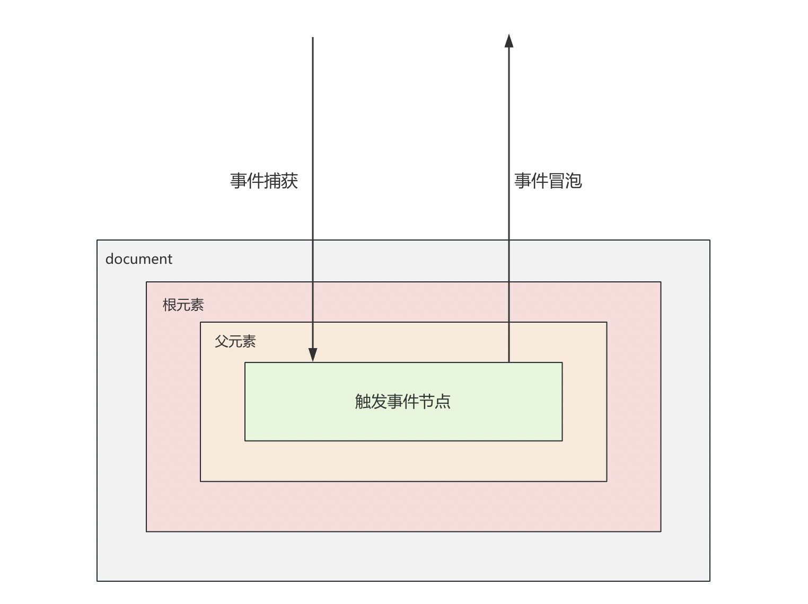
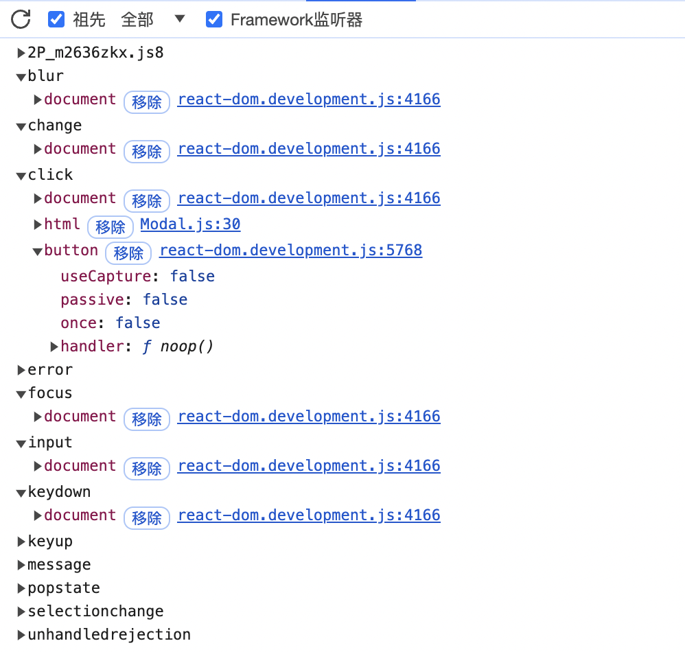
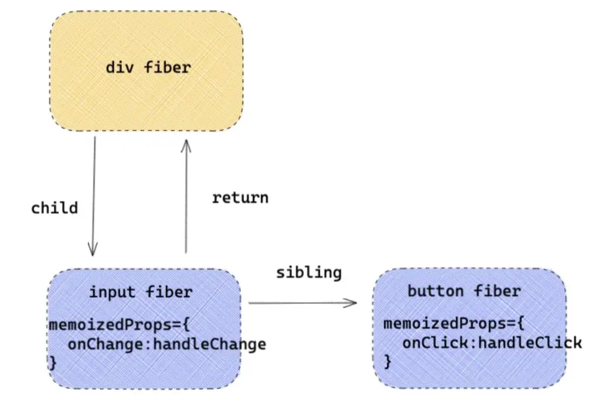
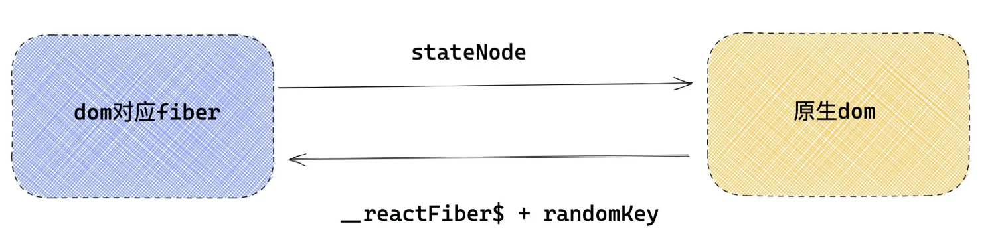
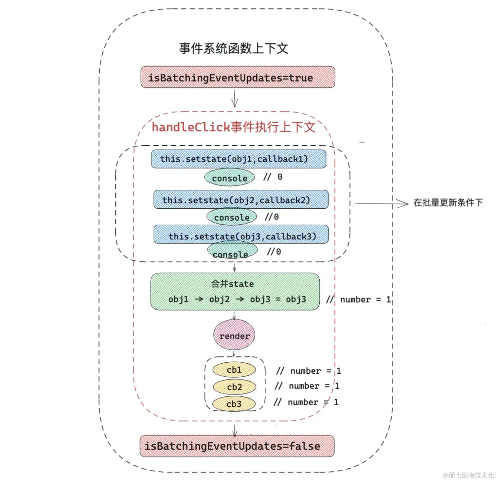
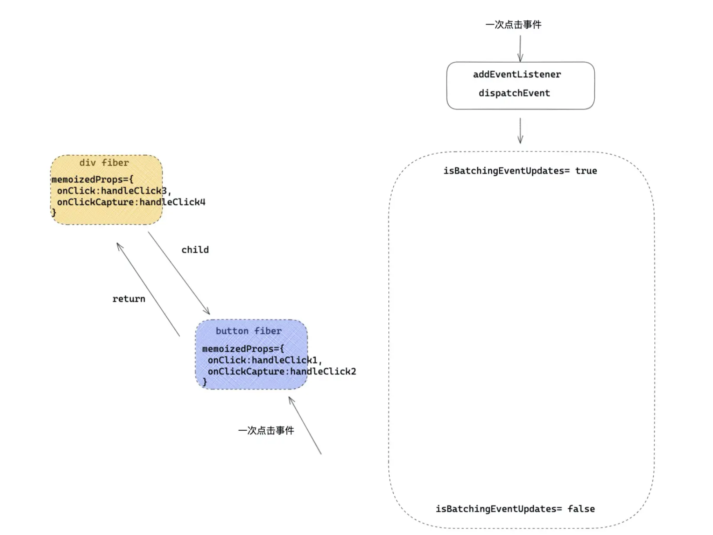
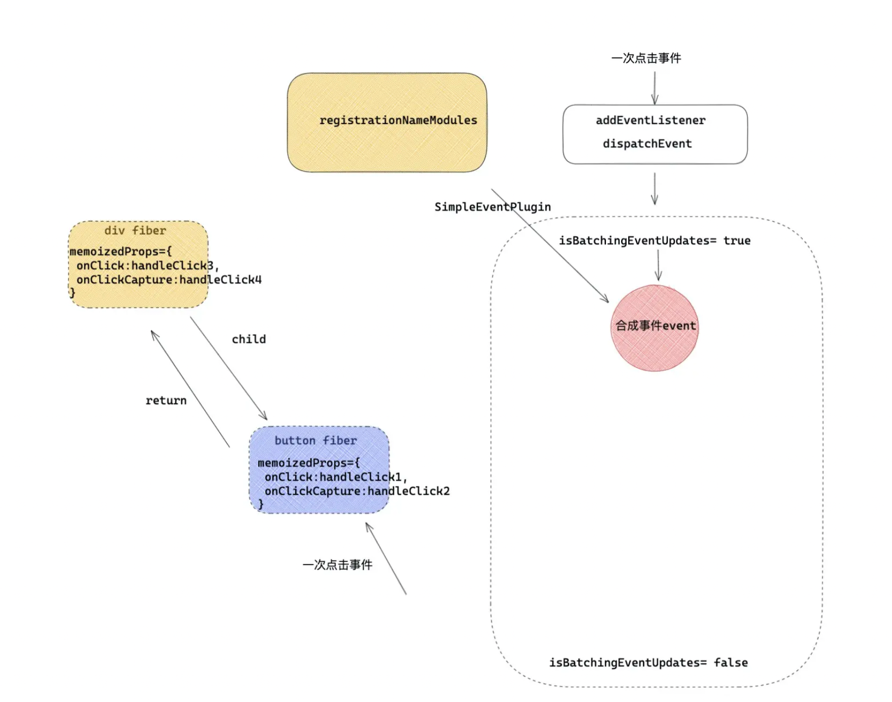
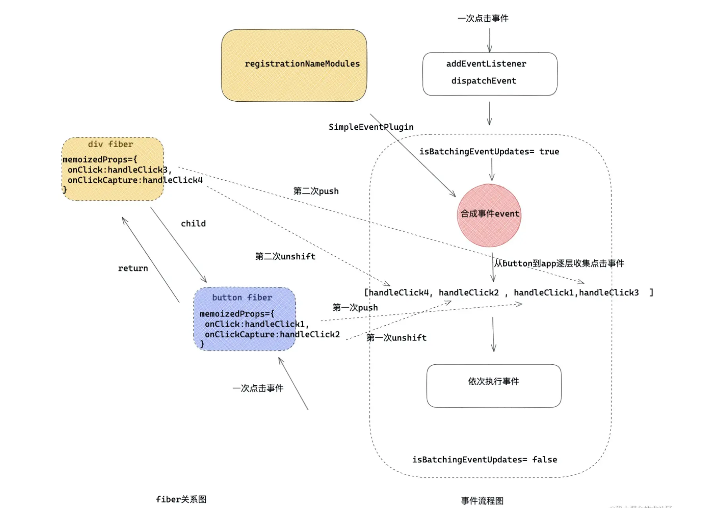

# react 原理


## 事件原理


在 React 应用中，所看到的 React 事件都是‘假’的：
- 给元素绑定的事件，不是真正的事件处理函数

- 在冒泡/捕获阶段绑定的事件，也不是在冒泡/捕获阶段执行的

- 在事件处理函数中拿到的事件源 e ，也不是真正的事件源 e


react 为什么需要自定义一套事件系统（合成事件）？
- 首先，对于不同的浏览器，对事件存在不同的兼容性，React 想实现一个兼容全浏览器的框架， 为了实现这个目标就需要创建一个兼容全浏览器的事件系统，以此抹平不同浏览器的差异

- 自定义事件系统，大部分处理逻辑都在底层处理了，对 ssr 和跨端支持度更高

- 利用事件委托机制，支持动态绑定，简化了 DOM 事件处理逻辑，减少了内存开销

- 合成事件系统与 React 的其他特性（如虚拟 DOM、批量更新等）紧密集成，提供了更好的开发体验和性能。
  - 虚拟 DOM：合成事件系统与虚拟 DOM 配合使用，可以在虚拟 DOM 更新时自动处理事件绑定和解绑。
  - 批量更新：合成事件系统与 React 的批量更新机制配合使用，可以减少重绘和重排的次数，从而提高性能。


### 旧版本事件原理


#### 事件阶段




js 基本的事件阶段:

事件捕获 ---> 事件源 ---> 事件冒泡


react 中阻止冒泡和阻止默认事件
- 阻止冒泡: `e.stopPropagation()`

- 阻止默认事件: 在原生事件中，可以使用 `e.preventDefault()` 和 `return false` 来阻止默认事件。由于 React 中给元素的事件并不是真正的事件处理函数，所以 `return false` 在 React 应用中失去了作用

> react 中的 e.stopPropagation 和 e.preventDefault 虽然和原生的写法差不多，但是底层原理完全不同，是由 React 事件源 e 也是独立组建的


#### 事件合成


react 事件合成分为三个部分
- 第一: 事件合成系统，初始化会注册不同的事件插件

- 第二: 在一次渲染过程中，对事件标签中事件的收集，向 container 注册事件

- 第三: 一次用户交互，事件触发，到事件执行一系列过程


##### react 事件合成


如下示例代码，为 input 绑定 change 事件

```jsx
const EventPage = () => {
  const handleClick = () => {}
  const handleChange = () => {}

  return (
    <div>
      <button onClick={ handleClick } >点击</button>
      <input onChange={ handleChange } />
    </div>
  )
}
```



这里的 click 上面有 button，实际上只是绑定了 noop 占位函数，事件还是绑定在 document 上的。验证就是: 手动移除 button 事件，完全没影响


- React 的事件不是绑定在元素上的，而是统一绑定在顶部容器上，在 v17 之前是绑定在 document 上的，在 v17 改成了 app 容器上。这样更利于一个 html 下存在多个应用（微前端）

- 绑定事件并不是一次性绑定所有事件，比如发现了 onClick 事件，就会绑定 click 事件，比如发现 onChange 事件，会绑定 [blur，change ，focus ，keydown，keyup] 多个事件

- React 事件合成的概念：React 应用中，元素绑定的事件并不是原生事件，而是React 合成的事件，比如 onClick 是由 click 合成，onChange 是由 blur ，change ，focus 等多个事件合成


##### react 事件插件


react 的事件合成，很大程度与事件插件机制相关，比如 onClick 和 onChange 事件，会有不同的事件插件 SimpleEventPlugin ，ChangeEventPlugin 处理。

下面是两个与事件插件机制相关的对象：


**registrationNameModules**

```js
const registrationNameModules = {
  onBlur: SimpleEventPlugin,
  onClick: SimpleEventPlugin,
  onClickCapture: SimpleEventPlugin,
  onChange: ChangeEventPlugin,
  onChangeCapture: ChangeEventPlugin,
  onMouseEnter: EnterLeaveEventPlugin,
  onMouseLeave: EnterLeaveEventPlugin,
  ...
}
```

registrationNameModules 记录了 React 事件（比如 onBlur ）和与之对应的处理插件的映射，比如 onClick ，就会用 SimpleEventPlugin 插件处理，onChange 就会用 ChangeEventPlugin 处理。应用于事件触发阶段，根据不同事件使用不同的插件。


**registrationNameDependencies**

```js
{
  onBlur: ['blur'],
  onClick: ['click'],
  onClickCapture: ['click'],
  onChange: ['blur', 'change', 'click', 'focus', 'input', 'keydown', 'keyup', 'selectionchange'],
  onMouseEnter: ['mouseout', 'mouseover'],
  onMouseLeave: ['mouseout', 'mouseover'],
  ...
}
```

这个对象保存了 React 事件和原生事件对应关系，这就是为什么只写了一个 onChange ，会有很多原生事件绑定在 document 上。在事件绑定阶段，如发现有 React 事件，比如 onChange ，就会找到对应的原生事件数组，进行逐一绑定。


#### 事件绑定


```jsx
const EventPage = () => {
  const handleClick = () => {}
  const handleChange = () => {}

  return (
    <div>
      <button onClick={ handleClick } >点击</button>
      <input onChange={ handleChange } />
    </div>
  )
}
```

如上代码，事件绑定，就是在 React 处理 props 时候，如果遇到事件比如 onClick ，就会通过 addEventListener 注册原生事件。

这里有个问题：给元素绑定的事件 handleClick ，handleChange ，最后去了哪里呢？答案就是：最后 onChange 和 onClick 会保存在对应 DOM 元素类型 fiber 对象（ hostComponent ）的 memoizedProps 属性上




然后就是根据事件，注册事件监听器

> react-dom/src/client/ReactDOMComponent.js

```js
function diffProperties(){
  // 判断当前的 propKey 是不是 React合成事件
  if(registrationNameModules.hasOwnProperty(propKey)) {

    // 这里多个函数简化了，如果是合成事件， 传入成事件名称 onClick ，向document注册事件
    legacyListenToEvent(registrationName, document);
  }
}
```

diffProperties 函数在 diff props 如果发现是合成事件( onClick ) 就会调用 legacyListenToEvent 函数。注册事件监听器。接下来看一下 legacyListenToEvent 是如何注册事件的。


> react-dom/src/events/DOMLegacyEventPluginSystem.js

```js
function legacyListenToEvent(registrationName，mountAt){
  // 根据 onClick 获取 onClick 依赖的事件数组 ['click']
  // {
  //   onBlur: ['blur'],
  //   onClick: ['click'],
  //   onChange: ['blur', 'change', 'click', 'focus', 'input', 'keydown', 'keyup', 'selectionchange'],
  //   ...
  // }
  const dependencies = registrationNameDependencies[registrationName];

  for (let i = 0; i < dependencies.length; i++) {
    const dependency = dependencies[i];

    //  addEventListener 绑定事件监听器
    legacyListenToTopLevelEvent(dependency, mountAt, listenerMap);
  }
}
```

应用 registrationNameDependencies 对 React 合成事件，分别绑定原生事件的事件监听器。比如发现是 onChange ，那么取出 ['blur', 'change', 'click', 'focus', 'input', 'keydown', 'keyup', 'selectionchange'] 遍历绑定


**问题：绑定在 document 的事件处理函数是如上写的handleChange，handleClick 吗？**

答案是否定的，绑定在 document 的事件，是 React 统一的事件处理函数 dispatchEvent ，React 需要一个统一流程去代理事件逻辑，包括 React 批量更新等逻辑

只要是 React 事件触发，首先执行的就是 dispatchEvent，那么 dispatchEvent 是如何知道是什么事件触发的呢？实际上在注册的时候，就已经通过 bind，把参数绑定给 dispatchEvent 了

```js
const listener = dispatchEvent.bind(null, 'click', eventSystemFlags, document) 

// 重要, 这里进行真正的事件绑定
document.addEventListener('click', listener, false) 
```


#### 事件触发


如下代码：

```js
const EventPage = () => {
  const handleClick1 = () => console.log(1)
  const handleClick2 = () => console.log(2)
  const handleClick3 = () => console.log(3)
  const handleClick4 = () => console.log(4)

  return (
    <div onClick={ handleClick3 }  onClickCapture={ handleClick4 }>
      <button onClick={ handleClick1 }  onClickCapture={ handleClick2 }>点击</button>
    </div>
  )
}
```

点击按钮 button，触发点击事件，那么在 React 系统中，整个流程会是这个样子的：


##### 1、批量更新

执行 dispatchEvent，dispatchEvent 执行会传入真实的事件源 button 元素本身。通过元素可以找到 button 对应的 fiber，React 在初始化真实 DOM 的时候，用一个随机的 key internalInstanceKey 指针指向了当前 DOM 对应的 fiber 对象，fiber 对象用 stateNode 指向了当前的 DOM 元素，这样就建立的联系。




然后就是批量更新




> react-dom/src/events/ReactDOMUpdateBatching.js

```js
export function batchedEventUpdates(fn,a){
  //打开批量更新开关
  isBatchingEventUpdates = true;

  try {
    // 事件在这里执行
    fn(a)
  } finally {
    //关闭批量更新开关
    isBatchingEventUpdates = false
  }
}
```


第一步整理流程




##### 2、合成事件源


第二步，会通过不同事件，找到事件插件，比如 onClick 就是 SimpleEventPlugin 插件，合成新的事件源 e，里面包含了 preventDefault 和 stopPropagation 等方法




##### 3、事件执行队列


在第一步通过原生 DOM 获取到对应的 fiber ，接着会从这个 fiber 向上遍历，遇到元素类型 fiber ，就会收集事件，用一个数组收集事件：

- 如果遇到捕获阶段事件 onClickCapture ，就会 unshift 放在数组前面。以此模拟事件捕获阶段

- 如果遇到冒泡阶段事件 onClick ，就会 push 到数组后面，模拟事件冒泡阶段

- 一直收集到最顶端 app ，形成执行队列，在接下来阶段，依次执行队列里面的函数

```js
 while (instance !== null) {
    const {stateNode, tag} = instance;
    if (tag === HostComponent && stateNode !== null) { /* DOM 元素 */
        const currentTarget = stateNode;
        if (captured !== null) { /* 事件捕获 */
            /* 在事件捕获阶段,真正的事件处理函数 */
            const captureListener = getListener(instance, captured); // onClickCapture
            if (captureListener != null) {
            /* 对应发生在事件捕获阶段的处理函数，逻辑是将执行函数unshift添加到队列的最前面 */
                dispatchListeners.unshift(captureListener);
                
            }
        }
        if (bubbled !== null) { /* 事件冒泡 */
            /* 事件冒泡阶段，真正的事件处理函数，逻辑是将执行函数push到执行队列的最后面 */
            const bubbleListener = getListener(instance, bubbled); // 
            if (bubbleListener != null) {
                dispatchListeners.push(bubbleListener); // onClick
            }
        }
    }
    instance = instance.return;
}
```


比如最开始示例代码，点击一次按钮，4个事件执行顺序是这样的：

- 首先第一次收集是在 button 上，handleClick1 冒泡事件 push 处理，handleClick2 捕获事件 unshift 处理。形成结构 [ handleClick2 , handleClick1 ]

- 然后接着向上收集，遇到父级，收集父级 div 上的事件，handleClick3 冒泡事件 push 处理，handleClick4 捕获事件 unshift 处理。[handleClick4, handleClick2 , handleClick1,handleClick3 ]

- 依次执行数组里面的事件，所以打印 4 2 1 3


第三步基本流程




#### React 阻止事件冒泡原理


主要在事件队列执行中处理

```js
function runEventsInBatch(){
    const dispatchListeners = event._dispatchListeners;
    if (Array.isArray(dispatchListeners)) {
    for (let i = 0; i < dispatchListeners.length; i++) {
      if (event.isPropagationStopped()) { /* 判断是否已经阻止事件冒泡 */
        break;
      }    
      dispatchListeners[i](event) /* 执行真正的处理函数 及handleClick1... */
    }
  }
}
```

比如有事件队列：[handleClick4, handleClick2, handleClick1, handleClick3]

假设在上述队列中，handleClick2 中调用 e.stopPropagation()，那么事件源里将有状态证明此次事件已经停止冒泡，那么下次遍历的时候，event.isPropagationStopped() 就会返回 true，所以跳出循环，handleClick1, handleClick3 将不再执行，模拟了阻止事件冒泡的过程
