# react 基础


### 1、基本认知


#### 1-1、创建一个 React 项目并启动

1. 创建：npx create-react-app my-app
2. 启动：npm run start
3. 暴露配置项：npm run eject


#### 1-2、入口 src/index.js

```js
import React from 'react'; // 负责逻辑控制，数据--> VDOM；使用了 jsx 就必须要引入 React
import ReactDOM from 'react-dom'; // React Dom 渲染实际 Dom，VDOM-->DOM
import './index.css';
import App from './App';
import * as serviceWorker from './serviceWorker';

// React 使用 jsx 来描述 ui，
// jsx ==> React.createElement(...)
// ReactDOM.render 生成真实的 Dom
ReactDOM.render(
  <React.StrictMode> {/*StrictMode: 指严格模式*/}
    <App /> {/* 这个是虚拟 Dom，这种是 jsx 写法*/}
  </React.StrictMode>,
  document.getElementById('root') // 将真实的 Dom 插入到根节点（root）下面
);

serviceWorker.unregister(); // pwa 相关
```

> babel-loader 将 jsx 编译为相应 js 对象，React.createElement 再将这个 js 对象构造成虚拟 Dom


#### 1-3、react 的演进过程

- 0.3.0 ~ 0.14.0（2013.5.29 - 2015.10.7）：基础功能打磨
- React 15（2016.4.7）：基本功能成熟
- React16（2017.9.26）：Fiber 架构引入，16.8 Hooks 的引入
- React17（2020.10.20）：事件委托机制发生变化，New JSX Transform
- React18（2022.3.29）：Consurrent、Suspence、Transitions


### 2、jsx 语法

jsx 是 js 语法的扩展，表面上像 HTML，本质上还是通过 babel 转换为 js 去执行

> jsx 主要就是通过 React.createElement 在 React 内部构建虚拟 Dom，最终渲染出页面，也可以说 jsx 是 React.createElement 的语法糖

```jsx
// jsx 代码
class Test extends React.Component {
  constructor(props) {
    super(props);
  }
  render() {
    return (
      <div>
        <h1 className="title">Hello,React</h1>
      </div>
    );
  }
}
ReactDOM.render(<Test />, document.getElementById('root'));

// 经过编译后会变成
class Test extends React.Component {
  constructor(props) {
    super(props);
  }
  render() {
    return React.createElement('div', null, React.createElement('h1', { className: 'title' }, 'Hello,React'));
  }
}
ReactDOM.render(<Test />, document.getElementById('root'));
```

> React.createElement 会通过 ReactElement 函数构建一个 JavaScript 对象（虚拟 DOM）来描述 HTML 结构的信息，包括标签名、属性、还有子元素等。这样的代码就是合法的 JavaScript 代码了


**jsx 到页面的流程：**

jsx-->Babel 将 jsx 编译为相应 js 对象-->ReactElement 将这个 js 对象生成虚拟 DOM-->ReactDOM.render 生成真实 DOM

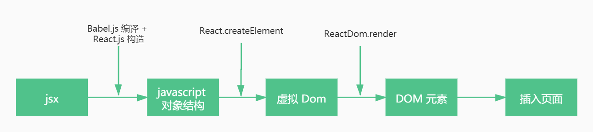


#### 2-1、基本使用，插值用 {}

> jsx 的 css 类选择器不能使用 class，而要使用 className，因为 jsx 是 js 上运行的，不能使用 js 的关键字

```js
const name = 'word';
const jsx = <div>hello, {name}!</div>;

ReactDOM.render(jsx, document.getElementById('root'));
```


#### 2-2、函数的使用

```js
const params = {
  first: 'mark',
  last: 'pretter',
};

function formatName(args) {
  return `${args.first} ${args.last}`;
}

const jsx = (
  <div>
    <div>{formatName(params)}</div>
  </div>
);

ReactDOM.render(jsx, document.getElementById('root'));
```


#### 2-3、jsx 对象

```js
const good = <div>goods</div>;
const jsx = <div>{good}</div>;

ReactDOM.render(jsx, document.getElementById('root'));
```


#### 2-4、条件语句

1. 使用三元表达式或者 &&

   ```js
   const show = true;
   const loginBtn = '登陆';

   const jsx = (
     <div>
       <div>{show ? loginBtn : '注册'}</div>
       <div>{show && loginBtn}</div>
     </div>
   );

   ReactDOM.render(jsx, document.getElementById('root'));
   ```

2. 使用 if...else（适合逻辑非常多）

   ```js
   import React, { Component } from 'react';

   class Login extends Component {
     render() {
       if (this.props.login) {
         return <div>已登录</div>;
       } else {
         return <div>未登录</div>;
       }
     }
   }

   export default Login;
   ```

3. 模拟 Vue 的 v-show（主要就是 display 属性 block 和 none 切换）

   ```js
   import React, { Component } from 'react';
   
   class Login extends Component {
     constructor(props) {
       super(props);
       this.state = {
         isShow: true,
       };
     }
   
     isShowClick() {
       this.setState({
         isShow: !this.state.isShow,
       });
     }
   
     render() {
       return (
         <div style={{ marginTop: '20px' }}>
           <button onClick={() => this.isShowClick()}>v-show</button>
           <h4 style={{ display: this.state.isShow ? 'block' : 'none' }}>模拟Vue的v-show</h4>
         </div>
       );
     }
   }
   
   export default Login;
   ```


#### 2-5、数组

1. 数组直接使用 jsx，记得要唯一 key

   ```js
   const eles = [<div key="1">数组1</div>, <div key="2">数组2</div>];

   const jsx = <div>{eles}</div>;

   ReactDOM.render(jsx, document.getElementById('root'));
   ```

2. 使用 map

   ```js
   const arr = ['arr1', 'arr2', 'arr3'];

   const jsx = (
     <div>
       <ul>
         {arr.map((item) => (
           <li key={item}>{item}</li>
         ))}
       </ul>
     </div>
   );

   ReactDOM.render(jsx, document.getElementById('root'));
   ```

3. 结合 filter 进行数据筛选

   ```js
   const arr = [22, 33, 4, 55, 66, 77];

   const jsx = (
     <div>
       <ul>
         {arr
           .filter((item) => item >= 50)
           .map((item) => (
             <li key={item}>{item}</li>
           ))}
       </ul>
     </div>
   );

   ReactDOM.render(jsx, document.getElementById('root'));
   ```

4. 结合 slice 进行列表截取

   ```js
   const arr = [22, 33, 4, 55, 66, 77];
   
   const jsx = (
     <div>
       <ul>
         {arr.slice(0, 4).map((item) => (
           <li key={item}>{item}</li>
         ))}
       </ul>
     </div>
   );
   
   ReactDOM.render(jsx, document.getElementById('root'));
   ```

> map 和 forEach 区别：forEach 没有返回值


#### 2-6、属性使用

```js
import logo from './logo.svg';

const jsx = (
  <div>
    
  </div>
);

ReactDOM.render(jsx, document.getElementById('root'));
```

动态添加 class，就像操作 js 字符串一样

```js
class ClassComponent extends Component {
  constructor(props) {
    super(props);
    this.state = {
      active: true,
    };
  }

  render() {
    return (
      <div>
        <div className={`first two ${this.state.active ? 'active' : ''}`}>动态绑定class</div>
      </div>
    );
  }
}
```

> 使用 className 是为了避免与 class 组件里面的 class 冲突
> style 使用 {} 插值， 里面那层的 {} 代表的是一个对象

对于动态的 class 属性，官方推荐使用 `classnames` 这个库，好处：

- 语法更加简洁
- className 的模板字符串直接判断如果是 false **会渲染一个空格**，不太好

```js
npm install classnames --save
```

使用：

```js
import classnames from 'classnames';

class ClassComponent extends Component {
  constructor(props) {
    super(props);
    this.state = {
      active: true,
    };
  }

  render() {
    return (
      <div>
        <div className={classnames('classone', this.state.active ? 'active' : '')}>classnames库</div>
      </div>
    );
  }
}
```


#### 2-7、模块化

```js
import style from './index.module.css';

const jsx = (
  <div>
    
  </div>
);

ReactDOM.render(jsx, document.getElementById('root'));
```

> css 模块化可以避免组件之间类名冲突


#### 2-8、布尔类型、Null 以及 Undefined 将会忽略

```js
<div>{false}</div>

<div>{true}</div>

<div>{null}</div>

<div>{undefined}</div>

```

以上的都不会渲染

> 如果 undefined 需要展示，那么 undefined 就需要跟字符串进行拼接


#### 2-9、属性展开

例如有：

```js
function App1() {
  return <Greeting firstName="Ben" lastName="Hector" />;
}
```

等价于：

```js
function App2() {
  const props = {firstName: 'Ben', lastName: 'Hector'};
  return <Greeting {...props} />;
}
```

也可以传递某些值：

```js
const Button = props => {
  const { kind, ...other } = props;
  const className = kind === "primary" ? "PrimaryButton" : "SecondaryButton";
  return <button className={className} {...other} />;
};

const App = () => {
  return (
    <div>
      <Button kind="primary" onClick={() => console.log("clicked!")}>
        Hello World!
      </Button>
    </div>
  );
};
```


### 3、组件

> 无论是类组件还是函数式组件，都需要首字母大写


#### 3-1、类组件（class component）

```js
import React, { Component } from 'react';

class ClassComponent extends Component {
  constructor(props) {
    super(props);
    this.state = { date: new Date() };
  }
  render() {
    return (
      <div>
        <h1>{this.props.title}</h1>
        <div>{this.state.date.toLocaleTimeString()}</div>
      </div>
    );
  }
}

export default ClassComponent;
```

1. 如果通过类的方式去定义组件，那么组件必须继承于 React.Component 这个类
2. 必须定义一个 render 方法，render 里面返回一个 jsx


#### 3-2、函数式组件（function component）

**函数式组件特点：**

1. 没有 this
2. 函数组件中，你无法使用 State，也无法使用组件的生命周期方法，这就决定了函数组件都是展示性组件（Presentational Components），接收 Props，渲染 DOM，而不关注其他逻辑。
3. 但是，React16.8 引入了 hooks，函数组件也可以有状态

```js
import React from 'react';

const FunComponent = (props) => {
  return (
    <div>
      <h1>{props.title}</h1>
      <p>这是一个函数组件</p>
    </div>
  );
};

export default FunComponent;
```

1. 函数组件必须返回 jsx 对象

> 声明了组件，直接导入，然后使用；不需要像 Vue 一样还要去 component 注册

**对比：**

在 Hook 没有出来之前，类组件相对于函数组件的优势：

- class 组件可以定义自己的 state 用来保存组件内部自己的状态
- 有自己的生命周期，在生命周期内完成特定的操作
- class 组件更新时只会执行 render 函数或者 componentDidUpdate 这些；函数式组件在更新时，整个函数都会被重新执行


#### 3-3、react 实现类似 vue 的插槽

第一种：组件双标签【只有一个插槽可以使用这种】

```js
export default class NavBar extends Component {
  constructor(props) {
    super();
  };

  render() {
    return (
      <div className="nav-bar">
        <div className="nav-left">{ this.props.children[0] }</div>
        <div className="nav-center">{ this.props.children[1] }</div>
        <div className="nav-right">{ this.props.children[2] }</div>
      </div>
    );
  }
}

// 使用
<NavBar>
  <div>左边</div>
  <div>中间</div>
  <div>右边</div>
</NavBar>
```

> 缺点：里面的标签不能乱，不然顺序会匹配不上


第二种：【推荐】

```js
import React, { Component } from 'react';

export default class NavBar extends Component {
  constructor(props) {
    super();
  };

  render() {
    const { leftSlot, centerSlot, rightSlot } = this.props;

    return (
      <div className="nav-bar">
        <div className="nav-left">{ leftSlot }</div>
        <div className="nav-center">{ centerSlot }</div>
        <div className="nav-right">{ rightSlot }</div>
      </div>
    );
  }
}

// 使用
<NavBar
  leftSlot={<span>左边</span>}
  centerSlot={<span>中间</span>}
  rightSlot={<span>右边</span>}
/>
```

> 解决了第一种的缺点


#### 3-4、受控非受控组件

在 React 中，**受控组件（Controlled Components）**和**非受控组件（Uncontrolled Components）**是处理表单元素的两种不同方式，它们的核心区别在于**数据管理权**和**更新机制**。


**1、受控组件**

受控组件的表单数据由 **React 组件状态（state）** 控制，输入值的变化由 React 管理，并通过 `onChange` 事件同步更新。

> 其实就是对应的 vue 中的 v-model，但是 react 中没有双向数据绑定，而是受控组件


```js
import { useState } from "react";

function ControlledInput() {
  const [value, setValue] = useState("");

  const handleChange = (e) => {
    setValue(e.target.value); // 手动更新 state
  };

  return (
    <input
      type="text"
      value={value} // 受控：value 绑定 state
      onChange={handleChange} // 必须监听变化
    />
  );
}
```

**特点：**

- **数据流**：`value` 由 React 的 `state` 控制，用户输入触发 `setState` 更新。
- **更新方式**：必须使用 `onChange` 监听输入变化，并手动更新 `state`。
- **适用场景**：需要实时验证、动态提交或依赖输入值的场景（如搜索框、动态表单）。


常见的一些表单处理：

| element                   | value                | change callback | new value in the callback |
| :------------------------ | -------------------- | --------------- | ------------------------- |
| <input type="text" />     | value="string"       | onChange        | event.target.value        |
| <input type="checkbox" /> | value={boolean}      | onChange        | event.target.checked      |
| <input type="radio" />    | value={boolean}      | onChange        | event.target.checked      |
| <textarea />              | value="string"       | onChange        | event.target.value        |
| <select />                | value="option value" | onChange        | event.target.value        |


select 表单

```js
import React, { PureComponent } from 'react';

export default class ModelCom extends PureComponent {
  constructor(props) {
    super();

    this.state = {
      fruits: 'orange'
    }
  }

  handleFruits(e) {
    this.setState({
      fruits: e.target.value
    });
  }

  handleFruitsSubmit(e) {
    e.preventDefault();
    console.log(this.state.fruits);
  }

  render() {
    const { fruits } = this.state;
    return (
      <div>
        <form onSubmit={e => this.handleFruitsSubmit(e)}>
          <label>
            <select value={fruits} onChange={e => this.handleFruits(e)}>
              <option value="apple">苹果</option>
              <option value="banana">香蕉</option>
              <option value="orange">橙子</option>
            </select>
          </label>
          <input type="submit" value="确定" />
        </form>
      </div>
    );
  }
}
```


**2、非受控组件**

> **React 推荐大多数情况下使用 `受控组件` 来处理表单数据，尽量不要使用非受控组件。**一个受控组件中，表单数据是由 React 组件来管理的，而非受控组件，表单数据将交由 DOM 节点来处理（即使用 ref）

非受控组件设置默认值：

- 普通 `<input>` 表单、`<select>`、`<textarea>` 使用 defaultValue
- `<input type="checkbox">`、`<input type="radio">` 使用 defaultCheck

```js
import { useRef } from "react";

function UncontrolledInput() {
  const inputRef = useRef(null);

  const handleSubmit = () => {
    console.log(inputRef.current.value); // 提交时获取值
  };

  return (
    <>
      <input type="text" ref={inputRef} /> {/* 非受控：无 value 绑定 */}
      <button onClick={handleSubmit}>Submit</button>
    </>
  );
}
```

**特点：**

- **数据流**：输入值存储在 DOM 中，React 不主动管理。
- **更新方式**：通过 `ref` 直接访问 DOM 元素（如提交时获取值）。
- **适用场景**：简单表单、文件上传（`<input type="file">`）或与第三方库集成。


#### 3-5、高阶组件

高阶组价，英文名 **Higher-Order Components**，简称 `HOC`，它不是 React API 的一部分，而是基于 react 组合特性而形成的设计模式。官方定义：**高阶组件是参数为组件，返回值为新组件的函数**。即：

- 高阶组件本身并不是一个组件，它是一个函数
- 高阶组件的参数是一个组件，并且返回值也是一个组件

一个简单例子：

```js
import React, { PureComponent } from 'react';

function hightOrderCom(WrapperComponent) {
  return class HOCCom extends PureComponent {
    render() {
      return (
        <WrapperComponent />
      );
    }
  }
}

class AppComponent extends PureComponent {
  render() {
    return (
      <div>
        <h3>===================高阶组件===================</h3>
        <p>AppComponent</p>
      </div>
    );
  }
}
export default hightOrderCom(AppComponent);
```


**高阶组件的使用：**

1. props 值增强

   1.1 添加新的 props

   ```js
   import React, { PureComponent } from 'react';
   
   class Header extends PureComponent {
     constructor(props) {
       super();
     }
   
     render() {
       const { title, right } = this.props;
       return (
         <div>
           <h2>{title}</h2>
           <h3>{right}</h3>
         </div>
       );
     }
   }
   
   function changeProp(WrapperCom, otherProps) {
     return props => <WrapperCom {...props} {...otherProps} />
   }
   
   const PropHeader = changeProp(Header, {right: '点击'})
   
   class HOCProp extends PureComponent {
     constructor(props) {
       super();
       this.state = {
         headTitle: '首页'
       }
     }
   
     render() {
       return (
         <div>
           <h4>----------------高阶组件props值增强-----------------</h4>
           <PropHeader title={this.state.headTitle} />
         </div>
       );
     }
   }
   
   export default HOCProp;
   ```
   
   1.2 利用高阶组件来共享Context
   
   ```js
   import React, { PureComponent, createContext } from 'react';
   
   const MyContext = createContext({title: '标题', right: '默认'});
   
   // function withContext(WrapperCom) {
   //   return props => {
   //     return (
   //       <MyContext.Consumer>
   //         {
   //           value => <WrapperCom {...props} {...value}/>
   //         }
   //       </MyContext.Consumer>
   //     )
   //   }
   // }
   
   // 简略代码
   function withContext(WrapperCom) {
     return props => (
       <MyContext.Consumer>
         {
           value => <WrapperCom {...props} {...value}/>
         }
       </MyContext.Consumer>
     );
   }
   
   // function Header() {
   //   return (
   //       <MyContext.Consumer>
   //         {
   //           value => {
   //             return (
   //               <div>
   //                 <h2>{value.title}</h2>
   //                 <h3>{value.right}</h3>
   //               </div>
   //             );
   //           }
   //         }
   //       </MyContext.Consumer>
   //   );
   // }
   
   function Header(props) {
     const {title, right} = props;
     return (
       <div>
         <h2>{title}</h2>
         <h3>{right}</h3>
       </div>
     );
   }
   
   const HeaderContext = withContext(Header);
   
   class HOCContext extends PureComponent {
     constructor(props) {
       super();
     }
   
     render() {
       return (
         <div>
           <h4>------------高阶组件共享Context----------</h4>
           <MyContext.Provider value={{title: '我的', right: '点击'}}>
             <HeaderContext />
           </MyContext.Provider>
         </div>
       );
     }
   }
   
   export default HOCContext;
   ```

2. 渲染判断鉴权

   场景：某些页面是必须用户登录成功才能进行进入，如果用户没有登录成功，那么直接跳转到登录页面

   ```js
   import React, { PureComponent } from 'react';
   
   function withAuth(PageCom) {
     return (props) => (props.isOK ? <PageCom /> : <Login />);
   }
   
   function Login() {
     return <h2>登陆</h2>;
   }
   
   function CardList() {
     return <h2>CardList</h2>;
   }
   
   const AuthHoc = withAuth(CardList);
   
   class HOCAuth extends PureComponent {
     constructor(props) {
       super();
       this.state = {
         isOk: true,
       };
     }
   
     handleLogin = () => {
       this.setState({
         isOk: true,
       });
     };
   
     handleLogout = () => {
       this.setState({
         isOk: false,
       });
     };
   
     render() {
       return (
         <div>
           <h4>------------高阶组件鉴权-----------</h4>
           <AuthHoc isOK={this.state.isOk} />
           <button onClick={this.handleLogin}>登进</button>
           <button onClick={this.handleLogout}>退出</button>
         </div>
       );
     }
   }
   
   export default HOCAuth;
   ```

3. 生命周期劫持（相当于 vue 中的 mixin 混入）

   ```js
   import React, { PureComponent } from 'react';
   
   function withLifeCycle(PageCom) {
     return class extends PureComponent {
       constructor(props) {
         super();
       }
   
       componentDidMount() {
         console.log(`${PageCom.name}渲染了`);
       }
   
       render() {
         return <PageCom {...this.props} />;
       }
     };
   }
   
   class Home extends PureComponent {
     render() {
       return <h3>Home页面</h3>;
     }
   }
   
   class Detail extends PureComponent {
     render() {
       return <h3>Detail页面</h3>;
     }
   }
   
   const LogHome = withLifeCycle(Home);
   const LogDetail = withLifeCycle(Detail);
   
   export default class HOCLifeCycle extends PureComponent {
     render() {
       return (
         <div>
           <h4>----------高阶组件劫持生命周期----------</h4>
           <LogHome />
           <LogDetail />
         </div>
       );
     }
   }
   
   ```


**高阶组件的意义：**

早期的 React 有提供组件之间的一种复用方式是 mixin，目前已经不再建议使用，因为 mixin 有许多缺点：

- `Mixin` 可能会相互依赖，相互耦合，不利于代码维护
- 不同的`Mixin`中的方法可能会相互冲突
- `Mixin` 来源不清晰等

HOC 没有上面的一些问题，但也带来了另外的问题：

- `HOC`需要在原组件上进行包裹或者嵌套，如果大量使用`HOC`，将会产生非常多的嵌套，这让调试变得非常困难

所以，在 Hook 出现后，更加推荐使用 Hook，而减少 HOC 的使用


#### 3-6、其它组件相关（Portal、Fragment等）

**1、Portal**

在某些情况，会希望渲染的内容独立于父组件之外，甚至独立于当前挂载到的DOM元素中（默认都是挂载到id为root的DOM元素上的）

Portal 提供了一种将子节点渲染到存在于父组件以外的 DOM 节点的优秀的方案

```js
ReactDOM.createPortal(child, container)
```

- 第一个参数（`child`）是任何可渲染的 React 子元素，例如一个元素，字符串或 fragment
- 第二个参数（`container`）是一个 DOM 元素

应用场景：准备开发一个 Modal 组件，它可以将它的子组件渲染到屏幕的中间位置

第一步：修改 index.html，往其中加入新节点：

```js
<div id="root"></div>
// 加入一个节点
<div id="modal"></div>
```

第二步：帮节点添加样式 (index.html)

```js
<style>
      #modal {
        position: fixed;
        left: 50%;
        top: 50%;
        transform: translate(-50%, -50%);
        background-color: pink;
      }
    </style>
```

第三步：编写 Modal 组件

```js
import React, { PureComponent } from 'react';
import { createPortal } from 'react-dom';

class Modal extends PureComponent {
  render() {
    // this.props.children：代表的是 Modal 组件里面的元素，类似 vue 插槽
    return createPortal(this.props.children, document.getElementById('modal'));
  }
}

export default class PortalCom extends PureComponent {
  render() {
    return (
      <div>
        <Modal>
          <h2>我是标题</h2>
        </Modal>
      </div>
    );
  }
}
```


**2、Fragment**

在组件开发中，总会需要一个根标签包裹：

```js
export default class App extends PureComponent {
  render() {
    return (
      <div>
        <h2>当前计数: 0</h2>
      </div>
    )
  }
}
```

 但是，当不需要渲染一个根 div 的时候，React 也支持不用 div 包裹，使用 Fragment 即可

```js
import React, { PureComponent, Fragment } from 'react';

export default class FragmentCom extends PureComponent {
  render() {
    return (
      <Fragment>
        <h2>Fragment标签</h2>
      </Fragment>
    );
  }
}
```

Fragment 的短语法写法：

```js
import React, { PureComponent, Fragment } from 'react';

export default class FragmentCom extends PureComponent {
  render() {
    return (
      // 这种就是 Fragment 的短语法写法
      <>
        <h2>Fragment标签</h2>
      </>
    );
  }
}
```

> 短语法可以简略书写，但是，当 Fragment 需要绑定 key 的时候，就不能使用短语法了


 **3、StrictMode 严格模式**

```js
ReactDom.render(
  <React.StrictMode>
    <App />
  </React.StrictMode>,
  document.getElementById('#root')
)
```

StrictMode 是一个用来突出显示应用程序中潜在问题的工具：

- 它不会被渲染成一个标签
- 它为后代元素触发额外的检查和警告
- 严格模式仅仅在开发模式下运行，不会影响生产环境

检查的内容：

- 一些不安全的生命周期【例如不再建议使用的】
- 识别过时的 ref API
- 检查意外的副作用
- ...


### 4、props


#### 4-1、props 值

props 接收的是组件传过来的值。

一个有意思的问题： 为什么当 super() 中没有继承 props 时，constructor 中打印的 props 是 undefined，而 render 函数中打印的 props 是有值的

```js
import React, { Component } from 'react';

class Child extends Component {
  constructor(props) {
    super();
    this.state = {};
    console.log('constructor 的 props：', this.props); // undefined
  }

  render() {
    console.log('render 的 props：', this.props);
    const { txt, addCount } = this.props;
    
    return (
      <div>
        <h2>子组件</h2>
        <p>{txt}</p>
        <button onClick={e => addCount(e, 'jack')}>加+</button>
      </div>
    );
  }
}

export default Child;
```

**主要原因：**因为 react 在挂载 class 组件的时候会自主的把 props 挂载到组件实例上，所以在 moutend 和 render 都可以在没有 super(props) 的情况下都可以访问得到

在 react 源码 package >> react-test-render >> src >> ReactShallowRender

```js
  _mountClassComponent(
    elementType: Function,
    element: ReactElement,
    context: null | Object,
  ) {
    this._instance.context = context;
    // 这里对 props 重新赋值，所以才有super() 这样也能在 render 中获取到 this.props 的值，而不需要 super(props)
    // class Clild extends Component {
    //   constructor() {
    //     super();
    //   }
    // }
    this._instance.props = element.props;
    this._instance.state = this._instance.state || null;
    this._instance.updater = this._updater;

    if (
      typeof this._instance.UNSAFE_componentWillMount === 'function' ||
      typeof this._instance.componentWillMount === 'function'
    ) {
      const beforeState = this._newState;

      // In order to support react-lifecycles-compat polyfilled components,
      // Unsafe lifecycles should not be invoked for components using the new APIs.
      if (
        typeof elementType.getDerivedStateFromProps !== 'function' &&
        typeof this._instance.getSnapshotBeforeUpdate !== 'function'
      ) {
        if (typeof this._instance.componentWillMount === 'function') {
          this._instance.componentWillMount();
        }
        if (typeof this._instance.UNSAFE_componentWillMount === 'function') {
          this._instance.UNSAFE_componentWillMount();
        }
      }

      // setState may have been called during cWM
      if (beforeState !== this._newState) {
        this._instance.state = this._newState || emptyObject;
      }
    }

    this._rendered = this._instance.render();
    // Intentionally do not call componentDidMount()
    // because DOM refs are not available.
  }
```


#### 4-2、props 校验

```js
// 单类型校验
[组件名].propTypes = {
  [键名]: PropTypes.[类型]
}

// 组合类型校验（其中一个类型；注意与 oneOf 的区别）
[组件名].propTypes = {
  [键名]: PropTypes.oneOfType([PropTypes.[类型], ...])
}

// 其中一个值
[组件名].propTypes = {
  [键名]: PropTypes.oneOf(['male', 'female'])
}

// 必须要传过来的
[组件名].propTypes = {
  [键名]: PropTypes.[类型].isRequired
}
```

> 常见的类型：array、bool、func、number、object、string、symbol

例子：

```js
class ClassComponent extends Component {
  constructor(props) {
    super(props);
    this.state = { date: new Date() };
  }
  render() {
    return (
      <div>
        <h1>{this.props.title}</h1>
        <div>{this.state.date.toLocaleTimeString()}</div>
      </div>
    );
  }
}

ClassComponent.propTypes = {
  title: PropTypes.string,
};
```

类组件也可以将 ClassComponent.propTypes 这种形式改为 static propTypes，因为在类中 [类名].propTypes 就相当于一个静态属性

```js
class ClassComponent extends Component {
  static propTypes = {
    title: PropTypes.string,
  };
  constructor(props) {
    super(props);
    this.state = { date: new Date() };
  }
  render() {
    return (
      <div>
        <h1>{this.props.title}</h1>
        <div>{this.state.date.toLocaleTimeString()}</div>
      </div>
    );
  }
}
```


#### 4-3、props 默认值

```js
[组件名].defaultProps = {
  [键名]: [默认值],
};
```

例子：

```js
class ClassComponent extends Component {
  constructor(props) {
    super(props);
    this.state = { date: new Date() };
  }
  render() {
    return (
      <div>
        <h1>{this.props.title}</h1>
        <div>{this.state.date.toLocaleTimeString()}</div>
      </div>
    );
  }
}

ClassComponent.defaultProps = {
  title: 'XXX Component',
};
```

ClassComponent.defaultProps 也可以写成 static defaultProps

```js
class ClassComponent extends Component {
  static defaultProps = {
    title: 'XXX Component',
  };
  constructor(props) {
    super(props);
    this.state = { date: new Date() };
  }
  render() {
    return (
      <div>
        <h1>{this.props.title}</h1>
        <div>{this.state.date.toLocaleTimeString()}</div>
      </div>
    );
  }
}
```


### 5、state

1. state 是当前组件的自定义属性，通过在 constructor() 中初始化 state
2. 不能直接修改 state，而是需要通过 setState() 去修改，直接修改如：this.state.xxx = 'xxx' 不会重新渲染
3. setState 是会更改组件的，会造成组件的重新渲染，如果短时间有很多 setState 去操作 state，那么就会造成组件不断地更行，影响性能；setState 的异步更新主要就是一个合并批量更新的操作，减少组件的更新次数，达到优化性能的目的。第二点就是如果同步更新 state，但是还没有执行 render 函数，那么可能会导致 state 和 props 的数据不同步，造成父组件和子组件相同的依赖但是结果不同。
4. state 的更新会被合并，当你调用 setState() 的时候，React 会把你提供的对象合并到当前的 state


#### 5-1、初始化 state

```js
class ClassComponent extends Component {
  constructor(props) {
    // 初始化一个 state
    this.state = {
      date: new Date(),
      count: 1,
    };
  }
}
```


#### 5-2、setState

> 注意：setState 只有在合成事件和生命周期函数中是异步的，react 18 之前，在原生事件和 setTimeout 中都是同步的，react18之后，在在原生事件和 setTimeout 中也是异步的；异步其实是为了批量更新和使 state 和 props 数据一致


**1、问题**

**1.1、在组件中没有实现 setState，怎么能通过 this.setState 调用**

因为，setState 是从 Component 中继承过来的，源码中定义：

```js
Component.prototype.setState = function(partialState, callback) {
  invariant(
    typeof partialState === 'object' ||
      typeof partialState === 'function' ||
      partialState == null,
    'setState(...): takes an object of state variables to update or a ' +
      'function which returns an object of state variables.',
  );
  this.updater.enqueueSetState(this, partialState, callback, 'setState');
};
```

  

**1.2、为什么需要使用 setState 呢**

因为 react 中不像 vue 一样做了数据劫持，那么数据变化，就需要通过一个方法告诉 react 进行重新渲染


**2、setState 是异步更新：**

- `setState` 设计为异步，可以显著的提升性能
  - 如果每次调用 setState 都进行一次更新，那么意味着 render 函数会被频繁调用，界面重新渲染，这样效率是很低的
  - 最好的办法应该是获取到多个更新，之后进行批量更新
- 保持状态一致性
  - 如果同步更新了state，但是还没有执行render函数，那么 state 和 props 不能保持同步。state 和 props 不能保持一致性，会在开发中产生很多的问题
- react 调度机制，fiber架构
  - **可中断渲染**：React Fiber 架构允许中断低优先级的状态更新，优先处理用户交互等高优先级任务。异步设计使得这种调度成为可能


**3、setState(partialState, callback)**

1. partialState: object | function(stete, props)
   - 用于产生与当前 state 合并的子集
2. callback: function
   - state 更新后被调用


**4、setState 第一个参数是对象时：**

```js
class ClassComponent extends Component {
  constructor(props) {
    this.state = {
      date: new Date(),
      count: 1,
    };
  }

  handleLog(arg1, arg2) {
    this.setState({
      count: 2,
    });
    console.log(this.state); // 第一次点击的结果 count 还是 1，因为 setState 是异步的
  }

  render() {
    return (
      <div>
        <h1 onClick={this.handleLog.bind(this, 'arg1', 'arg2')}>{this.props.title}</h1>
      </div>
    );
  }
}
```


**5、setState 第一个参数是函数时：**

```js
class ClassComponent extends Component {
  constructor(props) {
    this.state = {
      date: new Date(),
      count: 1,
    };
  }

  handleLog(arg1, arg2) {
    this.setState((state, props) => {
      return { count: state.count + 1 };
    });
    console.log(this.state); // 第一次点击的结果 count 还是 1，因为 setState 是异步的
  }

  render() {
    return (
      <div>
        <h1 onClick={this.handleLog.bind(this, 'arg1', 'arg2')}>{this.props.title}</h1>
      </div>
    );
  }
}
```

对于传入函数的方式，在调用 `setState` 进行更新 `state` 时，React 会按照各个 `setState` 的调用顺序，将它们依次放入一个队列，然后，在进行状态更新时，则按照队列中的先后顺序依次调用，并将上一个调用结束时产生的 `state` 传入到下一个调用的函数中，第一个 `setState` 调用时，传入的 `prevState` 则是当前的 `state` 。这样，便解决了传入对象式调用 `setState` 方法所存在的 不能依赖上一次的 `state` 去计算本次 `state` 的问题。


**6、setState 第二个参数是回调函数，因为 setState 设置 state 是一个异步操作，所以设置完 state 后的操作可以放在回调中执行，在回调中也能获取到更新后的 state（在 ComponentDidUpdate 中也能获取更新后的 state）**

```js
class ClassComponent extends Component {
  constructor(props) {
    this.state = {
      date: new Date(),
      count: 1,
    };
  }

  handleLog(arg1, arg2) {
    this.setState(
      (state, props) => {
        return { count: state.count + 1 };
      },
      () => {
        console.log('state的值已经变更');
      }
    );
    console.log(this.state); // 第一次点击的结果 count 还是 1，因为 setState 是异步的
  }

  render() {
    return (
      <div>
        <h1 onClick={this.handleLog.bind(this, 'arg1', 'arg2')}>{this.props.title}</h1>
      </div>
    );
  }
}
```


**7、React 18 之前，setState 在原生事件和异步代码（setTimeout、promise）内部都是同步的**

1. 在 setTimeout 中

   ```js
   class ClassComponent extends Component {
     constructor(props) {
       this.state = {
         date: new Date(),
         count: 1,
       };
     }
   
     handleLog(arg1, arg2) {
       setTimeout(() => {
         this.setState((state, props) => {
           return { count: state.count + 1 };
         });
   
         console.log(this.state); // 2
       }, 0);
     }
   
     render() {
       return (
         <div>
           <h1 onClick={this.handleLog.bind(this, 'arg1', 'arg2')}>{this.props.title}</h1>
         </div>
       );
     }
   }
   ```

2. 在原生事件中是同步的

   ```js
   class ClassComponent extends Component {
     constructor(props) {
       super(props);
       this.state = {
         date: new Date(),
         count: 1,
       };
     }
   
     componentDidMount() {
       // setState 在原生事件是同步的
       document.querySelector('.class-component-event').addEventListener('click', this.handleLog, false);
     }
   
     handleLog = (arg1, arg2) => {
       this.setState((state, props) => {
         return { count: state.count + 1 };
       });
       console.log(this.state); // 2
     };
   
     render() {
       return (
         <div>
           <h1 onClick={this.handleLog.bind(this, 'arg1', 'arg2')}>{this.props.title}</h1>
           <h3 className="class-component-event">setState 在原生事件中是同步的</h3>
           <div>{this.state.date.toLocaleTimeString()}</div>
         </div>
       );
     }
   }
   ```
   
   **react 18 之前**，setState 是同步还是异步主要分两种情况：
   
   - 在组件生命周期或 React 合成事件中，setState 是异步
   - 在 setTimeout 内部或者原生dom事件中，setState 是同步


React 18 之后，在原生事件和异步中，setState 默认是异步批处理，如果此时还想要同步，可以使用 flushSync：

```jsx
import { flushSync } from 'react-dom'


setTimeout(() => {
  flushSync(() => {
    this.setState((state, props) => {
      return { count: state.count + 1 };
    });
  })

  console.log(this.state);
}, 0);
```


**8、setState 的合并**

1. 数据的合并

   假设：

   ```js
   this.state = {
     name: "jack",
     age: 24
   }
   ```

   需要更新 age

   ```js
   this.setState({
     age: 18
   })
   ```

   这样子去更新 age 是不会影响到 name 的，因为在 react 源码中实际上是利用 Object.assign 将原对象与新对象合并。

   react 中源码(react-reconciler/src/ReactUpdateQueue.js)：

   ```js
   function getStateFromUpdate() {
     switch (update.tag) {
       ...
       case UpdateState: {
          ...
         // Merge the partial state and the previous state.
         return Object.assign({}, prevState, partialState);
       }
     }
   }
   ```

2. 多个 setState 合并

   ```js
   import React, { Component } from 'react';
   
   class ClassComponent extends Component {
       constructor(props) {
           super(props);
           this.state = {
               times: 0,
           };
       };
   
       handleSetStateMerge = () => {
           this.setState({
               times: this.state.times + 1
           });
           this.setState({
               times: this.state.times + 1
           });
           this.setState({
               times: this.state.times + 1
           });
       }
   
       render() {
           return (
               <div>
                   <div onClick={this.handleSetStateMerge}>setState合并</div>
               </div>
           );
       }
   }
    
   export default ClassComponent;
   ```

   执行 handleSetStateMerge ，times 的结果是 1，因为会对多个 setState 合并。

   要想结果为 3，那么可以将 setState 第一个参数改为函数形式：

   ```js
   import React, { Component } from 'react';
   
   class ClassComponent extends Component {
       constructor(props) {
           super(props);
           this.state = {
               times: 0,
           };
       };
   
       handleSetStateMerge = () => {
           this.setState((state, props) => {
               return { times: state.times + 1 }
           });
           this.setState((state, props) => {
               return { times: state.times + 1 }
           });
           this.setState((state, props) => {
               return { times: state.times + 1 }
           });
       }
   
       render() {
           return (
               <div>
                   <div onClick={this.handleSetStateMerge}>setState合并</div>
               </div>
           );
       }
   }
    
   export default ClassComponent;
   ```

   react 中源码（react-reconciler/src/ReactUpdateQueue.js）：

   ```js
   function getStateFromUpdate() {
     switch (update.tag) {
       case UpdateState: {
         const payload = update.payload;
         let partialState;
         // 判断 payload 是否是函数，即看 setState() 的第一个参数是对象还是函数
         if (typeof payload === 'function') {
           // Updater function
           if (__DEV__) {
             enterDisallowedContextReadInDEV();
             if (
               debugRenderPhaseSideEffectsForStrictMode &&
               workInProgress.mode & StrictMode
             ) {
               payload.call(instance, prevState, nextProps);
             }
           }
           // setState((prevState, nextProps) => { return { times: prevState.times + 1}})
           // 会执行一次函数
           partialState = payload.call(instance, prevState, nextProps);
           if (__DEV__) {
             exitDisallowedContextReadInDEV();
           }
         } else {
           // Partial state object
           // 如果 setState 的第一个参数是个对象
           partialState = payload;
         }
         return Object.assign({}, prevState, partialState);
       }
     }
   }
   
   function processUpdateQueue(
     workInProgress: Fiber,
     props: any,
     instance: any,
     renderExpirationTime: ExpirationTime,
   ) {
      ...
     // These values may change as we process the queue.
     if (baseQueue !== null) {
        ...
       if (first !== null) {
         let update = first;
         do {
             ...
             newState = getStateFromUpdate(
               workInProgress,
               queue,
               update,
               newState,
               props,
               instance,
             );
         } while (true);
       }
   }
   ```

   由上面可以看出：

   - 首先，有一个 do...while 循环，就是从队列中取出多个 state 进行合并的，主要就是执行其中的 getStateFromUpdate

   - getStateFromUpdate 中，会判断 setState 的第一个参数是一个函数还是一个对象，如果是一个函数，会将函数执行一下

     ```js
     // 源码
     partialState = payload.call(instance, prevState, nextProps);
     return Object.assign({}, prevState, partialState);
     
     // setState 
     this.setState((state, props) => {
       return { times: state.times + 1 }
     });
     // 执行了里面的函数，state.times + 1 就会执行，在 react 中， 直接操作 state 的属性会成功，但不会更新页面，所以实际上 state 的 times 会变为 1， 后面执行的两次也是一样，会累加
     ```

   - setState 的第一个参数是对象，那么仅仅是会合并

     ```
     // 源码
     partialState = payload;
     return Object.assign({}, prevState, partialState);
     
     // 这样子，三次操作其实state 中的 times 始终是 0，那么到最后一次，也就是
     Object.assign({}, {times: 0}, {times: 1});
     // 执行这个，所以会一直是 1
     ```


#### 5-3、setState 基本流程

- 首先，setState 会产生当前更新的优先级（老版本用 expirationTime ，新版本用 lane ）。
- 接下来 React 会从 fiber Root 根部 fiber 向下调和子节点，调和阶段将对比发生更新的地方，更新对比 expirationTime ，找到发生更新的组件，合并 state，然后触发 render 函数，得到新的 UI 视图层，完成 render 阶段。
- 接下来到 commit 阶段，commit 阶段，替换真实 DOM ，完成此次更新流程。
- 此时仍然在 commit 阶段，会执行 setState 中 callback 函数,如上的`()=>{ console.log(this.state.number) }`，到此为止完成了一次 setState 全过程。

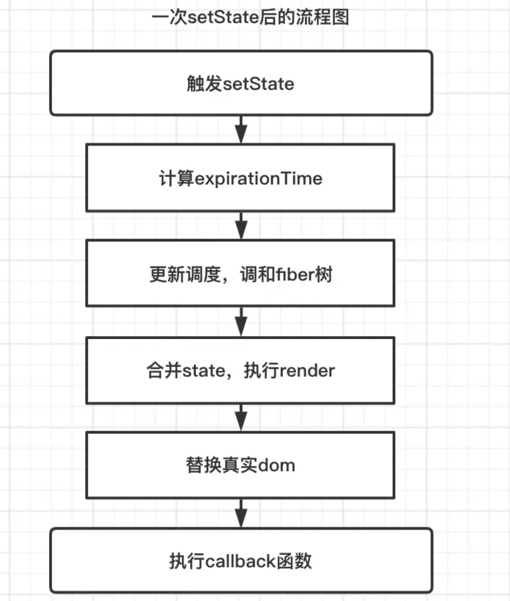


#### 5-4、setState 与 useState 的异同

**相同点：**

- 首先从原理角度出发，setState和 useState 更新视图，底层都调用了 scheduleUpdateOnFiber 方法，而且事件驱动情况下都有批量更新规则。

**不同点**

- 在不是 pureComponent 组件模式下， setState 不会浅比较两次 state 的值，只要调用 setState，在没有其他优化手段的前提下，就会执行更新。但是 useState 中的 dispatchAction 会默认比较两次 state 是否相同，然后决定是否更新组件。
- setState 有专门监听 state 变化的回调函数 callback，可以获取最新state；但是在函数组件中，只能通过 useEffect 来执行 state 变化引起的副作用。
- setState 在底层处理逻辑上主要是和老 state 进行合并处理，而 useState 更倾向于重新赋值。


### 6、事件绑定

1. 直接在 jsx 渲染的标签对象上进行绑定，需要写成驼峰式；onclick ==> onClick
2. 事件处理函数内部如果需要访问 this，需要通过 bind 进行绑定，或者使用箭头函数
3. 传参：1、通过 bind(this, arg1, arg2, ...) 2、通过包一层箭头函数 onClick={() => {this.handleLog(arg1,arg2)}}

**为什么获取不到 this 问题：**

```js
const obj = {
    name: 'jack',
    fn: function() {
        console.log(this)
    }
}

obj.fn() // 此时的 this 指向 obj

const fn = obj.fn
fn() // 此时的 this 指向 undefind


// 在 react 的事件中同理
class ClassComponent extends Component {

  handleLog() {
    console.log(this); // 打印出来的 this 是 undefined
  }

  render() {
    return (
      <div>
        <h1 onClick={this.handleLog}>点击</h1>
      </div>
    )
  }
}
```


#### 6-1、绑定事件

1. 需要通过 bind 进行绑定

   ```js
   class ClassComponent extends Component {
     constructor(props) {
       super(props);
       this.state = { date: new Date() };
     }
   
     handleLog() {
       console.log(this.state.date);
     }
   
     render() {
       return (
         <div>
           <h1 onClick={this.handleLog.bind(this)}>handleLog</h1>
           <div>{this.state.date.toLocaleTimeString()}</div>
         </div>
       );
     }
   }
   ```

   但是上面那种在 jsx 中绑定可能存在**多次绑定 this**，例如多个点击事件都需要使用**同一个事件处理函数**，这样会造成一定的性能损耗。每一次调用的时候都会生成一个新的方法实例，因此对性能有影响，并且当这个函数作为属性值传入低阶组件的时候，这些组件可能会进行额外的重新渲染，因为每一次都是新的方法实例作为的新的属性传递

   

   **改版：**在 class 类执行 constructor 构造器的时候绑定，这样只需要绑定一次，因为构造器只会执行一次

   ```js
   class ClassComponent extends Component {
     constructor(props) {
       super(props);
       this.state = { date: new Date() };
   
       this.handleLog = this.handleLog.bind(this);
     }
   
     handleLog() {
       console.log(this.state.date);
     }
   
     render() {
       return (
         <div>
           <h1 onClick={this.handleLog}>handleLog</h1>
           <div>{this.state.date.toLocaleTimeString()}</div>
         </div>
       );
     }
   }
   ```

2. 通过包一层箭头函数（如果需要传参数，推荐这种，既能传参，又能获取事件对象）；**缺点：**每一次调用的时候都会生成一个新的方法实例，因此对性能有影响，并且当这个函数作为属性值传入低阶组件的时候，这些组件可能会进行额外的重新渲染，因为每一次都是新的方法实例作为的新的属性传递

   ```js
   class ClassComponent extends Component {
     constructor(props) {
       super(props);
       this.state = { date: new Date() };
     }
   
     handleLog() {
       console.log(this.state.date);
     }
   
     render() {
       return (
         <div>
           {/* 这里面为 this.handleLog() 区别于 bind 的 this.handleLog */}
           <h1 onClick={() => {this.handleLog()}}>handleLog</h1>
           <div>{this.state.date.toLocaleTimeString()}</div>
         </div>
       );
     }
   }
   ```
   
   > 为什么这种的 this 也能访问到当前组件？
   >
   > 1. 首先，() => {} 这是一个箭头函数，不绑定 this
   >
   > 2. () => {this.handleLog()} 此时的 this 就是当前组件，那么就可以认为 `组件.handleLog()`，所以 this 指向组件
   
3. 方法名为箭头函数（不需要传参数，推荐这种）

   ```js
   class ClassComponent extends Component {
     constructor(props) {
       super(props);
       this.state = { date: new Date() };
     }
   
     handleLog = () => {
       console.log(this.state.date);
     };
   
     render() {
       return (
         <div>
           <button onClick={this.handleLog}>方法名为箭头函数绑定事件</button>
         </div>
       );
     }
   }
   ```

   > 因为箭头函数永远不会绑定 this，所以箭头函数内部没有 this；但是会去外层去找 this

   但这种在被循环创建的元素绑定会报错，例如：

   ```js
   class ImmutableCom extends Component {
     constructor(props) {
       super();
   
       this.state = {
         dataList: [
           { id: '1', name: 'jack', age: 20 },
           { id: '2', name: 'mark', age: 21 },
           { id: '3', name: 'lucy', age: 22 }
         ]
       }
     }
   
     addAge = (index) =>　{
       const newList = [...this.state.dataList];
       newList[index].age += 1;
       this.setState({
         dataList: newList
       });
     }
   
     render() {
       return (
         <div>
           {
             this.state.dataList.map((item, index) => (
               <div key={item.id}>
                 <span>姓名：{item.name}</span> ==== 
                 <span>年龄：{item.age}</span> ====
                 <button onClick={this.addAge}>+1</button>
               </div>
             ))
           }
         </div>
       );
     }
   }
   ```


#### 6-2、传参

1. 通过 bind(this, arg1, arg2, ...)

   ```js
   class ClassComponent extends Component {
     constructor(props) {
       super(props);
       this.state = { date: new Date() };
     }
   
     handleLog(arg1, arg2) {
       console.log(this.state.date, arg1, arg2);
     }
   
     render() {
       return (
         <div>
           <h1 onClick={this.handleLog.bind(this, 'arg1', 'arg2')}>{this.props.title}</h1>
           <div>{this.state.date.toLocaleTimeString()}</div>
         </div>
       );
     }
   }
   ```

   > 注意，此时通过构造器 constructor 绑定 this 传参不能用，因为在 constructor 绑定 this，使用 this.xxx(arg1) 会直接执行
   
2. 通过包一层箭头函数（推荐，既能传参，又能获取事件对象）

   ```js
   class ClassComponent extends Component {
     constructor(props) {
       super(props);
       this.state = { date: new Date() };
     }
   
     handleLog(arg1, arg2) {
       console.log(this.state.date, arg1, arg2);
     }
   
     render() {
       return (
         <div>
           <h1 onClick={(e) => this.handleLog(e, 'arg1', 'arg2')}>{this.props.title}</h1>
           <div>{this.state.date.toLocaleTimeString()}</div>
         </div>
       );
     }
   }
   ```


#### 6-3、为什么 react 的事件是合成事件

因为 react 不仅仅是只跑在浏览器中，还有 react-native；如果写死为浏览器原生事件，那么就需要分开浏览器和手机客户端分别写两套。而使用合成事件，则可以当跑在浏览器，就合成 dom 事件，跑在手机端，则合成手机app 事件。


### 7、组件通讯


#### 7-1、父传子

通过 props 进行传值

```js
// 子组件
import React, { Component } from 'react';

class Child extends Component {
  constructor(props) {
    super(props);
    this.state = {};
  }
  render() {
    const { txt } = this.props;

    return (
      <div>
        <h2>子组件</h2>
        <p>{txt}</p>
      </div>
    );
  }
}

// 父组件
import React, { Component } from 'react';
import Child from './Child';

class Parent extends Component {
  constructor(props) {
    super(props);
    this.state = {};
  }
  render() {
    return (
      <div>
        <h2>父子组件传值</h2>
        <Child txt="传过来的值" />
      </div>
    );
  }
}
```


#### 7-2、子传父

也是通过 props，只是让父组件给子组件传递一个回调函数，子组件调用回调函数即可。区别于 vue 使用自定义事件

```js
// 子组件
class Child extends Component {
  constructor(props) {
    super(props);
    this.state = {};
  }

  render() {
    const { txt, addCount } = this.props;

    return (
      <div>
        <h2>子组件</h2>
        <p>{txt}</p>
        {/*传递一个值，也可以不传，e 是事件*/}
        <button onClick={(e) => addCount(e, 'jack')}>加+</button>
      </div>
    );
  }
}

// 父组件
class Parent extends Component {
  constructor(props) {
    super(props);
  }

  addCount(name) {
    console.log(name);
  }

  render() {
    return (
      <div>
        <h2>父子组件传值</h2>
        {/* 这里也要对 this 做处理*/}
        <Child txt="传过来的值" addCount={(e, name) => this.addCount(name)} />
      </div>
    );
  }
}

export default Parent;
```


#### 7-3、跨组件数据共享（Context）

对于跨组件之间的通信，如果用 props 一层一层去传递，那是非常麻烦的。在 react 中提供了 Context 进行跨组价的数据传递。


**React.createContext：创建一个 Context**

```js
const MyContext = React.createContext(defaultValue);
```

创建一个需要共享的 Context

- 如果一个组件订阅了 Context，那么这个组件会从离自身最近的那个匹配的  `Provider`  中读取到当前的 context 值
- defaultValue：默认值，组件在顶层查找过程中没有找到对应的`Provider`，就会使用 defaultValue 这个默认值


**Context.Provider**

```js
<MyContext.Provider value={/* 某个值 */}>
```

每个 Context 对象都会返回一个 Provider React 组件，它允许消费组件订阅 context 的变化：

- Provider 接收一个 `value` 属性，传递给消费组件
- 一个 Provider 可以和多个消费组件有对应关系
- 多个 Provider 也可以嵌套使用，里层的会覆盖外层的数据

当 Provider 的 `value` 值发生变化时，它内部的所有消费组件都会重新渲染


**Class.contextType**

```js
class MyClass extends Component {
  static contextType = MyContext;
}

// 或者在外部
MyClass.contextType = MyContext;
```

挂载在 class 上的 `contextType` 属性**会被重赋值**为一个由 `React.createContext()` 创建的 Context 对象：

- 使得可以使用 `this.context` 来访问最近 Context 上的那个值
- 可以在任何生命周期中访问到它，包括 render 函数中


**Context.Consumer**

这个主要是在函数组件中使用，但是函数组件更加推荐使用 useContext 这个 hook 

```js
import React, { Component, createContext } from 'react';

const MyContext = createContext({title: '标题'});

function FunHead() {
  return (
    <MyContext.Consumer>
      {
        value => {
          return <h1>{value.title}</h1>
        }
      }
    </MyContext.Consumer>
  );
}

class Top extends Component {
  render() {
    return (
      <div>
        <FunHead />
      </div>
    );
  }
}

export default class ContextCom extends Component {
  render() {
    return (
      <div>
        <MyContext.Provider value={{title: '首页'}}>
          <Top />
        </MyContext.Provider>
      </div>
    );
  }
}
```


**使用：**

```js
import React, { Component, createContext } from 'react';

const MyContext = createContext({title: '标题'});

class Head extends Component {
  // 将 MyContext 赋值给 contextType【contentType 是 react 组件内部具有的属性】
  // 这样后面就可以通过 this.context 获取
  static contextType = MyContext;

  render() {
    return <h1>{this.context.title}</h1>
  }
}

class Top extends Component {
  render() {
    return <div><Head /></div>
  }
}

export default class ContextCom extends Component {
  render() {
    return (
      <div>
        <MyContext.Provider value={{title: '首页'}}>
          <Top />
        </MyContext.Provider>
      </div>
    );
  }
}
```

> 更复杂的数据共享应该使用 redux


#### 7-4、跨组件事件共享（eventbus）

Context 实现的是数据的跨组件共享，而需要实现事件的跨组件共享，需要依赖 `events` 这个第三方库。

```js
npm i events
```

`events` 常用的 api

- `new EventEmitter()`：创建一个 eventBus 对象
- `eventBus.emit("事件名称", 参数列表)`：发布一事件
- `eventBus.addListener("事件名称", 监听函数)`：监听一事件
- `eventBus.removeListener("事件名称", 监听函数)`：移除一事件

使用：

```js
import React, { Component } from 'react';
import { EventEmitter } from 'events';

const eventBus = new EventEmitter();

class Head extends Component {
  handleClick() {
    eventBus.emit('handleEvent', 'jack', 18)
  };

  render() {
    return (
      <div>
        <button onClick={this.handleClick}>events跨组件</button>
      </div>
    )
  };
}

class Top extends Component {
  render() {
    return <div><Head /></div>
  }
}

export default class EventsCom extends Component {
  componentDidMount() {
    eventBus.addListener("handleEvent", this.headleClick)
  };

  headleClick(name, age) {
    console.log(name, age);
  };

  componentWillUnmount() {
    eventBus.removeListener("handleEvent", this.headleClick);
  };

  render() {
    return (
      <div>
        <Top />
      </div>
    );
  }
}
```


### 8、生命周期

react16.3 之前和之后的生命周期有所区别。


#### 8-1、react16.3 之前的生命周期

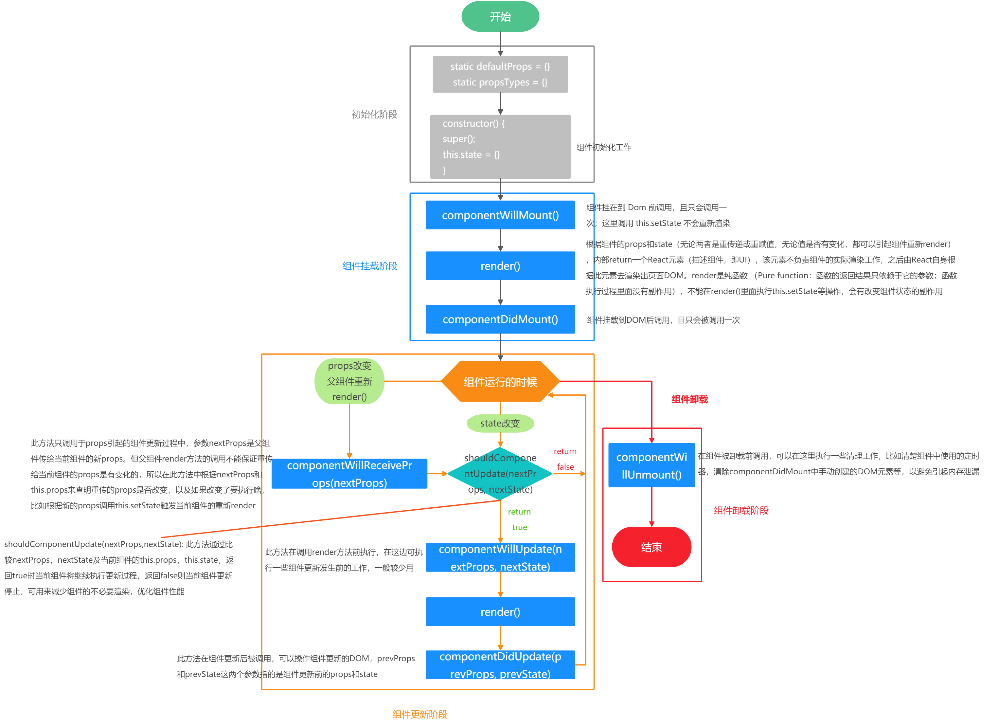


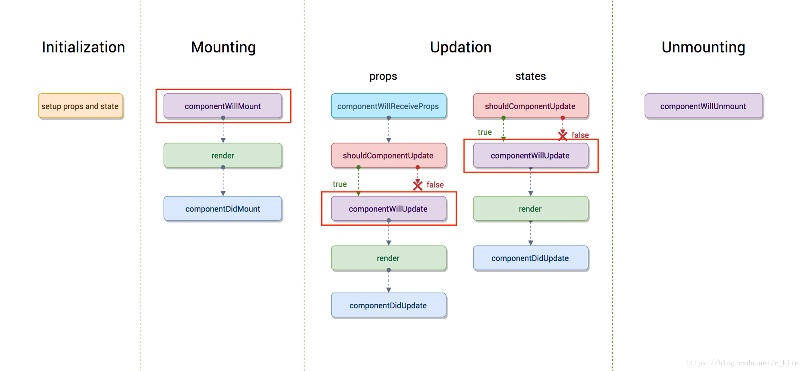

**1、组件初始化阶段（Initialization）**

```js
import React, { Component } from 'react';

class Xxxx extends Component {
  constructor(props) {
    super(props);
    this.state = { name: 'mark' };
  }
}
```

类继承于 React.Component，所以才有 render()，生命周期等方法可以使用，这也说明为什么函数组件不能使用这些方法的原因。但 react hook 出来后，函数组件也支持

super(props) 用来调用基类的构造方法 constructor(), 也将父组件的 props 注入给子组件，供子组件读取 (组件中 props 属性只读不可写，state 可写) 。 而 constructor() 用来做一些组件的初始化工作，比如定义 this.state 的初始内容，或者绑定事件 this【 bind(this) 】

> 如果不初始化 State 或者


**2、组件挂载阶段（Mounting）**

挂载阶段主要是 componentWillMount、render、componentDidMount 这三个生命周期

- componentWillMount：在组件挂载到 DOM 前调用，且只会被调用一次，在这里面调用 this.setState 不会引起组件的重新渲染，也可以把写在这里面的内容改写到 constructor() 中，所以在项目中很少这么使用。

- render：根据组件的 props 和 state（无论两者是重传递或重赋值，无论值是否有变化，都会引起组件重新 render） ，内部 return 一个 React 元素（描述组件，即 UI），该元素不负责组件的实际渲染工作，之后由 React 自身根据此元素去渲染出页面 DOM。render 是纯函数 （Pure function：函数的返回结果只依赖于它的参数；函数执行过程里面没有副作用），不能在 render()里面执行 this.setState 等操作，会有改变组件状态的副作用。

- componentDidMount：组件挂载到 DOM 后调用，且只会被调用一次。这个阶段一般可做：1、依赖 DOM 的操作；2、发送网络请求（官方推荐）；3、添加订阅（需要在 componentWillUnmount 中取消订阅，避免内存泄露）


**3、组件更新阶段（Update）**

更新阶段主要是 state 和 props 的更新。props 更新在 shouldComponentUpdate(nextProps,nextState) 之前比 state 多了 componentWillReceiveProps(nextProps)，其他的一样

- componentWillReceiveProps(nextProps)：此方法只调用于 props 引起的组件更新过程中，参数 nextProps 是父组件传给当前组件的新 props。但父组件 render 方法的调用不能保证重传给当前组件的 props 是有变化的，所以在此方法中根据 nextProps 和 this.props 来查明重传的 props 是否改变，以及如果改变了要执行啥，比如根据新的 props 调用 this.setState 触发当前组件的重新 render

- shouldComponentUpdate(nextProps,nextState)：此方法通过比较 nextProps，nextState 及当前组件的 this.props，this.state，返回 true 表示组件需要重新渲染，返回 false 表示组件不需要重新渲染，以此可用来减少组件的不必要渲染，优化组件性能

- componentWillUpdate(nextProps, nextState)：此方法在调用 render 方法前执行，在这边可执行一些组件更新发生前的工作，一般较少用

- render：render 只是重新调用

- componentDidUpdate(prevProps, prevState)：此方法在组件更新后被调用，可以操作组件更新的 DOM，prevProps 和 prevState 这两个参数指的是组件更新前的 props 和 state


**需要注意的是 react 组件的更新机制**：setState 引起的 state 更新，或父组件重新 render 引起的 props 更新，更新后的 state 和 props 相比较之前的结果，无论是否有变化，都将引起子组件的重新 render。造成组件更新有两类（三种）情况

1. 父组件重新 render 引起子组件重新 render 的情况有两种

   ```js
   每当父组件重新 render 导致的重传的 props，子组件都将直接跟着重新渲染，无论 props 是否有变化。可通过 shouldComponentUpdate 方法控制优化
   
   class Child extends Component {
      // 应该使用这个方法，否则无论 props 是否有变化都将会导致组件跟着重新渲染
      shouldComponentUpdate(nextProps){
          if(nextProps.someThings === this.props.someThings){
              return false
          }
      }
      render() {
          return <div>{this.props.someThings}</div>
      }
   }
   ```

2. 在 componentWillReceiveProps 方法中，将 props 转换成自己的 state

   ```js
   class Child extends Component {
      constructor(props) {
          super(props);
          this.state = {
              someThings: props.someThings
          };
      }
      componentWillReceiveProps(nextProps) {
          // 父组件重传 props 时就会调用这个方法
          this.setState({someThings: nextProps.someThings});
      }
      render() {
          return <div>{this.state.someThings}</div>
      }
   }

   根据官网的描述: 在 componentWillReceiveProps 方法中，将 props 转换成自己的 state
   是因为 componentWillReceiveProps 中判断 props 是否变化了，若变化了，this.setState 将引起    state 变化，从而引起render，此时就没必要再做第二次因重传 props 来引起 render了，不然就重复做一样的渲染了
   ```

3. 组件本身调用 setState，无论 state 有没有变化。可以通过 shouldComponentUpdate 方法控制优化

   ```js
   class Child extends Component {
     // 应该使用这个方法，否则无论 props 是否有变化都将会导致组件跟着重新渲染
     shouldComponentUpdate(nextProps, nextState) {
       if (nextState.someThings === this.state.someThings) {
         return false;
       }
     }
     render() {
       return <div>{this.props.someThings}</div>;
     }
   }
   ```


**4、组件卸载阶段（Unmount）**

- componentWillUnmount：此方法在组件被卸载前调用，可以在这里执行一些清理工作，比如清楚组件中使用的定时器，清除 componentDidMount 中手动创建的 DOM 元素、订阅事件等，以避免引起内存泄漏。此阶段不能调用 setState，因为组件永远不会重新渲染

> 对于类组件来说，最重要的几个生命周期是：constructor、render、componentDidMount、componentDidUpdate、componentWillUnmount。其他的是一些不常用或者用来优化的或者即将废弃的。


#### 8-2、react16.4 之后的生命周期

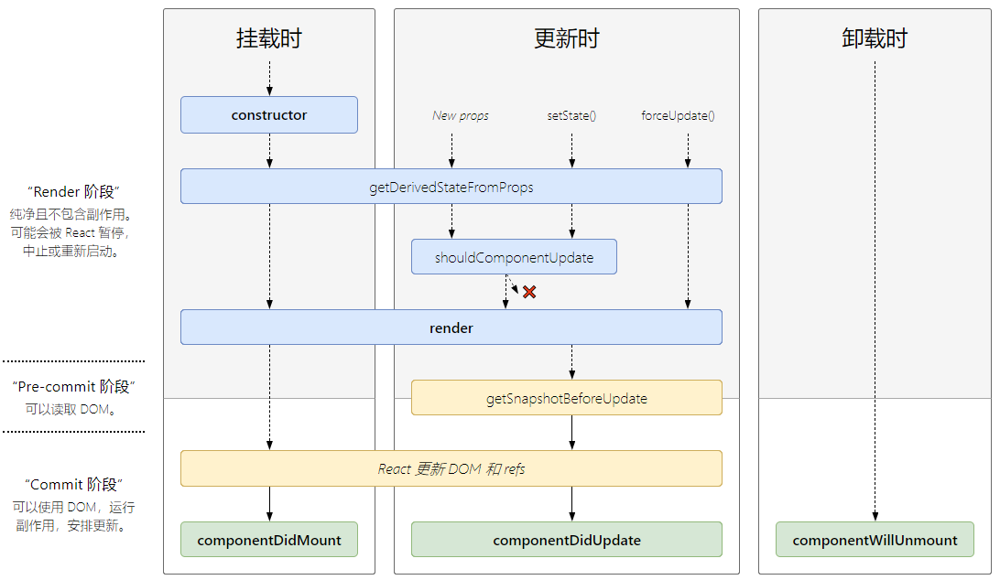

原来（React v16.3 前）的生命周期在 React v16.4 推出的 Fiber 之后就不合适了，因为如果要开启 async rendering，在 render 函数之前的所有函数，都有可能被执行多次

在 render 前执行的生命周期有:

- componentWillMount
- componentWillReceiveProps
- shouldComponentUpdate
- componentWillUpdate

如果开发者开了 async rendering，而且又在以上这些 render 前执行的生命周期方法做 AJAX 请求的话，那 AJAX 将被无谓地多次调用。明显不是我们期望的结果。而且在 componentWillMount 里发起 AJAX，不管多快得到结果也赶不上首次 render，而且 componentWillMount 在服务器端渲染也会被调用到（当然，也许这是预期的结果），这样的 IO 操作放在 componentDidMount 里更合适

禁止不能用比劝导开发者不要这样用的效果更好，所以除了 shouldComponentUpdate，其他在 render 函数之前的所有函数（componentWillMount，componentWillReceiveProps，componentWillUpdate）都可以被 getDerivedStateFromProps 替代

也就是用一个静态函数 getDerivedStateFromProps 来取代被不建议使用的几个生命周期函数，就是强制开发者在 render 之前只做无副作用的操作，而且能做的操作局限在，根据 props 和 state 决定新的 state

> v17 之后可能会废弃的三个生命周期，目前使用的时候加上 UNSAFE\_；后续这三个会用 getDerivedStateFromProps 替代
>
> - componentWillMount
> - componentWillReceiveProps
> - componentWillUpdate


#### 8-3、新引入的两个生命周期

- static getDerivedStateFromProps
- getSnapshotBeforeUpdate

**1、getDerivedStateFromProps**

```js
static getDerivedStateFromProps(nextProps, preState)
```

- `nextProps`: 即将接收的新的属性。
- `prevState`: 组件之前的状态。

> static getDerivedStateFromProps(nextProps, preState) 在组件初始化和更新时的 render 方法之前调用，父组件传入的 newProps 和当前组件的 prevState 进行比较，判断是否需要更新 state，返回值为对象用作更新 state，如果不需要则返回 null。不管什么原因，都会在每次 render 之前触发这个方法。与 componentWillReceiveProps 形成对比，componentWillReceiveProps 仅仅在父组件重新渲染时触发，而在调用 setState 时不触发

```js
class App extends Component {
  constructor(props) {
    super(props);
    this.state = {
      count: 0
    };
  }
  static getDerivedStateFromProps(nextProps, prevState) {
    // getDerivedStateFromProps 在 render 之前调用
    // 无论是初始化还是后续更新都会被调用
    // 应该返回一个对象来更新 state，如果返回 null，则不更新任何内容
    const { count } = prevState;
    console.log('getDerivedStateFromProps：', count);
    return count < 5 ? null : { count: 0 }; 
  }
  render() {
    return <div>22</div>;
  }
}
```

**2、getSnapshotBeforeUpdate**

```js
getSnapshotBeforeUpdate(prevProps, prevState);
```

> getSnapshotBeforeUpdate() 被调用于 render 之后，在 componentDidUpdate 之前。适用场景是可以读取但无法使用 DOM 的时候。它使组件可以在更改之前从 DOM 捕获一些信息（例如滚动位置）。此生命周期返回的任何值都将作为参数传递给 componentDidUpdate() (基本用处不大)

```js
class ScrollingList extends Component {
  constructor(props) {
    super(props);
    this.listRef = React.createRef();
  }
  getSnapshotBeforeUpdate(prevProps, prevState) {
    //我们是否要添加新的 items 到列表?
    // 捕捉滚动位置，以便我们可以稍后调整滚动.
    if (prevProps.list.length < this.props.list.length) {
      const list = this.listRef.current;
      return list.scrollHeight - list.scrollTop;
    }
    return null;
  }
  componentDidUpdate(prevProps, prevState, snapshot) {
    //如果我们有snapshot值, 我们已经添加了 新的items.
    // 调整滚动以至于这些新的items 不会将旧items推出视图。
    // (这边的snapshot是 getSnapshotBeforeUpdate方法的返回值)
    if (snapshot !== null) {
      const list = this.listRef.current;
      list.scrollTop = list.scrollHeight - snapshot;
    }
  }
  render() {
    return <div ref={this.listRef}>{/* ...contents... */}</div>;
  }
}
```


三个阶段生命周期+无状态组件总览图：

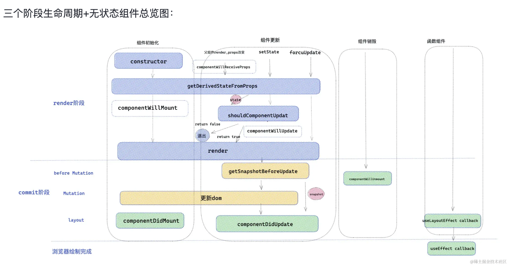


#### 8-4、React 各阶段生命周期能做些什么

#####8-4-1、constructor

constructor 在类组件创建实例时调用，而且初始化的时候执行一次，所以可以在 constructor 做一些初始化的工作。比如：

- 初始化 state ，比如可以用来截取路由中的参数，赋值给 state 。
- 对类组件的事件做一些处理，比如绑定 this 、节流、防抖等。
- 对类组件进行一些必要生命周期的劫持、渲染劫持，这个功能更适合反向继承的HOC ，在 HOC 环节，会详细讲解反向继承这种模式。

```jsx
constructor(props){
    super(props)        // 执行 super ，别忘了传递props,才能在接下来的上下文中，获取到props。
    this.state = {       //① 可以用来初始化state，比如可以用来获取路由中的
      name:'alien'
    }

    this.handleClick = this.handleClick.bind(this) /* ② 绑定 this */

    this.handleInputChange = debounce(this.handleInputChange , 500) /* ③ 绑定防抖函数，防抖 500 毫秒 */

    const _render = this.render

    this.render = function(){
      return _render.bind(this)  /* ④ 劫持修改类组件上的一些生命周期 */
    }
}

/* 点击事件 */
handleClick(){ /* ... */ }

/* 表单输入 */
handleInputChange(){ /* ... */ }
```


##### 8-4-2、getDerivedStateFromProps

只要组件更新，就会执行 `getDerivedStateFromProps`，不管是 props 改变，还是 setState ，或是 forceUpdate 。

在初始化和更新阶段，接受父组件的 props 数据， 可以对 props 进行格式化，过滤等操作，返回值将作为新的 state 合并到 state 中，供给视图渲染层消费。

```jsx
static getDerivedStateFromProps(newProps){
    const { type } = newProps
    switch(type){
      case 'fruit' : 
        return { list:['苹果','香蕉','葡萄' ] } /* ① 接受 props 变化 ， 返回值将作为新的 state ，用于 渲染 或 传递给s houldComponentUpdate */
      case 'vegetables':
        return { list:['菠菜','西红柿','土豆']}
    }
}
render(){
    return <div>{ this.state.list.map((item)=><li key={item} >{ item  }</li>) }</div>
}
```


##### 8-4-3、componentWillMount

componentWillMount 的作用还是做一些初始化操作


##### 8-4-3、componentWillReceiveProps

componentWillReceiveProps 函数的执行是在更新组件阶段，该生命周期执行驱动是因为父组件更新带来的 props 修改，但是只要父组件触发 render 函数，调用 React.createElement 方法，那么 props 就会被重新创建，生命周期 componentWillReceiveProps 就会执行了

- componentWillReceiveProps 可以用来监听父组件是否执行 render 。
- componentWillReceiveProps 可以用来接受 props 改变，组件可以根据props改变，来决定是否更新 state ，因为可以访问到 this ， 所以可以在异步成功回调(接口请求数据)改变 state 。这个是 getDerivedStateFromProps 不能实现的。


> 问题：当 props 不变的前提下， PureComponent 组件能否阻止 componentWillReceiveProps 执行？
>
> 
>
> 答案：答案是否定的，PureComponent 是在 componentWillReceiveProps 执行之后浅比较 props 是否发生变化


##### 8-4-5、componentWillUpdate

componentWillUpdate 可以意味着在更新之前，此时的 DOM 还没有更新。在这里可以做一些获取 DOM 的操作。就比如说在一次更新中，保存 DOM 之前的信息(记录上一次位置)、获取 DOM 元素位置等。

但是 React 已经出了新的生命周期 getSnapshotBeforeUpdate 来代替 componentWillUpdate。


##### 8-4-6、render

render 函数，就是 jsx 的各个元素被 React.createElement 创建成 React element 对象的形式。一次 render 的过程，就是创建 React.element 元素的过程。

那么可以在render里面做一些,**createElement创建元素** , **cloneElement 克隆元素** ，**React.children 遍历 children** 的操作。


##### 8-4-7、getSnapshotBeforeUpdate

**获取更新前的快照**，可以进一步理解为 获取更新前 DOM 的状态。该生命周期是在 commit 阶段的before Mutation ( DOM 修改前)，此时 DOM 还没有更新，但是在接下来的 Mutation 阶段会被替换成真实 DOM 。此时是获取 DOM 信息的最佳时期，getSnapshotBeforeUpdate 将返回一个值作为一个`snapShot`(快照)，传递给 componentDidUpdate作为第三个参数。

作用：

- getSnapshotBeforeUpdate 这个生命周期意义就是配合componentDidUpdate 一起使用，计算形成一个 snapShot 传递给 componentDidUpdate 。保存一次更新前的信息。

```jsx
getSnapshotBeforeUpdate(prevProps,preState){
    const style = getComputedStyle(this.node) 
    return { /* 传递更新前的元素位置 */
        cx:style.cx,
        cy:style.cy
    }
}
componentDidUpdate(prevProps, prevState, snapshot){
    /* 获取元素绘制之前的位置 */
    console.log(snapshot)
}
```

> 注意：getSnapshotBeforeUpdate 如果没有返回值会给予警告⚠️，如果没有 `componentDidUpdate`也会给予警告。


##### 8-4-8、componentDidUpdate

作用

- componentDidUpdate 生命周期执行，此时 DOM 已经更新，可以直接获取 DOM 最新状态。这个函数里面如果想要使用 setState ，一定要加以限制，否则会引起无限循环。
- 接受 getSnapshotBeforeUpdate 保存的快照信息。


##### 8-4-9、componentDidMount

componentDidMount 生命周期执行时机和 componentDidUpdate 一样，一个是在**初始化**，一个是**组件更新**。此时 DOM 已经创建完，既然 DOM 已经创建挂载，就可以做一些基于 DOM 操作，DOM 事件监听器。

作用：

- 可以做一些关于 DOM 操作，比如基于 DOM 的事件监听器。
- 对于初始化向服务器请求数据，渲染视图，这个生命周期也是蛮合适的。


##### 8-4-10、shouldComponentUpdate

shouldComponentUpdate 三个参数，第一个参数新的 props ，第二个参数新的 state ，第三个参数新的 context。

这个生命周期，一般用于性能优化，shouldComponentUpdate 返回值决定是否重新渲染的类组件。需要重点关注的是第二个参数 newState ，如果有 getDerivedStateFromProps 生命周期 ，它的返回值将合并到 newState ，供 shouldComponentUpdate 使用。


##### 8-4-11、componentWillUnmount

componentWillUnmount 是组件销毁阶段唯一执行的生命周期，主要做一些收尾工作，比如清除一些可能造成内存泄漏的定时器，延时器，或者是一些事件监听器。

作用

- 清除延时器，定时器。
- 一些基于 DOM 的操作，比如事件监听器。


### 9、React 中的 Dom 操作


#### 9-1、通过 ref 获取 Dom，然后通过 this.refs.xxx 操作

```js
import React, { PureComponent } from 'react';

export default class DomCom extends PureComponent {
  constructor(props) {
    super();
  }

  refOnClick = () => {
    this.refs.refone.innerHTML = 'this.refs.xxx 执行'
  }

  render() {
    return (
      <div>
        <button ref="refone" onClick={this.refOnClick}>通过 this.refs.xxx</button>
      </div>
    );
  }
}
```

> 不要在 render 或者 render 之前访问 refs


#### 9-2、通过`React.createRef()`

- 对象是通过 `React.createRef()` 方式创建出来的
- 使用时获取到创建的对象其中有一个`current`属性就是对应的元素

```js
import React, { PureComponent, createRef } from 'react';

export default class DomCom extends PureComponent {
  constructor(props) {
    super();

    this.reftwo = createRef()
  }

  refTwoClick = () => {
    this.reftwo.current.innerHTML = 'createRef()执行'
  }

  render() {
    return (
      <div>
        <button ref={this.reftwo} onClick={this.refTwoClick}>通过 React.createRef</button>
      </div>
    );
  }
}
```


#### 9-3、通过传入函数的方式

该函数会在DOM被挂载时进行回调，这个函数会传入一个 元素对象，可以保存。使用时，直接拿到之前保存的元素对象即可

```js
import React, { PureComponent } from 'react';

export default class DomCom extends PureComponent {
  constructor(props) {
    super();

    this.refthree = null;
  }


  refThreeClick = () => {
    this.refthree.innerHTML = '传入一个函数 执行';
  }

  render() {
    return (
      <div>
        <button ref={e => this.refthree = e} onClick={this.refThreeClick}>通过传入一个函数</button>
      </div>
    );
  }
}
```


#### 9-4、函数式组件获取 Dom

**函数式组件没有实例**，无法通过ref获取他们的实例。可以通过  hooks 中的 `useRef`

```js
import React, { PureComponent, createRef, useRef } from 'react';

function UseRefFun() {
  const funRef = useRef(null);

  const funRefClick = () => {
    funRef.current.innerHTML = 'useRef执行';
  }

  return (
    <div>
      <button ref={funRef} onClick={funRefClick}>useRef</button>
    </div>
  )
}
```


#### 9-5、ref 在组件身上

```js
import React, { PureComponent, createRef } from 'react';

class CountCom extends PureComponent {
  constructor(props) {
    super();
    this.state = {
      count: 0
    }
  }

  handleAdd = () => {
    this.setState({
      count: this.state.count + 1
    })
  }

  render() {
    return (
      <div>
        <h3>{count}</h3>
      </div>
    );
  }
}

export default class DomCom extends PureComponent {
  constructor(props) {
    super();

    this.refFour = createRef();
  }


  handleCountAdd = () =>　{
    this.refFour.current.handleAdd();
  }

  render() {
    return (
      <div>
        <CountCom ref={refFour} />
        <button onClick={this.handleCountAdd}>addCount</button>
      </div>
    );
  }
}
```

> ref 在类组件上，获取的是当前的组件实例。


如果是在函数式组件上使用，需要包裹在 forwardRef 中：

```jsx
import React, { PureComponent, createRef, forwardRef } from 'react';

const CountCom = forwardRef(function(props, ref) {
  return (
  	<div ref={ref}>
      <h3>{count}</h3>
    </div>
  )
})

export default class DomCom extends PureComponent {
  constructor(props) {
    super();

    this.refFour = createRef();
  }


  handleCountAdd = () =>　{
    this.refFour.current.handleAdd();
  }

  render() {
    return (
      <div>
        <CountCom ref={refFour} />
        <button onClick={this.handleCountAdd}>addCount</button>
      </div>
    );
  }
}
```


### 10、React 常见的性能优化手段


#### 10-1、首先，需要了解 react 的更新机制

渲染流程：


更新流程：

React 在内存中维护一颗虚拟 DOM 树，当数据发生改变时（state & props），会自动的更新虚拟 DOM，获得一个新的虚拟 DOM 树，然后通过 Diff 算法，比较新旧虚拟 DOM 树，找出最小的有变化的部分，将这个变化的部分（Patch）加入队列，最终批量的更新这些 Patch 到实际的 DOM 中。

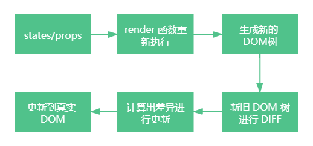

当 props 或者 state 发生改变，会调用 render 函数去生成新的 Dom 树，然后基于新旧两颗不同的树之间的差别来判断如何有效的更新视图。

如果一棵树参考另外一棵树进行完全递归比较更新，那么即使是最先进的算法，该算法的复杂程度为 O(n^3 )，其中 n 是树中元素的数量。一个最直观的例子：1000 个元素所需要执行的计算量将在十亿的量级范围。这样的对比开销过于昂贵，会导致性能抵消。

所以 react 进行了简化：

- 同层节点之间相互比较，不会跨节点进行比较
- 不同类型的节点，产生不同的树结构
- 可以通过key来指定哪些节点在不同的渲染下保持稳定

这样子的算法复杂度降低为 O(n)。


#### 10-2、简单了解 React 的 Diff 算法

- 当对比节点为不同的元素，React会拆卸原有的树，并且建立起新的树

- 当比对两个相同类型的 React 元素时，React 会保留 DOM 节点，仅比对及更新有改变的属性

- 当递归 DOM 节点的子元素时，React 会同时遍历两个子元素的列表。

  ```js
  <ul>
    <li>first</li>
    <li>second</li>
  </ul>
  ```

  当在后面插入一条元素，前面两个比较是完全相同的，所以直接在后面插入即可；但前面插入一条元素，首先发现第一个对不上，那么会删掉旧 dom 的第一个，创建一个新 dom 的第一个，后面的对不上也是如此。


#### 10-3、key 优化

如果只是往前面插入一条数据，其他元素不变，只是位置变了，那么都删掉重新创建显然不合理。React 首先会对新集合进行遍历，通过唯一 key 来判断老集合中是否存在相同的节点，如果没有则创建，如果有的，则判断是否需要进行移动操作。这就有效避免低效的销毁重建。所以对于列表之类的使用 key 是非常有必要的。

> 如果是在尾部追加数据， key 的意义不大；如果是在前面或者中间，那么 key 可以减少虚拟 dom 的创建和销毁，提高效率

使用 key 的注意事项

- key 应该是唯一的
- key 不要使用随机数（随机数在下一次render时，会重新生成一个数字）


#### 10-4、SCU的优化

在 react 中，**只要修改了父组件的数据，那么无论修改的数据有没有影响到子组件，子组件都会重新 render**

```js
import React, { Component } from 'react';

class TestScu extends Component {
  render() {
    console.log('TestScu进行了render');
    return <div>TestScu</div>
  }
}

class ScuCom extends Component {
  constructor() {
    super();
    this.state = {
      componentTitle: 'ScuCom'
    }
  }

  handleClick = () => {
    this.setState({
      componentTitle: '变化后的ScuCom'
    });
  }

  render() {
    console.log('ScuCom进行了render');
    return (
      <div>
        <p onClick={this.handleClick}>{this.state.componentTitle}</p>
        <TestScu />
      </div>
    );
  }
}

export default ScuCom;
```

事实上，很多的组件没有必须要重新 render；因此，react 提供了 `shouldComponentUpdate` 进行优化

shouldComponentUpdate(nextProps , nextState )

- 两个参数：nextProps 修改之后的 props 属性；nextState 修改之后的 state 属性
- 应该返回一个 boolean 类型：返回值为 true，那么就需要调用 render 方法；返回值为 false，那么不需要调用 render 方法。默认是 true。

使用 shouldComponentUpdate 优化

```js
import React, { Component } from 'react';

class TestScu extends Component {
  constructor(props) {
    super(props);
  }

  shouldComponentUpdate(nextProps, nextState) {
    return nextProps.title !== this.props.title;
  }

  render() {
    console.log('TestScu进行了render');
    return (
      <div>
        <h1>{this.props.title}</h1>
        TestScu
      </div>
    )
  }
}

class ScuCom extends Component {
  constructor() {
    super();
    this.state = {
      componentTitle: 'ScuCom',
      propTitle: '哈哈哈'
    }
  }

  handleClick = () => {
    this.setState({
      componentTitle: '变化后的ScuCom'
    });
  }

  handleClickTest = () => {
    this.setState({
      propTitle: '嘿嘿和'
    });
  }

  render() {
    console.log('ScuCom进行了render');
    return (
      <div>
        <p onClick={this.handleClick}>{this.state.componentTitle}</p>
        <p onClick={this.handleClickTest}>改变子组件props</p>
        <TestScu title={this.state.propTitle} />
      </div>
    );
  }
}
```


#### 10-5、PureComponent 和 memo

所有的类，都需要手动来实现 shouldComponentUpdate，那么会给开发者增加非常多的工作量。其实 react 有其更方便的实现方式。

**当是 class 组件，那么可以继承自 PureComponent** 

```js
import React, { Component, PureComponent } from 'react';

class TestScu extends PureComponent {
  constructor(props) {
    super();
  }

  render() {
    console.log('TestScu进行了render');
    return (
      <div>
        <h1>{this.props.title}</h1>
        TestScu
      </div>
    )
  }
}

class ScuCom extends Component {
  constructor() {
    super();
    this.state = {
      componentTitle: 'ScuCom',
      propTitle: '哈哈哈'
    }
  }

  handleClick = () => {
    this.setState({
      componentTitle: '变化后的ScuCom'
    });
  }

  handleClickTest = () => {
    this.setState({
      propTitle: '嘿嘿和'
    });
  }

  render() {
    console.log('ScuCom进行了render');
    return (
      <div>
        <p onClick={this.handleClick}>{this.state.componentTitle}</p>
        <p onClick={this.handleClickTest}>改变子组件props</p>
        <TestScu title={this.state.propTitle} />
      </div>
    );
  }
}
```

PureComponent 的原理：**对 props 和 state 进行浅层比较**

首先，在 react/ReactBaseClasses.js 中：在 PureComponent 的原型上增加一个 isPureReactComponent 为 true 的属性

```js
function Component(props, context, updater) {}

Component.prototype.isReactComponent = {};

Component.prototype.setState = function(partialState, callback) {};

Component.prototype.forceUpdate = function(callback) {
  this.updater.enqueueForceUpdate(this, callback, 'forceUpdate');
};

function ComponentDummy() {}
ComponentDummy.prototype = Component.prototype;

function PureComponent(props, context, updater) {}

const pureComponentPrototype = (PureComponent.prototype = new ComponentDummy());
pureComponentPrototype.constructor = PureComponent;
Object.assign(pureComponentPrototype, Component.prototype);

pureComponentPrototype.isPureReactComponent = true;

export {Component, PureComponent};
```

然后，在 React-reconcilier/ReactFiberClassComponent.js 中：会判断是使用了组件内部的 shouldComponentUpdate 还是使用了 PureComponent

```js
function checkShouldComponentUpdate() {
  const instance = workInProgress.stateNode;
  // 当组件内部实现了 shouldComponentUpdate
  if (typeof instance.shouldComponentUpdate === 'function') {
     ...
    startPhaseTimer(workInProgress, 'shouldComponentUpdate');
    const shouldUpdate = instance.shouldComponentUpdate(
      newProps,
      newState,
      nextContext,
    );
    stopPhaseTimer();
    ...
	// 返回 shouldUpdate 是 true 或者 false
    return shouldUpdate;
  }

  // 使用了 PureComponent
  if (ctor.prototype && ctor.prototype.isPureReactComponent) {
    return (
      !shallowEqual(oldProps, newProps) || !shallowEqual(oldState, newState)
    );
  }
  return true;
}
```

当使用了 PureComponent，会调用 shallowEqual(oldProps, newProps)  和 shallowEqual(oldState, newState) 进行 props 和 state 的浅层比较

在 shared/shallowEqual.js 中：

```js
function shallowEqual(objA: mixed, objB: mixed): boolean {
  // 判断两个对象是否是同一个对象
  if (is(objA, objB)) {
    return true;
  }
  
  // 不是对象或者是个 null
  if (
    typeof objA !== 'object' ||
    objA === null ||
    typeof objB !== 'object' ||
    objB === null
  ) {
    return false;
  }

  const keysA = Object.keys(objA);
  const keysB = Object.keys(objB);

  // 两个对象长度是否一样
  if (keysA.length !== keysB.length) {
    return false;
  }

  // 遍历比较 objA 的 key 是否在 objB 里面，并且对应的值是否一致，只比对第一层
  for (let i = 0; i < keysA.length; i++) {
    if (
      !hasOwnProperty.call(objB, keysA[i]) ||
      !is(objA[keysA[i]], objB[keysA[i]])
    ) {
      return false;
    }
  }

  return true;
}
```

> 在开发中，使用浅层比较就好；官网有说明使用深层比较是非常消耗性能的


**当是函数组件时，pureComponent 不适用，可以使用 memo**

```js
import React, { Component, memo } from 'react';

const MemoScu = memo(function(props) {
  console.log('MemoScu被render');
  return (
    <div>{props.title}</div>
  );
})

class ScuCom extends Component {
  constructor() {
    super();
    this.state = {
      componentTitle: 'ScuCom',
      propTitle: '哈哈哈',
      memoTitle: 'memo的标题'
    }
  }

  handleClick = () => {
    this.setState({
      componentTitle: '变化后的ScuCom'
    });
  }

  handleClickMemo = () => {
    this.setState({
      memoTitle: '变化后memo的标题'
    });
  }

  render() {
    console.log('ScuCom进行了render');
    return (
      <div>
        <p onClick={this.handleClick}>{this.state.componentTitle}</p>
        <p onClick={this.handleClickMemo}>改变子组件memo</p>
        <MemoScu title={this.state.memoTitle} />
      </div>
    );
  }
}
```

React.memo 的基本原理：

首先，在 react/memo.js 中：

```js
export default function memo<Props>(
  type: React$ElementType,
  compare?: (oldProps: Props, newProps: Props) => boolean,
) {
  if (__DEV__) {
    if (!isValidElementType(type)) {
      console.error(
        'memo: The first argument must be a component. Instead ' +
          'received: %s',
        type === null ? 'null' : typeof type,
      );
    }
  }
  // 返回一个对象，这个对象有一些标记属性，对象带有一些标志属性，在react Fiber的过程中会做相应的处理（react-reconciler/ReactFiberBeginWork.js）
  return {
    $$typeof: REACT_MEMO_TYPE,
    type,
    compare: compare === undefined ? null : compare,
  };
}
```

memo 函数返回的是一个对象，这个对象带有一些标志属性，在 react Fiber 的过程中会做相应的处理。

在 react-reconciler/ReactFiberBeginWork.js 中：

```js
if (updateExpirationTime < renderExpirationTime) {
    const prevProps = currentChild.memoizedProps;
    let compare = Component.compare;
    // 在 memo 中有没有传入 compare，没有就使用 shallowEqual 浅层比较
    // function memo<Props>(type: React$ElementType,compare?: (oldProps: Props, newProps: Props) => boolean,) {}
    compare = compare !== null ? compare : shallowEqual;
    if (compare(prevProps, nextProps) && current.ref === workInProgress.ref) {
      return bailoutOnAlreadyFinishedWork(
        current,
        workInProgress,
        renderExpirationTime,
      );
    }
```


#### 10-6、不可变数据

```js
import React, { Component } from 'react'

class ImmutableCom extends Component {
  constructor(props) {
    super();

    this.state = {
      dataList: [
        { id: '1', name: 'jack', age: 20 },
        { id: '2', name: 'mark', age: 21 },
        { id: '3', name: 'lucy', age: 22 }
      ]
    }
  }

  shouldComponentUpdate(nextProps, nextState) {
    return nextState.dataList !== this.state.dataList;
  }

  addPeople = () => {
    let id = String(+this.state.dataList[this.state.dataList.length-1].id + 1);
    /**
     * 一定不要这样子做，这样子做将导致 shouldComponentUpdate 或者 PureComponent 之类的有问题
     * 首先，shouldComponentUpdate、PureComponent 的比较依赖于 state 或者 props，而 this.state.dataList.push({id: id, name: `people${id}`, age: 20 + id}) 将导致 nextState 和 state 的 dataList 相同，那么将不会重新 render
     */
    // this.state.dataList.push({id: id, name: `people${id}`, age: 20 + id});
    // this.setState({
    //   dataList: this.state.dataList
    // })

    // 正确做法
    const newData = [...this.state.dataList, {id: id, name: `people${id}`, age: 20 + id}];
    this.setState({
      dataList: newData
    })
  }

  render() {
    return (
      <div>
        {
          this.state.dataList.map(item => (
            <div key={item.id}>
              姓名：<span>{item.name}</span> ==== 
              年龄：<span>{item.age}</span> ====
              <button>+1</button>
            </div>
          ))
        }
        <button onClick={this.addPeople}>添加一个</button>
      </div>
    );
  }
}
```

使用 setState 修改数据，例如修改一个对象，**不要直接去修改 state 中的对象**，而是把 state 中的对象复制一份再操作。原因： 在 js 中，复杂数据类型，数据存在堆中，栈中存的是对于堆的一个引用指针；当往 state 的 dataList 中 push 一条数据，即往存数据的对中 push 一条数据，但是指针是不变的。在 shouldComponentUpdate(nextProps, nextState) 中比较 `nextState.dataList !== this.state.dataList`,实际上着**两者的 dataList 都是存在栈中的指针**，那么 肯定是相等的，所以返回 false，就会导致不进行 render。

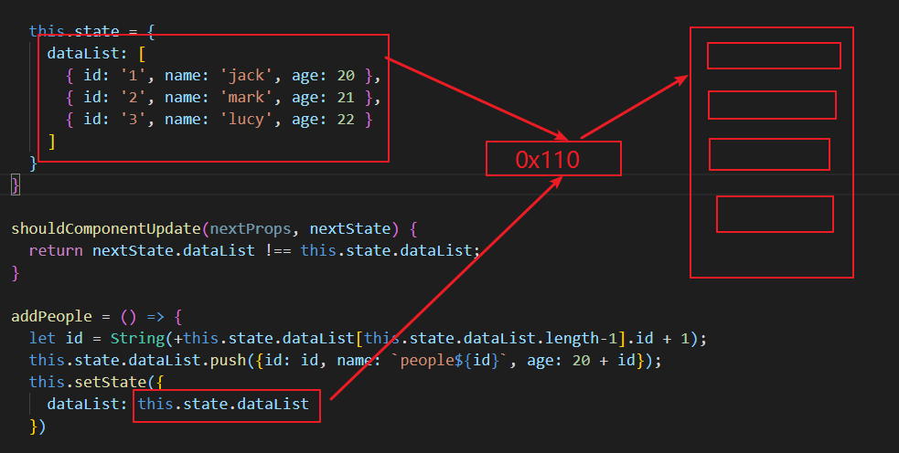

正确的做法是：

```js
class ImmutableCom extends Component {
  constructor(props) {
    super();

    this.state = {
      dataList: [
        { id: '1', name: 'jack', age: 20 },
        { id: '2', name: 'mark', age: 21 },
        { id: '3', name: 'lucy', age: 22 }
      ]
    }
  }

  shouldComponentUpdate(nextProps, nextState) {
    return nextState.dataList !== this.state.dataList;
  }

  addPeople = () => {
    let id = String(+this.state.dataList[this.state.dataList.length-1].id + 1);

    // 浅拷贝
    const newData = [...this.state.dataList, {id: id, name: `people${id}`, age: 20 + id}];
    this.setState({
      dataList: newData
    })
  }
  
  addAge = () => {
    const newData = [...this.state.dataList]
    newData[index].age += 1
    this.setData({
      dataList: newData
    })
  }

  render() {
    return (
      <div>
        {
          this.state.dataList.map((item, index) => (
            <div key={item.id}>
              姓名：<span>{item.name}</span> ==== 
              年龄：<span>{item.age}</span> ====
              <button onClick={this.addAge(index)}>+1</button>
            </div>
          ))
        }
        <button onClick={this.addPeople}>添加一个</button>
      </div>
    );
  }
}
```


### 11、React 动画


#### 11-1、react-transition-group

在 React 中，提供了一个库，`react-transition-group` 来做动画相关的。

```js
npm install react-transition-group -S
```

`react-transition-group` 本身非常小，不会为项目带来体积负担

`react-transition-group` 主要包括四个组件：

- Transition：该组件是一个和平台无关的组件（不一定要结合CSS），在开发中，通常结合CSS来完成样式，所以比较常用的是 CSSTransition
- CSSTransition：结合 CSS 样式来完成动画
- SwitchTransition：两个组件显示隐藏切换，可以使用这个组件
- TransitionGroup：将多个动画组件包裹在其中，常用于列表中元素的动画


#### 11-2、CSSTransition

CSSTransition 基于 Transition 组件，它的执行过程有三种状态，分别为：appear、enter、exit；这三种状态，需要定义对应的 CSS 样式。

- 第一类，开始状态：对应的类 `-appear`、`-enter`、`-exit`
- 第二类，执行动画：对应的类`-appear-active`、`-enter-active`、`-exit-active`
- 第三类，执行结束：对应的类`-appear-done`、`-enter-done`、`-exit-done`


CSSTransition 常见的一些属性：

- in：触发进入或者退出状态
  - 当 in 为 true 时，触发进入状态，会添加 -enter 和 -enter-active 的 class，当动画执行结束，会移除这两个 class，并且添加 -enter-done 的 class
  - 当 in 为 false，触发退出状态，会添加 -exit 和 -exit-active 的 class，当动画执行结束，会移除这两个 class，并且添加 -exit-done 的 class
- classNames：动画的 class 的名称，决定写 CSS 的时候，需要写的 CSS 前缀名。例如 classNames="my"，那么 CSS 类名就是 my-enter
- unmountOnExit：如果 `unmountOnExit={true}`，那么该组件会在执行退出动画结束后被移除掉
- timeout：过渡动画时间
- appear：是否在初次进入时添加动画，需要 in 也为 true


CSSTransition 对应的钩子函数，用来在动画执行过程完成一些 js 操作：

- onEnter：进入动画前
- onEntering：进入动画
- onEntered：进入动画后
- onExit：退出动画前
- onExiting：退出动画
- onExited：退出动画后


例子：

```js
import './index.css'
import React, { PureComponent } from 'react'

import { CSSTransition } from 'react-transition-group';

import { Tabs } from 'antd'
const { TabPane } = Tabs

class CSSAnimat extends PureComponent {
  constructor(props) {
    super();
    this.state = {
      tabKey: '1'
    }
  }
  changeTab = (activeKey) => {
    this.setState({
      tabKey: activeKey
    });
  }
  render() {
    const { tabKey } = this.state;
    return (
      <div className="css-animat">
        <Tabs defaultActiveKey="1" onChange={(activeKey) => this.changeTab(activeKey)}>
          <TabPane tab="Tab 1" key="1">
            <CSSTransition
              in={tabKey === '1'}
              timeout={1000}
              classNames="card"
              onEnter={el => console.log("进入动画前")}
              onEntering={el => console.log("进入动画")}
              onEntered={el => console.log("进入动画后")}
              onExit={el => console.log("退出动画前")}
              onExiting={el => console.log("退出动画")}
              onExited={el => console.log("退出动画后")}
            >
              <div>就安静安静安静安静</div>
            </CSSTransition>
          </TabPane>
          <TabPane tab="Tab 2" key="2">
            <CSSTransition
              in={tabKey === '2'}
              timeout={1000}
              classNames="card"
            >
              <div>就安静安静安静安静</div>
            </CSSTransition>
          </TabPane>
        </Tabs>
      </div>
    )
  }
}

export default CSSAnimat
```

对应 css中样式：

```js
.card-enter, .card-appear {
  opacity: 0;
  transform: scale(.8);
}

.card-enter-active, .card-appear-active {
  opacity: 1;
  transform: scale(1);
  transition: opacity 300ms, transform 300ms;
}

.card-exit {
  opacity: 1;
}

.card-exit-active {
  opacity: 0;
  transform: scale(.8);
  transition: opacity 300ms, transform 300ms;
}
```


#### 11-3、SwitchTransition

SwitchTransition 可以完成两个组件之间切换的炫酷动画

SwitchTransition 中主要的属性 mode：

- in-out：新组件先进入，旧组件再移除
- out-in：旧组件先移除，新组件再进入

SwitchTransition 组件的使用：

- SwitchTransition 组件里面必须要有 Transition 或者 CSSTransition 组件，不能直接包裹我们想要切换的组件
- SwitchTransition 里面的 CSSTransition 或 Transition 组件不再像以前那样接受 in 属性来判断元素是何种状态，取而代之的是 key 属性


例子：

```js
import React, { PureComponent } from 'react';
import { SwitchTransition, CSSTransition } from "react-transition-group";

import './SwitchAnimat.css';

export default class SwitchAnimation extends PureComponent {
  constructor(props) {
    super(props);

    this.state = {
      isOn: true
    }
  }

  render() {
    const {isOn} = this.state;

    return (
      <SwitchTransition mode="out-in">
        <CSSTransition classNames="btn" timeout={500} key={isOn ? "on" : "off"}>
          {
            <button onClick={this.btnClick.bind(this)}>
              {isOn ? "on": "off"}
            </button>
          }
        </CSSTransition>
      </SwitchTransition>
    )
  }

  btnClick() {
    this.setState({isOn: !this.state.isOn})
  }
}
```

样式 css：

```js
.btn-enter {
  transform: translate(100%, 0);
  opacity: 0;
}

.btn-enter-active {
  transform: translate(0, 0);
  opacity: 1;
  transition: all 500ms;
}

.btn-exit {
  transform: translate(0, 0);
  opacity: 1;
}

.btn-exit-active {
  transform: translate(-100%, 0);
  opacity: 0;
  transition: all 500ms;
}
```


#### 11-4、TransitionGroup

当有一组动画的时候，需要将这一组 CSSTransition 放到 TransitionGroup 中

例子：

```js
import React, { PureComponent } from 'react'
import { CSSTransition, TransitionGroup } from 'react-transition-group';

export default class GroupAnimation extends PureComponent {
  constructor(props) {
    super(props);

    this.state = {
      friends: []
    }
  }

  render() {
    return (
      <div>
        <TransitionGroup>
          {
            this.state.friends.map((item, index) => {
              return (
                <CSSTransition classNames="friend" timeout={300} key={index}>
                  <div>{item}</div>
                </CSSTransition>
              )
            })
          }
        </TransitionGroup>
        <button onClick={e => this.addFriend()}>+friend</button>
      </div>
    )
  }

  addFriend() {
    this.setState({
      friends: [...this.state.friends, "coderwhy"]
    })
  }
}
```


### 12、react 中使用 css 的方式

react 不像 vue，规定了 template 模板中写 style 的方式写 css；react 官方也没有说明该使用哪种方式编写 css，所以导致了 react 中编写 css 的方式特别多，可能造成同一个团队，不同项目的 css 编写方式都不一样。而且社区也对 css 的最佳方法争吵不断，下面就是一些常见的 react 中 编写 css 的方式。

强烈建议阅读：https://juejin.cn/post/6844904021304541198


#### 12-1、内联样式

```js
export default function LinkStyle() {
  const pStyle = {
    fontSize: '30px',
    color: 'red'
  }
  return (
    <div>
      <h1 style={{ fontSize: '50px' }}>内联h1</h1>
      <div style={pStyle}>内联p</div>
    </div>
  )
}
```

内联样式特点：

- style 接受一个采用**小驼峰**命名属性的 js 对象，而不是 css 字符串
- 并且可以引用 state 中的状态来设置相关的样式

优点：

- 样式之间不会有冲突
- 可以使用 state 属性

缺点：

- 大量样式耦合在标签内部，代码混乱
- 代码提示问题
- 某些样式没法编写，例如伪类


#### 12-2、普通 css

 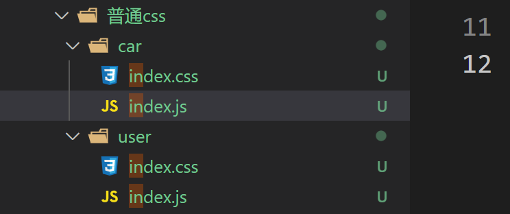

例如：

> car

```js
// index.css
.title {
  color: red;
}

// index.js
import React, { PureComponent } from 'react'
import './index.css'

export default class CarIndex extends PureComponent {
  render() {
    return (
      <div>
        <h1 class="title">汽车</h1>
      </div>
    )
  }
}
```

> user

```js
// index.css
.title {
  color: green;
}

// index.js
import React, { PureComponent } from 'react'
import CarIndex from '../car'

import './index.css'

export default class UserIndex extends PureComponent {
  render() {
    return (
      <div>
        <h1 class="title">user</h1>
        <CarIndex />
      </div>
    )
  }
}
```

上面的例子就是 user 组件里面引用了 car 组件，并且两个组件都有一个 class: title

造成的结果就是：

 

明明 car 中给的颜色是`红色`，却导致被污染了。也就是说，普通 css 的写法不适合组件化的形式，它没有局部作用域。


#### 12-3、css-module

css-module 解决了普通 css 文件没有局部作用域的问题；

css modules 并不是 React 特有的解决方案，而是所有使用了类似于 webpack 配置的环境下都可以使用的。但是，如果在其他项目中使用个，那么需要进行配置，比如配置 webpack.config.js 中的 modules: true 等。

React 的脚手架已经内置了css modules 的配置，只需要将 `.css/.less/.scss` 等样式文件都修改成 `.module.css/.module.less/.module.scss` 这种形式即可

css modules确实解决了局部作用域的问题，也是很多人喜欢在React中使用的一种方案。

> cssModule.module.css

```js
.title {
  color: skyblue;
}

.title-sub {
  color: pink;
}
```

> cssModule.js

```js
import React, { PureComponent } from 'react'
import styleCss from './cssModule.module.css'

export default class CssModule extends PureComponent {
  render() {
    return (
      <div>
        <h1 className={styleCss.title}>css Module</h1>
        {/* 如果是连接符 - 形式，需要使用这种 */}
        <h2 className={styleCss['title-sub']}>title-sub</h2>
      </div>
    )
  }
}
```

> 注意：如果是 title-sub 这种连接符形式，需要 styleCss['title-sub']，所以为了同一，一般都直接使用这种读对象的形式

css-module 形式解决了局部作用域的问题，目前也有很多人在使用这种形式，但是，它不足的地方就是：

- 所有的 className 都必须使用 {styleCss.className} 的形式来编写


#### 12-4、CSS-in-JS

“CSS-in-JS” 是指一种模式，其中 CSS 由 JavaScript 生成而不是在外部文件中定义；此功能**并不是 React 的一部分，而是由第三方库提供**；实际上，React 官方对样式如何定义并没有明确态度。

事实上 CSS-in-JS 的模式就是一种将样式（CSS）也写入到 JavaScript 中的方式，并且可以方便的使用 JavaScript 的状态。所以，React 有时又被人称之为 All in JS。

目前比较流行的 CSS-in-JS 的库是：

- styled-components
- reactCSS


##### styled-components

**1、安装 styled-components**

```js
yarn add styled-components
```


**2、ES6 模板标签字符串**

 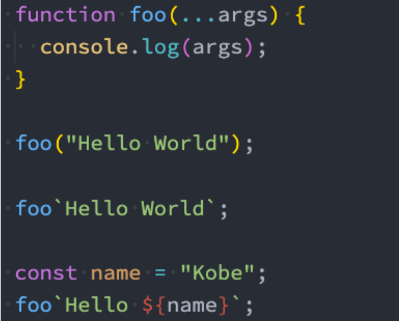

- ES6中增加了模板字符串的语法，但是模板字符串还有另外一种用法：标签模板字符串
- 普通的 JavaScript 的函数，都是通过 `函数名()` 方式来进行调用的，其实函数还有另外一种调用方式
- 在调用的时候插入其他的变量，模板字符串被拆分了，第一个元素是数组，是被模块字符串拆分的字符串组合，后面的元素是一个个模块字符串传入的内容
- 在 styled component 中，就是通过这种方式来解析模块字符串，最终生成我们想要的样式的


**3、基本使用**

```js
import React from 'react'
import styled from 'styled-components'

// 这实际上就是返回的一个组件，是一个 div 标签
// 这里设置的就是这个 div 标签的 css 样式
const DivCom = styled.div`
  color: red;
`

// 这实际上就是返回的一个组件，是一个 h2 标签
// 这里设置的就是这个 h2 标签的 css 样式
const HCom = styled.h2`
  font-size: 50px;
  color: green;
`

export default function CssInJs() {
  return (
    <DivCom>
      你好
      <HCom>h2标签</HCom>
    </DivCom>
  )
}
```

styled-components 的本质是通过函数的调用，最终创建出一个组件：

- 这个组件会被自动添加上一个不重复的 class
- styled-components 会给该 class 添加相关的样式

 


注意：要想在 vscode 中写 styled-components 有提示，可以安装一个 vscode 插件

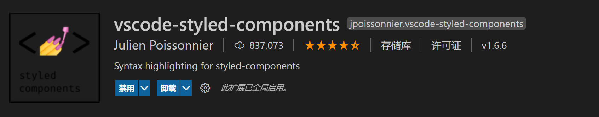


**4、支持类似 less 的嵌套**

```js
import React from 'react'
import styled from 'styled-components'

// 这实际上就是返回的一个组件，是一个 div 标签
// 这里设置的就是这个 div 标签的 css 样式
const DivCom = styled.div`
  color: red;
  font-size: 30px;

  .title {
    font-size: 50px;
    color: skyblue;
  }
`

export default function CssInJs() {
  return (
    <DivCom>
      哈哈哈
      <div className="title">标题</div>
    </DivCom>
  )
}
```

以上，就是在嵌套了 title 类。也就是说，平时在写的时候，大多数只需要创建一个最外层的 styled.div 即可，其他的都可以通过嵌套的写法。【类似 less】


#### 12-5、CSS in JS 和 CSS Modules 谁优谁胜

CSS Modules 会比 CSS in JS 的侵入性更小，CSS in JS 可以和 JS 共享变量，谁优谁胜无法武断。这个看个人喜好。


### 13、React Hook

**为什么需要 Hook：**

Hook 是 React 16.8 的新增特性，它可以让我们在不编写 class 的情况下使用 state 以及其他的 React 特性（比如生命周期）。

先来思考一下 class 组件相对于函数式组件有什么优势？比较常见的是下面的优势：

1. class 组件可以定义自己的 state，用来保存组件自己内部的状态；
   - 函数式组件不可以，因为函数每次调用都会产生新的临时变量；
2. class 组件有自己的生命周期，我们可以在对应的生命周期中完成自己的逻辑；
   - 比如在 componentDidMount 中发送网络请求，并且该生命周期函数只会执行一次；
   - 函数式组件在学习 hooks 之前，如果在函数中发送网络请求，意味着每次重新渲染都会重新发送一次网络请求；
3. class 组件可以在状态改变时只会重新执行 render 函数以及我们希望重新调用的生命周期函数 componentDidUpdate 等；
   - 函数式组件在重新渲染时，整个函数都会被执行，似乎没有什么地方可以只让它们调用一次；

所以，在 Hook 出现之前，对于上面这些情况我们通常都会编写 class 组件。

**class 组件存在的问题：**

1. 复杂组件变得难以理解：
   - 最初编写一个 class 组件时，往往逻辑比较简单，并不会非常复杂。但是随着业务的增多，我们的 class 组件会变得越来越复杂；
   - 比如 componentDidMount 中，可能就会包含大量的逻辑代码：包括网络请求、一些事件的监听（还需要在
     componentWillUnmount 中移除）；
   - 而对于这样的 class 实际上非常难以拆分：因为它们的逻辑往往混在一起，强行拆分反而会造成过度设计，增加代码的复杂度；
2. 难以理解的 class：
   - 很多人发现学习 ES6 的 class 是学习 React 的一个障碍。
   - 比如在 class 中，我们必须搞清楚 this 的指向到底是谁，所以需要花很多的精力去学习 this。
3. 组件复用状态很难：
   - 在前面为了一些状态的复用需要通过高阶组件或 render props；
   - 像 redux 中 connect 或者 react-router 中的 withRouter，这些高阶组件设计的目的就是为了状态的复用；
   - 或者类似于 Provider、Consumer 来共享一些状态，但是多次使用 Consumer 时，代码就会存在很多嵌套；
   - 这些代码让我们不管是在编写还是设计上来说，都变得非常困难；

**Hook 的出现，可以解决上面提到的这些问题：**

1. 简单总结一下 hooks：
   - 它可以让我们在不编写 class 的情况下使用 state 以及其他的 React 特性；
   - 但是我们可以由此延伸出非常多的用法，来让我们前面所提到的问题得到解决；
2. Hook 的使用场景：
   - Hook 的出现基本可以代替我们之前所有使用 class 组件的地方（除了一些非常不常用的场景）；
   - 但是如果是一个旧的项目，你并不需要直接将所有的代码重构为 Hooks，因为它完全向下兼容，你可以渐进式的来使用它；
   - Hook 只能在函数组件中使用，不能在类组件，或者函数组件之外的地方使用；

**Hook 原则：**
1. 不要在循环、条件判断或者子函数中使用 hook
2. 不要在 React 函数组件以外的地方使用 hook


#### 13-1、useState

这就是一个 hook，可以在函数组件定义 State。

在 React Hook 没出来之前，Function Component 也叫做 Functional Stateless Component（FSC），这是因为 Function Component 每次执行的时候都会生成新的函数作用域所以同一个组件的不同渲染（render）之间是不能够共用状态的，因此开发者一旦需要在组件中引入状态就需要将原来的 Function Component 改成 Class Component，这使得开发者的体验十分不好。

useState 就是用来解决这个问题的，它允许 Function Component 将自己的状态持久化到 React 运行时（runtime）的某个地方（memory cell），这样在组件每次重新渲染的时候都可以从这个地方拿到该状态，而且当该状态被更新的时候，组件也会重新渲染。

```js
import React, { useState } from 'react';

function HookComponent() {
  // count 是一个 state，setCount 是用来设置 count 值的
  // 这里最好使用 const 来做声明关键字，防止我们意外直接修改 state 而没有通过 set 方法去设置。
  const [count, setCount] = useState(0);

  return (
    <div>
      <p>点击了 {count} 下</p>
      <button onClick={() => setCount(count + 1)}>点击</button>
    </div>
  );
}

export default HookComponent;
```

使用 hook 的 setCount 和 React 自带的 setState 区别：setState 是合并 state，而 setCount 是替换值，毕竟 setCount 只为一个 state 服务

这个设置 state 初始值，和调用方法修改 state 并不难

当然如果有多个 state，那么你只需调用多次 useState 即可

> useState 的 setState 是全量替代，而 this.setState 是将当前设置的 state 浅归并（shallowly merge）到旧 state 的操作。所以在使用 useState 的 setState 时，应该避免将没有关系的状态放在一起管理
>
> 
>
> useState 每次调用都会使组件重新渲染


**源码内定义的 useState：**

```js
function useState<S>(initialState: S | (() => S)): [S, Dispatch<SetStateAction<S>>];

type Dispatch<A> = (value: A) => void;

type SetStateAction<S> = S | ((prevState: S) => S);
```

- 参数：一个值或者带返回值的函数
- 返回值：[state, 操作函数]


**useState 对于复杂数据的添加修改：**

1. 往数组中添加一项

   ```js
   import React, { useState, useEffect, useRef } from 'react';
   
   const HookComponent = (id) => {
     const [arr, setArr] = useState(['nba']);
   
     return (
       <div>
         <ul>
           {arr.map((item, index) => {
             return <li key={index}>{item}</li>
           })}
         </ul>
         <button onClick={ e => setArr([...arr, 'cba']) }>添加数组</button>
       </div>
     );
   };
   ```

   注意点：必须是通过 setArr 设置一个新的数组，不能直接通过  arr.push，即：

   ```js
   arr.push('nbba')
   setArr(arr)
   ```

   这种做法是错误的，页面并不会进行重新渲染。因为：每次进行 setArr 的时候，就会触发页面重新渲染，但是会判断传入的 arr 是否是同一个，如果是同一个，不会返回新的 jsx。

2. 修改数组对象的某一个值

   ```js
   import React, { useState, useEffect, useRef } from 'react';
   
   const HookComponent = (id) => {
     const [userList, setUserList] = useState([
       { id: '001', name: 'jack', 'age': 18 },
       { id: '002', name: 'mark', 'age': 19 },
       { id: '003', name: 'lucy', 'age': 20 },
     ]);
   
     const editAge = (index) => {
       // 对于数组的操作都得这样，复制一份新数组
       const newUserList = [...userList];
       newUserList[index].age += 1;
       // set 一个新的数组，react 就会重新渲染
       setUserList(newUserList)
     }
   
     return (
       <div>
         <ul>
           {
             userList.map((item, index) => {
               return (
                 <li key={item.id} onClick={()    => editAge(index)}>
                   名字：{item.name} 年龄：{item.   age}
                   <button>年龄+</button>
                 </li>
               )
             })
           }
         </ul>
       </div>
     );
   };
   ```

   > 不要通过往数组 arr.push() 一项，然后用 setArr(arr) 设置上去，而是使用 setArr([...arr, xxx]) 这样。因为 react 内部优化了，如果是同一个数组，那么不进行重新渲染；setArr([...arr, xxx]) 这样等于传了一个新数组，所以会重新渲染


**useState 初始值也可以是一个有返回值的函数：**

```JS
// function useState<S>(initialState: S | (() => S)): [S, Dispatch<SetStateAction<S>>];

const HookComponent = (id) => {
 // useState 初始值也可以是一个有返回值的函数
 const [count, setCount] = useState(() => 10);

 return (
   <div>
     <p>函数useState：{count}</p>
     <button onClick={() => setCount(count + 10)}>count+</button>
   </div>
 );
};
```


接收的的操作函数的参数可以是函数

```js
// function useState<S>(initialState: S | (() => S)): [S, Dispatch<SetStateAction<S>>];
// type Dispatch<A> = (value: A) => void;
// type SetStateAction<S> = S | ((prevState: S) => S);

const HookComponent = (id) => {
 const [count, setCount] = useState(() => 10);

 const addCount = () => {
   // setCount(count + 10) 三次会被合并，最终结果是 20
   // setCount(count + 10);
   // setCount(count + 10);
   // setCount(count + 10);

   // 三次操作不会被合并，最终结果是 40
   setCount((prevCount) => prevCount + 10);
   setCount((prevCount) => prevCount + 10);
   setCount((prevCount) => prevCount + 10);
 };

 return (
   <div>
     <p>函数useState：{count}</p>
     <button onClick={addCount}>count+</button>
   </div>
 );
};
```

> 操作函数参数是函数的好处：直接 setCount(count + 10) 这样三次会被合并，最终结果是 20；setCount((prevCount) => prevCount + 10) 三次操作不会被合并，最终结果是 40。这与 setState 使用函数和直接设置值是一样的


为什么能累加呢？

- **更新函数的参数**：`prevCount` 是 React 内部计算出的 **最新状态值**（即使之前的更新尚未渲染到界面上）
- **队列机制**：React 会将多个更新函数按顺序放入队列，依次执行，每次执行时传入最新的状态


#### 13-2、useEffect

useEffect 这个 Hook 使你的 function 组件具有生命周期的能力！可以看做是 componentDidMount，componentDidUpdate，componentWillUnmount 这三个生命周期函数的组合。通过使用这个 Hook，你可以告诉 React 组件需要在**渲染后**执行某些操作。React 会保存你传递的函数（我们将它称之为“effect”），**并且在执行 DOM 更新之后调用它**


**useEffect(effect, dependencies)**

- effect: function ，要执行的副作用函数，它可以是任意的用户自定义函数，用户可以在这个函数里面操作一些浏览器的 API 或者和外部环境进行交互（例如：请求），这个函数会在**每次组件渲染完成之后**被调用
  
- dependencies?: [prop, ...]，只有在 dependencies 数组里面的元素的值发生变化时才会执行 effect 副作用函数，优化性能，避免死循环

```js
import React, { useState, useEffect } from 'react';
import ReactDOM from 'react-dom';

const UserDetail = ({ userId }) => {
  const [userDetail, setUserDetail] = useState({});

  useEffect(() => {
    fetch(`https://myapi/users/${userId}`)
      .then((response) => response.json())
      .then((user) => setUserDetail(userDetail));
  });

  return (
    <div>
      <div>User Name: {userDetail.name}</div>
    </div>
  );
};
```

上面定义的获取用户详情信息的副作用会在 UserDetail 组件每次完成渲染后执行，所以当该组件第一次挂载的时候就会向服务器发起获取用户详情信息的请求然后更新 userDetail 的值，这里的第一次挂载我们可以类比成 Class Component 的 componentDidMount。

可是如果试着运行一下上面的代码的话，你会发现代码进入了死循环：组件会不断向服务端发起请求。出现这个死循环的原因是 useEffect 里面调用了 setUserDetail，这个函数会更新 userDetail 的值，从而使组件重渲染，而重渲染后 useEffect 的 effect 继续被执行，进而组件再次重渲染。。。

为了避免重复的副作用执行，useEffect 允许我们通过第二个参数 dependencies 来限制该副作用什么时候被执行：指明了 dependencies 的副作用，只有在 dependencies 数组里面的元素的值发生变化时才会被执行，因此如果要避免上面的代码进入死循环我们就要将 userId 指定为我们定义的副作用的 dependencies

如果指定一个空数组作为这个副作用的 dependencies，那么这个副作用只会在组件首次渲染的时候被执行一次

```js
import React, { useState, useEffect } from 'react';
import ReactDOM from 'react-dom';

const UserDetail = ({ userId }) => {
  const [userDetail, setUserDetail] = useState({});

  useEffect(() => {
    fetch(`https://myapi/users/${userId}`)
      .then((response) => response.json())
      .then((user) => setUserDetail(userDetail));
  }, [userId]);

  return (
    <div>
      <div>User Name: ${userDetail.name}</div>
    </div>
  );
};
```

除了发起服务端的请求外，往往还需要在 useEffect 里面调用浏览器的 API，例如使用 addEventListener 来添加浏览器事件的监听函数等。我们一旦使用了 addEventListener 就必须在合适的时候调用 removeEventListener 来移除对事件的监听，否则会有性能问题，useEffect 允许我们在副作用函数里面返回一个 cleanup 函数，这个函数会在组件重新渲染之前被执行，我们可以在这个返回的函数里面移除对事件的监听（即移除副作用）

```js
import React, { useEffect } from 'react';
import ReactDOM from 'react-dom';

const WindowScrollListener = () => {
  useEffect(() => {
    const handleWindowScroll = () => console.log('yean, window is scrolling!');
    window.addEventListener('scroll', handleWindowScroll);

    return () => {
      window.removeEventListener(handleWindowScroll);
    };
  }, []);

  return <div>I can listen to the window scroll event!</div>;
};
```

上面的代码中我们会在 WindowScrollListener 组件首次渲染完成后注册一个监听页面滚动事件的函数，并在组件下一次渲染前移除该监听函数。由于我们指定了一个空数组作为这个副作用的 dependencies，所以这个副作用只会在组件首次渲染时被执行一次，而它的 cleanup 函数只会在组件 unmount 时才被执行，这就避免了频繁注册页面监听函数从而影响页面的性能


**useEffect 比较常见的三种场景**

1. 替代 componentDidMount，使用 useEffect，第二个参数传入空数组

   ```js
   function Example() {
     const [dataSource, setdataSource] = useState([]);

     useEffect(() => {
       const dataSource = await getSceneList();
       setDataSource(dataSource);
     }, []);

     return <div></div>;
   }
   ```

2. 替代 componentDidUpdate，使用 useEffect，第二个参数为更新依赖

   ```js
   function Example() {
     const [query, setQuery] = useState({});
     const [dataSource, setDataSource] = useState([]);

     useEffect(() => {
       const dataSource = await getSceneList();
       setDataSource(setDataSource);
     }, [query]);

     return <div></div>;
   }
   ```

3. 替代 componentWillUnmount 方案，使用 useEffect，第一个参数返回函数会在组件卸载前执行，第二个参数为空数组

   ```js
   function Example() {
     useEffect(() => {
       const listener = (e) => {
         console.log(e);
       };
       document.addEventListener('onClick', listener, false);
   
       return () => {
         document.removeEventListener('onClick', listener, false);
       };
     }, []);
   
     return <div></div>;
   }
   ```


#### 13-3、useLayoutEffect

useLayoutEffect 看起来和 useEffect 非常的相似，事实上两者也只有一点区别：

- useEffect 会在渲染的内容更新到 DOM 上后执行，不会阻塞 DOM 的更新
- useLayoutEffect 会在渲染的内容更新到 DOM 上之前执行，会阻塞 DOM 的更新

例子：

```js
const DemoUseLayoutEffect = () => {
  const target = useRef()

  useLayoutEffect(() => {
      // 我们需要在dom绘制之前，移动dom到制定位置
    const { x ,y } = getPositon() // 获取要移动的 x,y坐标
    animate(target.current,{ x,y })
  }, [])

  return (
    <div >
      <span ref={ target } className="animate"></span>
    </div>
  )
}
```


#### 13-4、useContext

在之前，要在组件中使用共享的 Context，主要是：

- 在类组件中，设置 `xxx.contextType = MyContext` 的形式
- 在函数组件中，通过 `MyContext.Consumer` 方式共享 context

而 useContext 这个 hook 可以直接获取某个 Context 的值

> index.js

```js
import React, { createContext } from 'react'
import UseContextHook from './useContextHook'

export const UserContext = createContext()
export const ThemeContext = createContext()

const HookComponent = () => {
  return (
    <div>
      <UserContext.Provider value={{ name: 'jack', token: 'aabbcc'}}>
        <ThemeContext.Provider value={{ color: '#f5f5f5' }}>
          <UseContextHook />
        </ThemeContext.Provider>
      </UserContext.Provider>
    </div>
  );
};

export default HookComponent;
```

> UseContextHook.js 中：

```js
import React, { useContext } from 'react'

import { UserContext, ThemeContext } from './index'

const UseContextHook = () => {
  const user = useContext(UserContext)
  const theme = useContext(ThemeContext)

  console.log(user)
  console.log(theme)

  return (
    <div>
      <hr />
      <h2>useContext</h2>
      <p>name: {user.name}，token: {user.token}</p>
      <p>color: {theme.color}</p>
    </div>
  )
}

export default UseContextHook
```

可以发现，可以直接拿取到 Context 的值，就不需要像之前的 函数组件 那么复杂


#### 13-5、userReducer

useReducer 并不是 redux 的某个替代品，而是 useState 的一种替代方案


**基本使用：**

```js
import React, { useReducer } from 'react'

const reducer = (state, action) => {
  switch (action.type) {
    case 'add':
      return {...state, count: state.count + action.payload}
    case 'reduce':
      return {...state, count: state.count - action.payload}
    default:
      return {...state}
  }
}

const UseReducerHook = () => {
  /**
   * useReducer 参数：
   *  第一个参数：reducer
   *  第二个参数：state 初始值
   */
  const [state, dispatch] = useReducer(reducer, { count: 0 })

  return (
    <div>
      <hr />
      <h2>useReducer</h2>
      <p>结果：{state.count}</p>
      <button onClick={() => dispatch({ type: 'add', payload: 5 })}>加+</button>
      <button onClick={() => dispatch({ type: 'reduce', payload: 5 })}>减-</button>
    </div>
  )
}

export default UseReducerHook
```

> useReducer 的参数：
>
>   第一个参数：reducer
>
>   第二个参数：state 初始值


所以，如果将 reducer 抽离成单独的一个文件，那么其他地方也是可以使用的。

但是，useReducer 的数据是不会共享的，只是使用了相同的 reducer 的函数而已，如下，两个组件都使用了相同的 reducer 函数，但是数据并没有同时改变：

 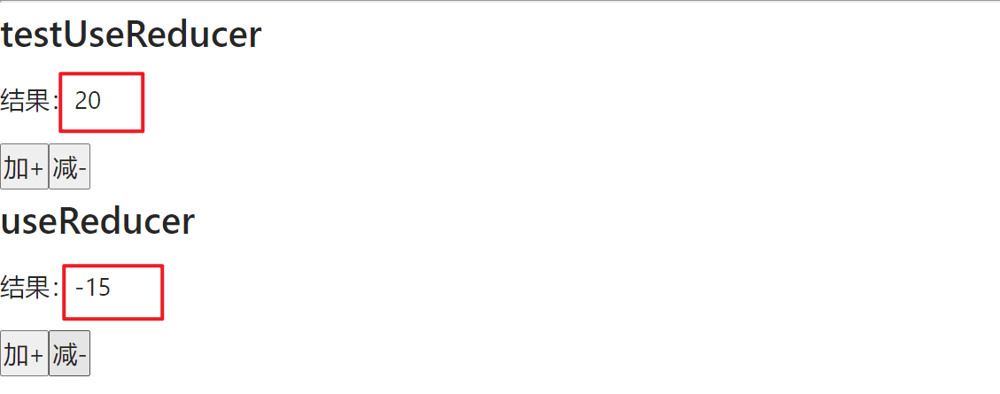


现在也有一些人使用 userReducer + userContext 实现状态管理


#### 13-6、useCallback

useCallback 主要是用来进行性能优化的：

- useCallback  会返回一个函数的记忆值（memoized）
- 在依赖不变的情况下，多次定义的时候，返回的值是相同的


```js
const memoizedCallback = useCallback(fn, deps)
```

useCallback 需要的参数：

- fn：一个函数最终会返回该回调函数，该回调函数仅仅只在 `deps` 参数发生改变时才会更新
- deps：用于触发 `fn` 回调函数改变的参数**数组**

> 把内联回调函数及依赖项数组作为参数传入 `useCallback`，它将返回该回调函数的 memoized 版本，该回调函数仅在某个依赖项改变时才会更新。当你把回调函数传递给经过优化的并使用引用相等性去避免非必要渲染（例如 `shouldComponentUpdate`）的子组件时，它将非常有用


**1、不要滥用 useCallback：**

事例如下：

```js
import React from 'react'

const UseCallbackHook = () => {

  const handleClick = () => {
    console.log('useCallback')
  }

  return (
    <button onClick={handleClick}>
      useCallback的使用
    </button>
  )
}
```

当组件自身触发刷新或作为子组件跟随父组件刷新时，我们注意到 `onClick` 会被重新赋值。为了"提升性能"，使用 `useCallback` 包裹`onClick` 以达到缓存的目的：

```js
import React, { useCallback } from 'react'

const UseCallbackHook = () => {

  const handleClick = useCallback(() => {
    console.log('useCallback')
  }, [])

  return (
    <button onClick={handleClick}>
      useCallback的使用
    </button>
  )
}
```

这样做性能有没有提升呢？答案是没有，反倒是 useCallback 所制造的闭包将保持对回调函数和依赖项的引用，未被垃圾回收标记，造成内存损耗


**2、useCallback 正确的使用方法：**

产生误区的原因是 `useCallback` 的设计初衷并非解决组件内部函数多次创建的问题，而是减少子组件的不必要重复渲染。实际上在 React 体系下，优化思路主要有两种：

- 减少重新 render 次数。React 最耗费性能的就是调和过程（reconciliation），只要不 render 就不会触发 reconciliation。
- 减少计算量

事例如下：

```js
const GButton = ({ title, addFunc }) => {
  console.log(`${title}重新渲染了`)

  return (
    <button onClick={addFunc}>GButton</button>
  )
}

const UseCallbackHook = () => {
  const [count, setCount] = useState(0)
  const add1 = () => {
    setCount(count + 1)
  }

  const add2 = () => {
    setCount(count + 1)
  }

  return (
    <div>
      <GButton title={'button1'} addFunc={add1} />
      <GButton title={'button2'} addFunc={add2} />
    </div>
  )
}
```

点击 button1 的时候，button2 也会重新渲染，即使 `count2` 并未发生改变。原因就是当执行 `add1` 的时候，UseCallbackHook 组件重新渲染， `add2` 被重新定义，导致 React 在 diff 新旧组件时，判定组件发生了变化。

此时，就可以使用 useCallback 配合 memo：

```js
const GButton = memo(({ title, addFunc }) => {
  console.log(`${title}重新渲染了`)

  return (
    <button onClick={addFunc}>GButton</button>
  )
})

const UseCallbackHook = () => {
  const [count1, setCount1] = useState(0)
  const [count2, setCount2] = useState(0)
  const add1 = () => {
    setCount1(count1 + 1)
  }

  const add2 = useCallback(() => {
    setCount2(count2 + 1)
  }, [count2])

  return (
    <div>
      <GButton title={'button1'} addFunc={add1} />
      <GButton title={'button2'} addFunc={add2} />
    </div>
  )
}
```

`memo` 作用于函数组件，会对传入组件的新旧数据进行浅比较，如果相同则不会触发渲染；而 `useCallback` 保证了 `add2` 函数不发生变化。所以，在实现减少不必要渲染的优化过程中，`useCallback`和`memo`是一对利器。


**3、useCallback 源码：**

```JS
// 初始化阶段
function mountCallback(callback, deps) {
    const hook = mountWorkInProgressHook();
    const nextDeps = deps === undefined ? null : deps;
    hook.memoizedState = [callback, nextDeps];
    return callback;
}

// 更新阶段
function updateCallback(callback, deps) {
    const hook = updateWorkInProgressHook();，
    const nextDeps = deps === undefined ? null : deps;
    const prevState = hook.memoizedState;
    if (prevState !== null) {
        if (nextDeps !== null) {
            const prevDeps = prevState[1];
            // 比较是否相等
            if (areHookInputsEqual(nextDeps, prevDeps)) {
                // 如果相等，返回旧的 callback
                return prevState[0];
            }
        }
    }
  
    hook.memoizedState = [callback, nextDeps];
    return callback;
}
```

核心就是比较`deps`是否发生变化，如果有变化则返回新的`callback`函数，否则返回原函数。


#### 13-7、useMemo

useMemo 的实际目的也是为了性能优化：

- useCallback  也会返回一个记忆值（memoized），【与 useCallback 的区别是：useCallback 返回的是一个函数，而 useMemo 返回的可以是一个值，对象，函数 等】
- 在依赖不变的情况下，多次定义的时候，返回的值是相同的


**1、不要滥用 useMemo：**

```js
import React, { useMemo } from 'react'

const useMemoHook = () => {
  const total = 0

  const resTotal = useMemo(() => total, [])

  return (
    <div>
      <p>总量：{resTotal}</p>
    </div>
  )
}
```

这种创建 resTotal 的开销是完全没有必要的，原因与 useCallback 一致,生成了闭包。


**2、正确的 useMemo 使用方法：**

只有当创建行为本身会产生高昂的开销（比如计算上千次才会生成变量值），才有必要使用`useMemo`，例如：

```js
import React, { useMemo, useState } from 'react'

const calcTotal = (count) => {
  console.log('重新计算了')

  let total = 0
  for(let i = 0; i < count; i++) {
    total += count
  }

  return total
}

const useMemoHook = () => {
  const [count, setCount] = useState(0)

  // useMemo 第一个参数是返回一个值
  const resTotal = useMemo(() => calcTotal(count), [count])

  return (
    <div>
      <p>总量：{resTotal}</p>
      <button onClick={e => setCount(count + 1)}>add total</button>
    </div>
  )
}
```


还有一些场景就是：

```js
import React, { useState, memo } from 'react'

const MemoTest = memo(({ info }) => {
  console.log('MemoTest重新渲染')

  return (
    <div>name: {info.name}</div>
  )
})

const useMemoHook = () => {
  const [count, setCount] = useState(0)

  const infoDetail = { name: 'jack' }

  return (
    <div>
      <hr />
      <h2>useMemo的使用</h2>
      <MemoTest info={infoDetail} />
      <button onClick={e => setCount(count + 1)}>add total</button>
    </div>
  )
}
```

这种场景下，就算使用了 `memo`，在点击按钮的时候，MemoTest 组件也会重新渲染，因为，每次都生成了 infoDetail。此时就可以使用 useMemo 了：

```js
import React, { useMemo, useState, memo } from 'react'

const MemoTest = memo(({ info }) => {
  console.log('MemoTest重新渲染')

  return (
    <div>name: {info.name}</div>
  )
})

const useMemoHook = () => {
  const [count, setCount] = useState(0)

  const infoDetail = useMemo(() => ({ name: 'jack' }), [])

  return (
    <div>
      <hr />
      <h2>useMemo的使用</h2>
      <MemoTest info={infoDetail} />
      <button onClick={e => setCount(count + 1)}>add total</button>
    </div>
  )
}
```


#### 13-8、useRef

useRef 返回一个可变的 ref 对象，其 current 属性被初始化为传入的参数（initialValue）。返回的 ref 对象在组件的整个生命周期内保持不变。

需要 useRef 的主要原因有两个：

1. **持久性**：`useRef`的返回对象在组件的整个生命周期中都是持久的，而不是每次渲染都重新创建。
2. **不会触发渲染**：当`useState`中的状态改变时，组件会重新渲染。而当`useRef`的`.current`属性改变时，组件不会重新渲染。

总结来说，`useRef`既能保存状态，还不会在更新时触发渲染


最常见的 ref 的两种用法：

- 获取子组件或者 dom 节点
- 保存一个数据，这个对象在整个生命周期中可以保持不变


**1、获取子组件或者 dom 节点：**

```js
import React, { useRef, Component } from 'react'

class TestRef1 extends Component {
  render() {
    return (
      <div>TestRef1</div>
    )
  }
}

const UseRefHook = () => {
  const pRef = useRef()
  const testRef1 = useRef()

  const handleChangeP = () => {
    pRef.current.innerHTML= 'hello, world'
    console.log(testRef1.current)
  }

  return (
    <div>
      <p ref={pRef}>hello</p>
      <TestRef1 ref={testRef1} />
      <button onClick={handleChangeP}>handleChangeP</button>
    </div>
  )
}
```

需要注意的是，ref 不能直接作用在函数组件上，会报错：

```js
import React, { useRef, Component } from 'react'

const TestRef = () => {
  return (
    <div>TestRef</div>
  )
}

const UseRefHook = () => {
  const testRef = useRef()

  const handleChange = () => {
    console.log(testRef.current)
  }

  return (
    <div>
      <TestRef ref={testRef} />
      <button onClick={handleChange}>点击</button>
    </div>
  )
}
```

报错如下：提示，函数组件上使用 ref 需要包裹在 forwardRef 中

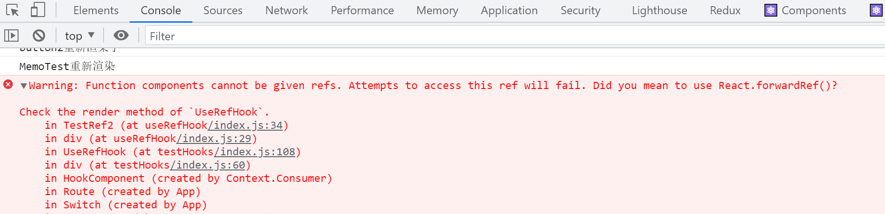

改：

```js
import React, { useRef, forwardRef } from 'react'

// 包裹在 forwardRef 中之后，除了接受 props 参数，还接受 ref
const TestRef = forwardRef((props, ref) => {
  return (
    <div ref={ref}>TestRef2</div>
  )
})

const UseRefHook = () => {
  const testRef = useRef()

  const handleChange = () => {
    console.log(testRef.current)
  }

  return (
    <div>
      {/* 函数组件不能直接绑定 ref，要想绑定 ref，函数组件需要包裹在 forwardRef 中 */}
      <TestRef ref={testRef} />
      <button onClick={handleChange}>点击</button>
    </div>
  )
}
```


**2、使用 ref 保存上一次的某一个值：**

```js
const UseRefHook = () => {
  const [count, setCount] = useState(0)

  const countRef = useRef(0)

  // 谨记 useEffect 的执行时机：是在组件渲染完成之后，才执行
  useEffect(() => {
    countRef.current = count
  }, [count])

  return (
    <div>
      <hr />
      <h2>useRef 的使用</h2>
      <h3>count上一次的值：{countRef.current}</h3>
      <h3>count当前值：{count}</h3>
      <button onClick={() => setCount(count + 10)}>+10</button>
    </div>
  )
}
```

 


#### 13-9、useImperativeHandle

上面 useRef 那一节说过，ref 不能直接作用在函数组件上，需要结合 forwardRef 一起使用。

forwardRef 的做法本身没有什么问题，但是这样会将子组件的 DOM 直接暴露给了父组件：

- 直接暴露给父组件带来的问题是某些情况的不可控。
- 父组件可以拿到 DOM 后进行任意的操作。
- 更理想的是希望限制父组件可以做哪些操作，不可以做哪些操作

而 useImperativeHandle 就是解决上面的问题的。


**基本用法：**

```js
import React, { forwardRef, useRef, useImperativeHandle } from 'react'

const TestCom = forwardRef((props, ref) => {

  useImperativeHandle(ref, () => {
    return {
      focus: () => {
        console.log('useImperativeHandle')
      }
    }
  })

  return (
    <div>
      <input />
    </div>
  )
})

const UseImperativeHandleHook = () => {
  const testRef = useRef()

  const handleClick = () => {
    console.log(testRef)
    testRef.current.focus()
  }

  return (
    <div>
      <hr />
      <h2>useImperativeHandle的使用</h2>
      <TestCom ref={testRef} />
      <button onClick={handleClick}>点击</button>
    </div>
  )
}
```

useImperativeHandle：

- 第一个参数：就是 ref 对象

- 第二个参数：是一个回调函数，这个回调函数返回一个对象，**这个返回的对象会被绑定到 ref 上。也就是说，在父组件通过 `testRef.current.innerHTML()` 调用的 innerHTML 方法，就是这个回调函数返回对象中定义的**

   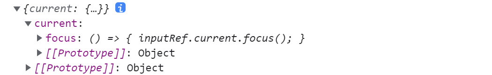


此时想要父组件操作子组件的 focus 事件：需要子组件自身的 useRef 

```js
import React, { forwardRef, useRef, useImperativeHandle } from 'react'

const TestCom = forwardRef((props, ref) => {

  const inputRef = useRef()

  useImperativeHandle(ref, () => {
    return {
      focus: () => {
        // 使用子组件本身的 ref
        inputRef.current.focus()
      }
    }
  })

  return (
    <div>
      <input ref={inputRef} />
    </div>
  )
})

const UseImperativeHandleHook = () => {
  const testRef = useRef()

  const handleClick = () => {
    console.log(testRef)
    testRef.current.focus()
  }

  return (
    <div>
      <hr />
      <h2>useImperativeHandle的使用</h2>
      <TestCom ref={testRef} />
      <button onClick={handleClick}>点击</button>
    </div>
  )
}
```


#### 13-10、自定义 Hook

自定义 Hook 本质上只是一种函数代码逻辑的抽取。它在内部使用了React 内置的 Hook 或者其它的自定义 Hook。虽然可以任意命名自定义 Hook，可是为了让其它开发者更容易理解我们的代码以及方便一些开发工具例如 `eslint-plugin-react-hooks` 来更好地提示，所以需要将自定义 Hook 以 `use` 作为开头，并且使用驼峰发进行命名，例如 `useLocation`


例子：

```js
import React, { createContext } from 'react';
import CustomHook from './customHooks';

export const UserContext = createContext()
export const TokenContext = createContext()

const HookComponent = (id) => {
  return (
    <div>
      {/* 自定义 hooks */}
      <UserContext.Provider value={{name: 'jack', age: 24}}>
        <TokenContext.Provider value={{token: 'aahhhshdh'}}>
          <CustomHook />
        </TokenContext.Provider>
      </UserContext.Provider>
    </div>
  );
};

```

在没有使用自定义 hook 的时候，要想正在 CustomHook 组件中拿到这些 context，常规的做法是：

```js
import React, { useContext } from 'react'
import { UserContext, TokenContext } from './index'

const CustomHook = () => {
  const user = useContext(UserContext)
  const token = useContext(TokenContext)

  console.log(user)
  console.log(token)
  return (
    <div>
      
    </div>
  )
}

export default CustomHook
```

但是如果有多个组件都需要这些 context，那么久需要写很多重复代码


使用自定义 hook 改造：

> userInfoHook.js

```js
import { useContext } from 'react'
import { TokenContext, UserContext } from "../pages/testHooks"

const useInfoHook = () => {
  const user = useContext(UserContext)
  const token = useContext(TokenContext)

  return [user, token]
}

export default useInfoHook
```

使用：这样自定义 hook 可以在多处组件使用

```js
import React from 'react'
import userInfoHook from '../../hooks/useInfoHooks'

const CustomHook = () => {
  const [user, token] = userInfoHook()

  console.log('\n--------------自定义hook---------------------')
  console.log(user)
  console.log(token)

  return (
    <div>
      
    </div>
  )
}
```


