# react 生态


### 1、Redux

**为什么需要 Redux：**

1. javascript 开发的应用程序，已经变得越来越复杂，需要管理的状态越来越多，包括服务器返回的数据、缓存数据、用户操作产生的数据、控制 ui 的状态等等。
2. 对于不断变化的状态，想要管理好是非常困难的；状态之间可能会存在相互依赖（一个状态变化引起另外一个状态的改变）。而当应用程序复杂时，状态在什么时候，因为什么原因发生变化，发生了什么样的变化，将变得非常难以控制和追踪。
3. Redux 就是一个帮助管理 state 状态的容器，提供了可预测的状态管理。除了可以和 React一起使用之外，它也可以和其他界面库一起来使用（比如Vue），并且它非常小（包括依赖在内，只有2kb）。

**Redux 的核心理念：**

场景：需要管理一个列表

> 如果没有定义统一的规范来操作列表，那么整个数据的变化时无法追踪的。例如页面的某处通过 push 增加了一条数据，另外一个页面又通过xx.xx = '' 的方式修改了一条数据，整个应用程序错综复杂，当出现bug时，很难跟踪到底哪里发生的变化

而 redux 要求通过 action 来更新数据：

- 所有数据的变化，需要通过派发（dispatch）action 来更新
- action 是一个普通的 javascript 对象，用来描述这次更新的类型（type）和内容（content）

有如下数据：

```js
const initialState = {
  userList: [
    { name: "jack", age: 18 },
    { name: "lucy", age: 40 },
    { name: "john", age: 30 },
  ]
};
```

那么更新数据的 action 例如：

```js
const action1 = { type: "ADD_LIST", info: { name: "lindy", age: 20 } }
const action2 = { type: "CHANGE_NAME", playload: { index: 0, newName: "mark" } }
```

使用 action 的好处：可以清晰的知道数据到底发生了什么样的变化，所有的数据变化都是可跟追、可预测的

而将 state 和 action 联系在一起就需要 reducer

- reducer 是一个纯函数
- reducer 做的事情就是将传入的 redux state 和 action 结合起来生成一个新的 state

```js
function reducer(state = initialState, action) {
  switch (action.type) {
    case 'ADD_LIST':
      return { ...state, userList: [...state.userList, action.info] };
    case 'CHANGE_NAME':
      return {
        ...state,
        userList: state.userList.map((item, index) => {
          if (index === action.index) {
            return { ...item, name: action.newName };
          }
          return item;
        }),
      };
    default:
      return state;
  }
}
```

**Redux 的三大原则：**

1. **单一数据源： **

   整个应用程序的 state 被存储在一棵 object tree 中，而这个 object tree 只存在一个 store 中

   - redux 中并没有说不可以创建多个 store，但是那样做不利于数据的维护
   - 单一的数据源可以让整个应用程序的 state 变得变得方便维护、追踪、修改

2. **redux 的 state 是只读的：**

   唯一修改 redux 的 state 的方法是触发 action，不要试图使用其他方式来修改 redux 的 state

   - 这样确保了 View 或网络请求都不能直接修改 redux 的 state，它们只能通过 action 来描述自己想要如何修改
   - 这样可以保证所有修改都被集中处理，并且严格按照先后顺序，避免了竟态问题

3. **使用纯函数来执行修改：**

   通过 reducer 将旧 state 和 actions 联系在一起，并返回新的 state

   - 随着应用的复杂度增加，可以将 reducer 拆分为多个小 reducer，分别操作不同 state tree 的一部分
   - 但所有 reducer 都应该是纯函数，不能产生副作用


#### 1-1、前置知识：纯函数

**纯函数定义：**

- 确定的输入，一定会产生确定的输出
- 函数在执行过程中，不能产生副作用


**例子：**

```js
// sum 是一个纯函数；因为输入输出确定，并且返回的值一定是 num1 与 num2 这两个参数的和
function sum(num1, num2) {
  return num1 + num2;
}

// add 不是一个纯函数；因为输入相同，但是输出受到 flag 的影响，并不能保证确定输出
let flag = 10;
function add(num) {
  return num + flag;
}
// 将 add 改成纯函数：只需要将 let flag 改为 const flag，因为 const 决定了 flag 不可重新赋值，那么 flag 永远都是 10，那么输入输出可以确定

// changeInfo 不是一个纯函数；因为这个函数存在副作用
function changeInfo(info) {
  info.name = 'jack';
}
```

> 在 react 中，纯函数的一些意义：所有 react 组件必须像纯函数一样保护他的 props 不被修改


#### 1-2、Redux 的基本使用

**安装：**

```js
npm install redux --save
```

**基本使用：**

1. 创建一个对象，作为要保存的状态

   ```js
   import redux from 'redux';
   
   const initState = {
     count: 0
   }
   ```

2. 创建一个 store 来存储这个 state

   - 创建 store 前必须创建 reducer
   - 可以通过 store.getState 来获取当前 state

   ```js
   const reducer = (state = initState, action) => {
     return state;
   }
   
   const store = redux.createStore(reducer);
   
   // console.log(store.getState());
   ```

3. 通过 action 来修改 state

   ```js
   store.dispatch({
     type: 'ADD_NUMBER',
     number: 5
   });
   ```

4. 修改 reducer 中的处理代码

   - 这里一定要记住，reducer 是一个纯函数，不需要直接修改 state；不要修改传入参数；不要执行有副作用的操作，如 API 请求和路由跳转；调用非纯函数，如 `Date.now()` 或 `Math.random()`

   ```js
   const reducer = (state = initState, action) => {
     switch (action.type) {
       case 'ADD_NUMBER':
         return {...state, count: state.count + action.number};
       default:
         return state;
     }
   }
   ```

5. 在**派发 action 之前**，监听 store 的变化

   ```js
   store.subscribe(() => {
     console.log(store.getState());
   });
   ```

完整代码：

```js
import redux from 'redux';

// 1、创建一个 state
const initState = {
  count: 0
}

// 2、创建一个 reducer
const reducer = (state = initState, action) => {
  switch (action.type) {
    case 'ADD_NUMBER':
      return {...state, count: state.count + action.number};
    default:
      return state;
  }
}

// 3、根据 reducer 创建一个 store 来存储 state
const store = redux.createStore(reducer);

// 可以通过 store.getState() 来获取当前 state
// console.log(store.getState());

// 可以在派发 action 之前，监听 store 变化
// store.subscribe(() => {
//   console.log(store.getState());
// });

// 4、通过 action 来修改 state
const actios = {
  type: 'ADD_NUMBER',
  number: 5
}
store.dispatch(actios);
```


#### 1-3、Redux 结构划分

如果将所有的逻辑代码写到一起，那么当 redux 变得复杂时代码就难以维护；所依需要将 redux 按照 store、reducer、action、actionTypes(常量) 拆分。

1. 创建 store/index.js

   ```js
   import redux from 'redux';
   import reducer from './reducer.js';
   
   const store = redux.createStore(reducer);
   
   export default store;
   ```

2. 创建 store/reducer.js

   ```js
   import { ADD_NUMBER } from './actionTypes.js';
   
   const initState = {
     count: 0
   };
   
   const reducer = (state = initState, action) => {
     switch (action.type) {
       case ADD_NUMBER:
         return {...state, count: state.count + number};
       default:
         return state;
     }
   };
   
   export default {
     reducer
   };
   ```

3. 创建 store/actionCreators.js

   - 使用函数返回 action 可以更方便地动态传参

   ```js
   import { ADD_NUMBER } from './actionTypes.js';
   
   const addNumber = number => ({type: ADD_NUMBER, number});
   
   export {
     addNumber
   };
   ```

4. 创建 store/actionTypes.js 

   ```js
   const ADD_NUMBER = 'ADD_NUMBER';
   
   export {
     ADD_NUMBER
   };
   ```


#### 1-4、Redux 执行流程

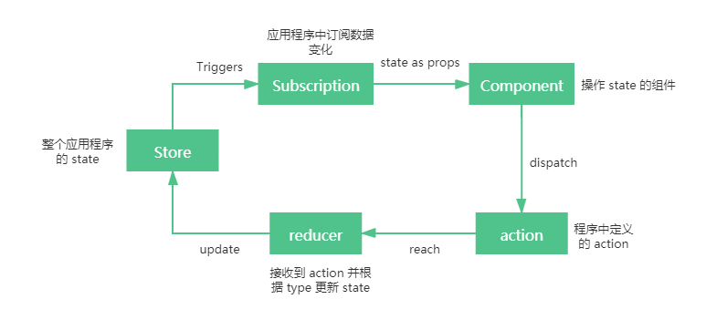

1. 全局唯一的 Store 存储 state
2. component 中会有些操作派发 action
3. reducer 接收到 action，根据设置返回一个新的State
4. State 发生更新之后会触发通知，告知订阅者数据发生了改变
5. 订阅者拿到最新的数据，更新到界面


#### 1-5、React 简单结合 Redux 使用

```js
import React, { PureComponent } from 'react';
import store from '../../../store';
import { addNumber } from '../../../store/actionCreators';

export default class Test extends PureComponent {
  constructor(props) {
    super(props);
    this.state = {
      count: store.getState().count,
    };
  }

  // componentDidMount 中订阅变化重新 setState
  componentDidMount() {
    this.unsubscribe = store.subscribe(() => {
      this.setState({
        count: store.getState().count,
      });
    });
  }

  // componentWillUnmount 中取消订阅
  componentWillUnmount() {
    this.unsubscribe();
  }

  // dispatch 去更新 redux 状态
  addCount = () => {
    store.dispatch(addNumber(1));
  };

  render() {
    return (
      <div>
        <h2>Test</h2>
        <div>当前计数: {this.state.count}</div>
        <button onClick={this.addCount}>+</button>
      </div>
    );
  }
}
```

主要就是：

- 调用 store 的`dispatch`来派发对应的`action`

- 在 `componentDidMount` 中订阅数据的变化，当数据发生变化时重新 setState
- `componentWillUnmount` 中取消订阅


#### 1-6、自定义 connect 抽离重复代码

在上面的使用中，有一些重复的代码，比如：

- 监听 store 数据改变的代码，都需要在 `componentDidMount` 中完成
- 派发事件，都需要去先拿到 `store`， 在调用其 `dispatch`  

基于以上，自定义一个 connect 函数将重复代码抽离：

- connect 函数有两个参数
  - 参数一：存放 component 需要使用的 state 属性
  - 参数二：存放 component 需要使用的 dispatch 动作
- connect 返回一个高阶组件
  - 在 constructor 中的 state 中保存需要获取的状态
  - 在 componentDidMount 中订阅 store中 数据的变化，并且执行 setState 操作
  - 在 componentWillUnMount 中取消订阅
  - 在 render 中返回一个组件，并将所有状态映射到 props 中

在 utils/connect.js 中：

```js
import React, { PureComponent } from 'react'

import store from '../../../store';

const connect = (mapStateToProps, mapDispatchToProps) => {
  return function handleMapCpn(PageCom) {
    return class extends PureComponent {

      constructor(props) {
        super(props);
        this.state = {
          storeState: mapStateToProps(store.getState())
        }
      }

      // 为什么需要这一步：
      // 因为直接改变 redux 的数据，这边是不知道数据发生变化的，所以需要这一步来通知数据变化，重新渲染
      componentDidMount() {
        this.unsubscribe = store.subscribe(() => {
          this.setState({
            storeState: mapStateToProps(store.getState())
          });
        })
      }

      componentWillUnmount() {
        this.unsubscribe();
      }

      render() {
        return (
          <PageCom
            {...this.props}
            {...mapStateToProps(store.getState())}
            {...mapDispatchToProps(store.dispatch)}
          />
        );
      }
    }
  }
};

export default connect;
```

test/index.js 中：

- mapStateToProps：用于将 state 映射到一个对象中，对象中包含需要的属性
- mapDispatchToProps：用于将 dispatch 映射到对象中，对象中包含在组件中可能操作的函数
- 使用数据和操作函数都**通过 props 传入**

```js
import React, { PureComponent } from 'react';

import connect from '../../../utils/connect';
import { addNumber } from '../../../store/actionCreators';

import Test from './test';

class ConnectRedux extends PureComponent {

  render() {
    return (
      <div>
        <h2>自定义connect</h2>
        <div>当前计数: {this.props.count}</div>
        <button onClick={e => this.props.addCount(1)}>加1</button>
        <Test />
      </div>
    );
  }
}

const mapStateToProps = state => {
  return {
    count: state.count
  }
}

const mapDispatchToProps = dispatch => {
  return {
    addCount: function(number) {
      dispatch(addNumber(number));
    }
  }
}

export default connect(mapStateToProps, mapDispatchToProps)(ConnectRedux);
```

这样就完成了 connect 抽离公共代码

逻辑抽离后，实际上可以直接变成一个**函数组件**：

```js
import React from 'react';

import connect from './connect';
import { addNumber } from '../../../store/actionCreators';

import Test from './test';

function ConnectRedux(props) {
  return (
    <div>
      <h2>自定义connect</h2>
      <div>当前计数: {props.count}</div>
      <button onClick={e => props.addCount(1)}>加1</button>
      <Test />
    </div>
  );
}

const mapStateToProps = state => {
  return {
    count: state.count
  }
}

const mapDispatchToProps = dispatch => {
  return {
    addCount: function(number) {
      dispatch(addNumber(number));
    }
  }
}

export default connect(mapStateToProps, mapDispatchToProps)(ConnectRedux);
```

但是，这样子的 connect 存在着一个问题，就是**依赖导入的 store**，如果想要将这个 connect 封装成一个独立的库，那么这个导入的 store 将无法处理，不可能让使用库的人直接修改源码，所以就**需要 context 来处理 store**

所以，正确的做法是提供一个Provider，Provider来自于创建的 Context，让用户将 store 传入到 value 中即可

创建一个 utils/context.js 文件：

```js
import { createContext } from 'react';

const StoreContext = createContext();

export {
  StoreContext
}
```

修改 test/connect.js 中部分代码：

- import { StoreContext } from '../../../utils/context';
- static contextType  = StoreContext
- 组件传 props 改为 this.context.xxx
- 凡是之前 store.xxx 的改为 this.context.xxx
- 注意：在 constructor 必须 super 一下 context 才能在其中使用 context

```js
import React, { PureComponent } from 'react'
import { createContext } from 'react';

export const StoreContext = createContext();

export const connect = (mapStateToProps, mapDispatchToProps) => {
  return function handleMapCpn(PageCom) {
    return class extends PureComponent {
      static contextType  = StoreContext

      constructor(props, context) {
        super(props, context);
        this.state = {
          storeState: mapStateToProps(context.getState())
        }
      }

      componentDidMount() {
        this.unsubscribe = this.context.subscribe(() => {
          this.setState({
            storeState: mapStateToProps(this.context.getState())
          });
        })
      }

      componentWillUnmount() {
        this.unsubscribe();
      }

      render() {
        return (
          <PageCom
            {...this.props}
            {...mapStateToProps(this.context.getState())}
            {...mapDispatchToProps(this.context.dispatch)}
          />
        );
      }
    }
  }
};
```

在入口的 index.js 中：

```js
import store from './store';
import { StoreContext } from './utils/connect'

<StoreContext.Provider value={store}>
  <App />
</StoreContext.Provider>
```

其他的不变。


#### 1-7、react-redux

虽然手动实现了 connect、Provider 这些帮助完成连接 redux、react 的辅助工具，但是不建议这样做。实际上 redux 提供了 react-redux 库，可以直接在项目中使用，并且实现的逻辑会更加的严谨、而且享受 react-redux 带来的性能优化，更加高效。


**1、react-redux 结合 redux 的使用**

安装：

```js
npm i react-redux -S
```

将之前使用的 connect 函数换成 react-redux 的：

```js
import { connect } from "react-redux";

export default connect(mapStateToProps, mapDispatchToProps)(ReactReduxCom);
```

使用 Provider：

- 将之前创建的 Context 的 Provider，换成 react-redux 的 Provider 组件
- 注意：这里传入的是 store 属性，而不是 value 属性

```js
import store from './store';
import { Provider } from 'react-redux';

<Provider store={store}>
  <App />
</Provider>
```


完整代码：

> store/index.js

```js
import { createStore } from 'redux'
import reducer from './reducer'

const store = createStore(reducer)

export default store
```


> store/reducer.js

```js
import { CHANGE_NAME } from './constants'

const initState = {
  name: 'zhangsan',
}

const reducer = (state = initState, action) => {
  switch (action.type) {
    case CHANGE_NAME:
      return { ...state, name: action.payload }
    default:
      return state;
  }
}

export default reducer
```


> store/actions.js

```js
export const changeName = (name) => ({ type: 'CHANGE_NAME', payload: name })
```


> store/constants.js

```js
export const CHANGE_NAME = 'CHANGE_NAME';
```


使用

```jsx
import React, { PureComponent } from 'react'
import { connect } from 'react-redux'
import { changeName } from '../store/actions';

export class Home extends PureComponent {
  render() {
    const { name, changeName } = this.props;

    return (
      <div>
        <h1>{name}</h1>
        <button onClick={() => changeName('wangwu')}>改变name</button>
      </div>
    )
  }
}

// 代表需要从 redux 的 state 中取出什么数据，放到组件的 props 中，就是高阶组件的 props 增强的使用
const mapStateToProps = (state) => {
  return {
    name: state.name
  }
}

// 将 redux 的 changeName 方法，映射到 props
// const mapDispatchToProps = { changeName }

// 当需要在使用 Action 之前自定义逻辑或者需要调用多个 Action 时，可硬通过 dispatch 来分发 Action
const mapDispatchToProps = (dispatch) => {
  return {
    changeName: (name) => {
      dispatch(changeName(name))
    }
  }
}

export default connect(mapStateToProps, mapDispatchToProps)(Home)
```


**2、简单了解 react-redux 的 Provider 和 connect 的源码**

1. 首先是 Provider

   在 Provider.js 中的：

   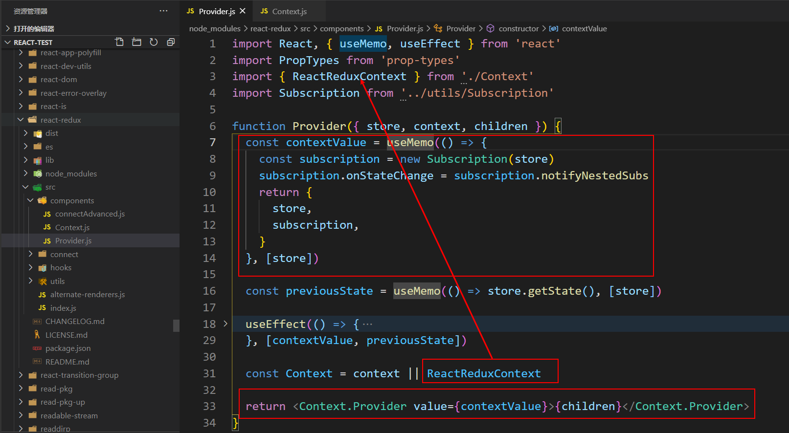

   - 首先返回一个 contextValue，使用了 useMemo 包裹，利于性能优化，在依赖的 store 不变的情况下，不会进行重新计算
   - 在 Context 的 Provider 中就会将其赋值给 value 属性

   Context 由 ReactReduxContext 生成：

   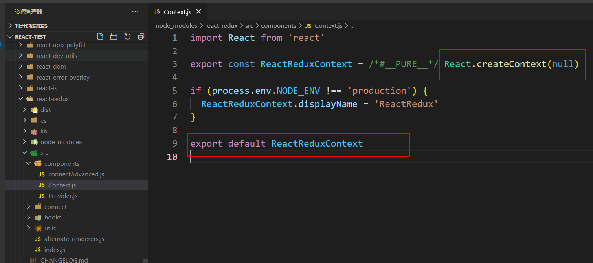

2. 然后是 connect 函数

   ```js
   export function createConnect() {
     connectHOC = connectAdvanced,
     ...
     return function connect() {
       ...
       return connectHOC(selectorFactory, {
           ...
       })
     }
   }
   
   export default /*#__PURE__*/ createConnect()
   ```

   - 首先全局返回的是 createConnect() 执行的结果，就是 connect 这个函数
   - connect 函数返回的是 connectHOC 这个函数的执行结果；`connectHOC = connectAdvanced` 可以看出实际上是 connectAdvanced

   ```js
   export default function connectAdvanced() {
     ...
     return function wrapWithConnect(WrappedComponent) {
       ...
       return hoistStatics(Connect, WrappedComponent)
     }
   }
   ```

   - connectAdvanced 实际上就是返回 wrapWithConnect 这个高阶组件


#### 1-8、redux 进行异步操作

存储到 redux 的数据，很多情况下都是通过接口拿到的，那么就会涉及到异步请求，常规的流程是：


在 componentDidMount 生命周期中发送请求，然后再存储到 redux 中。这样做的一个缺陷是：必须将网络请求的异步代码放到组件的生命周期中来完成；事实上，网络请求到的数据也属于状态管理的一部分，更好的一种方式应该是将其也交给 redux 来管理。


**1、Redux 发送异步请求**

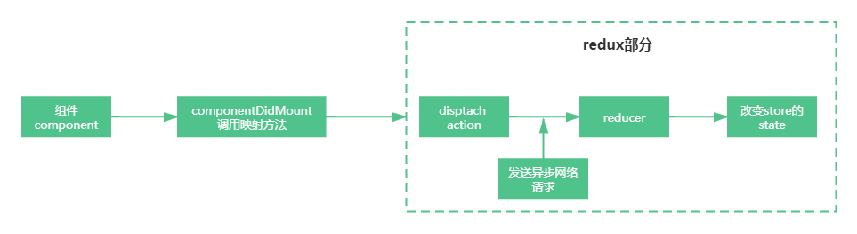

在 redux 中，要进行异步操作，主要是使用**中间件**。

- 中间件的目的：在 dispatch 的 action 和 reducer 之间扩展一些自己的代码，例如日记记录、调用异步接口、添加代码调试等

而在 redux 中发送异步请求，官方推荐的中间件是 `redux-thunk`，也可以使用 `redux-saga`


#### 1-9、redux-thunk

- 通常情况，dispatch(action) 的 action 是一个 js 对象
- redux-thunk 可以让 dispatch(action) 的 action 是一个函数

> redux-thunk 如何做到让我们可以发送异步的请求呢？
>
> - 默认情况下的 dispatch(action)，action 需要是一个对象
> - redux-thunk 可以让 dispatch(action函数)，action 可以是一个函数
> - 该函数会被调用，并且会传给这个函数一个 dispatch 函数和 getState 函数
>   - dispatch 函数用于之后再次派发 action
>   - getState 函数考虑到之后的一些操作需要依赖原来的状态，用于获取之前的一些状态


使用 redux-thunk：

1. 安装

   ```js
   npm i redux-thunk -S
   ```

2. 应用 redux-thunk 中间件

   ```js
   import { createStore, applyMiddleware } from 'redux';
   import thunkMiddleware from 'redux-thunk'
   import reducer from './reducer.js';
   
   // 使用 redux-thunk 中间件
   // applyMiddleware(中间件1, 中间件2, ...)
   const enhancer = applyMiddleware(thunkMiddleware)
   
   const store = createStore(reducer, enhancer);
   
   export default store;
   ```

   - createStore 可以接受第二个参数

3. > actionsCreators.js

   ```js
   import { CHANGE_INFO } from './actionTypes.js';
   
   export const changeInfo = info => ({type: CHANGE_INFO, info})
   
   // 用于 redux-thunk
   export const getInfo = (dispatch, getState) => {
     // 做异步操作
     // axios.get('xxxxxxx').then(res => {
     //   // 在这里调用 dispatch 执行相关操作
     //   dispatch(reduceNumber(10))
     // })
     setTimeout(() => {
       dispatch(changeInfo({name: 'lucy', age: 20}))
     })
   }
   ```

4. > reducer.js

   ```js
   import { CHANGE_INFO } from './actionTypes.js';
   
   const initState = {
     info: {
       name: '',
       age: 10
     }
   };
   
   const reducer = (state = initState, action) => {
     switch (action.type) {
       case CHANGE_INFO:
         return {...state, info: action.info}
       default:
         return state;
     }
   }
   
   export default reducer;
   ```

5. 调用

   ```js
   import React, { useEffect } from 'react'
   import { connect } from 'react-redux'
   import { getInfo } from '../../../store/actionCreators'
   
   function ReduxThunkCom (props) {
     useEffect(() => {
       props.getInfo()
     }, [])
   
     return (
       <div>
         <h3>{props.info.age}</h3>
       </div>
     )
   }
   
   const mapStateToProps = state => {
     return {
       info: state.info
     }  
   }
   
   const mapDispatchToProps = dispatch => {
     return {
       getInfo() {
         dispatch(getInfo)
       }
     }
   }
   
   export default connect(mapStateToProps, mapDispatchToProps)(ReduxThunkCom)
   ```


#### 1-10、redux-devtools 的使用

redux 提供了 redux-devtools 插件来追踪 redux 的变化；需要在 谷歌浏览器安装一下这个插件。

安装好后，打开控制台，会是这样子：什么都没有，需要点击 `the instructions` 进去，按照指引，进行配置

 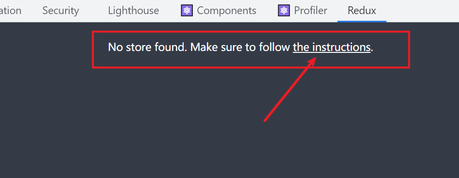

地址：https://github.com/zalmoxisus/redux-devtools-extension#usage

照着进行配置：

```js
import { createStore, applyMiddleware, compose } from 'redux';
import thunkMiddleware from 'redux-thunk'
import reducer from './reducer.js';

const composeEnhancers =
  typeof window === 'object' &&
  window.__REDUX_DEVTOOLS_EXTENSION_COMPOSE__ ?   
    window.__REDUX_DEVTOOLS_EXTENSION_COMPOSE__({
      // 开启 trace 可以追踪到具体源码位置
      trace: true
    }) : compose;

// 使用 redux-thunk 中间件
// applyMiddleware(中间件1, 中间件2, ...)
const enhancer = applyMiddleware(thunkMiddleware)

const store = createStore(reducer, composeEnhancers(enhancer));

export default store;
```

如果是 typescript：

```js
const composeEnhancers =
  typeof window === 'object' &&
  (window as any).__REDUX_DEVTOOLS_EXTENSION_COMPOSE__ ?
      (window as any).__REDUX_DEVTOOLS_EXTENSION_COMPOSE__({
        // 开启 trace 可以追踪到具体源码位置
      	trace: true
      }) : compose
```

配置完后的结果：

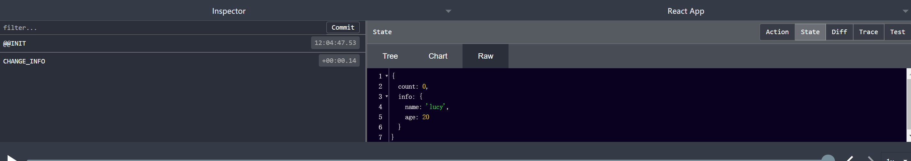

可以发现，追踪到了 redux；左边是所有处理过的 action，右边记录的是变化的 store


#### 1-11、手写 redux 中间件

当有一个需求，需要在 redux 执行 dispatch 前后进行日志打印，那么不可能每次执行 dispatch 的时候，都手动写日志打印代码，此时就可以利用 redux 中间件，写一个**日志打印中间件**；像 redux-thunk 这些就是一个 redux 中间件。

具体实现步骤如下：

```js
/**
 * 实现 redux 中间件
 */

const redux = require('redux')

const initState = {
  count: 0
}

const reducer = (state = initState, action) => {
  switch(action.type) {
    case 'ADD_NUMBER':
      return {...state, count: state.count + action.number}
    default:
      return state
  }
}

const store =  redux.createStore(reducer)

// // 可以在派发 action 之前，订阅 store 变化
// store.subscribe(() => {
//   console.log(store.getState());
// });

const action = {
  type: 'ADD_NUMBER',
  number: 5
}

// 1、基本做法
// console.log('dispatch之前', initState)
// store.dispatch(action)
// console.log('dispatch之后', store.getState())


// 2、封装成一个函数
// function loggingMiddleWare(store, action) {
//   console.log('dispatch之前', initState)
//   store.dispatch(action)
//   console.log('dispatch之后', store.getState())
// }
// // 但是使用 redux 更期望的是通过 store.dispatch 的方式调用 action，而不是调用一个函数
// loggingMiddleWare(store, action)


// 3、hack 的方式：进行优化: 修改原有的dispatch
// const next = store.dispatch
// function loggingMiddleWare(action) {
//   console.log('dispatch之前', initState)
//   next(action)
//   console.log('dispatch之后', store.getState())
// }
// store.dispatch = loggingMiddleWare

// store.dispatch(action)


// 4、将第三种方式包装成函数
function loggingMiddleWare(store) {
  const next = store.dispatch

  function middleWare(action) {
    console.log('dispatch之前', initState)
    next(action)
    console.log('dispatch之后', store.getState())
  }

  return middleWare
}

function patchThunk(store) {
  const next = store.dispatch

  function middleWare(action) {
    console.log('patchThunk中间件')
    next(action)
  }

  return middleWare
}

function applyMiddleware(...middleware) {
  const newMiddleWare = [...middleware]
  newMiddleWare.forEach(mw => {
    store.dispatch = mw(store)
  })
}

applyMiddleware(loggingMiddleWare, patchThunk)

store.dispatch(action)
```


#### 1-12、reducer 的拆分

在项目开始变得复杂的时候，如果还是所有的 reducer 都写在一个文件中，那么就会导致当前文件越来越臃肿，难以维护。此时，就需要将 reducer 根据模块或者页面功能进行拆分。

而拆分之后，redux 提供了 combineReducers 函数可以方便的让我们对多个 reducer 进行合并。

基本使用查看事例代码：`src/components/ReduxCom/split-reducer`

实际上就是：

```js
import { combineReducers } from 'redux'

function counterReducer(state = initialCounterState, action) {
  switch (action.type) {
    case ADD_NUMBER:
      return { ...state, counter: state.counter + action.num }
    default:
      return state
  }
}

function homeReducer(state = initialHomeState, action) {
  switch (action.type) {
    case CHANGE_BANNERS:
      return { ...state, banners: action.banners }
    default:
      return state
  }
}

const reducer = combineReducers({
  counterInfo: counterReducer,
  homeInfo: homeReducer
})

export default reducer
```

而在拿取值的时候，就需要：

```js
state.counterInfo.counter
```


#### 1-13、React 中的 state 如何进行管理

目前，常见的：

- 组件自己的 state（或者 hook）
- Context 数据共享
- redux 管理

而在开发中，应该如何选择？

这没有一个标准的答案：

- 有些人，喜欢将所有的状态都放在 redux 中去管理，方便追踪和共享
- 有些人，选择将某些组件自己的状态放到组件内部进行管理
- 有些人，将类似主题、用户信息等数据放到 Context 中进行共享和管理

这就需要开发者来进行衡量；其实这也是 react 做得比较失败的地方，官方没有统一的管理状态库，导致社区管理状态库混乱。


而根据 redux 作者的观点：

- 当状态需要共享，那么放在 redux 中
- 在例如路由切换的时候，需要把状态缓存下来，而不是跟随组件销毁而销毁，那么放在 redux 中

所以，会有一些方案：（当然，这不是绝对的）

- UI 相关的组件内部可以维护的状态，在组件内部自己维护
- 大部分需要共享的状态，交给  redux 来维护
- 从服务器请求的数据（包括请求的操作），交给 redux 维护


#### 1-14、实现 redux

[实现一个redux](./cRedux/readme.md)


### 2、react-router

React 的路由实现依赖于 react-router。

从 React Router 版本4开始，路由不再集中在一个包中进行管理：

- react-router 是 router 的核心部分代码
- react-router-dom 用于浏览器
- react-router-native 用于原生应用

基本原理与 vue-router 差不多，都是利用 hash 和 history 实现的。


安装：安装 react-router-dom 会自动安装 react-router 依赖

```js
yarn add react-router-dom
```


#### 2-1、基本使用

react-router 最主要就是提供了一些组件。


**BrowserRouter  和 HashRouter ：**

- BrowserRouter 组件：使用 history 模式
- HashRouter 组件：使用 hash 模式

**Link 和 NavLink：**

- 路径的跳转一般使用 Link 组件，最终会被渲染成 a 元素
- NavLink 是在 Link 基础之上增加了一些样式属性
- to：Link 中最重要的属性，用于设置跳转到的路径

**Route：**

- Route 用于路径的匹配
- path 属性：用于设置匹配到的路径
- component 属性：设置匹配到路径后，渲染的组件
- exact：精准匹配，只有**匹配到完全一致的路径**，才会渲染对应的组件。
  - 如果不加上 exact，采用的是模糊匹配，那么就会产生 `'/'` 与 `'/home'` 这两个因为都有 `/`，都会被匹配上。
  - 那么，exact 在什么时候应该加上呢？当有嵌套路由的时候，不应该加上；一般情况下，是在 `/` 这个根路径需要加上

例子：

```js
import React from 'react'; 

import { BrowserRouter, Link, Route } from 'react-router-dom'

import Index from './pages/index'
import TestPage from './pages/testPage'
import Mine from './pages/mine'

import style from './index.module.css'

const App = () => {
  return (
    <BrowserRouter>
      <div className={style['router-link']}>
        <Link className={style['link-item']} to="/">index</Link>
        <Link className={style['link-item']} to="/testPage">testPage</Link>
        <Link className={style['link-item']} to="/mine">mine</Link>
      </div>
      <div>
        <Route exact path="/" component={Index}/>
        <Route path="/testPage" component={TestPage}/>
        <Route path="/mine" component={Mine}/>
      </div>
    </BrowserRouter>
  )
}
```


#### 2-2、NavLink

NavLink 与 Link 都是进行路径跳转，而且最终都会被渲染成 a 元素。区别在与 NavLink 可以添加一些样式属性


**需求：**在路径被选中的时候，对应的便签变成红色

这时就可以使用 NavLink 来替代 Link：

- activeStyle：活跃时（匹配时）的样式
- activeClassName：活跃时添加的 class 类名
- exact：是否精准匹配（只有精确匹配，才使用激活属性）【当有嵌套路由的时候，不应该加上】

```js
import { BrowserRouter, NavLink, Route } from 'react-router-dom'

<BrowserRouter>
      <div className={style['router-link']}>
        <NavLink exact activeStyle={{ color: 'red' }} to="/">index</NavLink>
        <NavLink exact activeClassName={style['link-active']} to="/testPage">testPage</NavLink>
        <NavLink exact activeClassName={style['link-active']} to="/mine">mine</NavLink>
      </div>
      <div>
        <Route exact path="/" component={Index}/>
        <Route exact path="/testPage" component={TestPage}/>
        <Route exact path="/mine" component={Mine}/>
      </div>
</BrowserRouter>
```

结果：

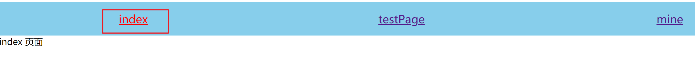


#### 2-3、Switch

在 react-router 中，只要是路径被匹配到的 Route 对应的组件都会被渲染。这样子对于一些特殊情况就不太好处理，比如 404 页面。

一般情况下，都希望当用户输入不存在的路由时，显示 404 页面。在 Route 标签上，如果不写 path，那么就会默认匹配所有路径。

```js
<Route exact path="/" component={Index}/>
<Route exact path="/testPage" component={TestPage}/>
<Route exact path="/mine" component={Mine}/>

<Route component={noMatch} />
```

如果这样子写，那么 `<Route component={noMatch} />` 这个每次都会被匹配到，就会导致每次都有 404 页面被渲染

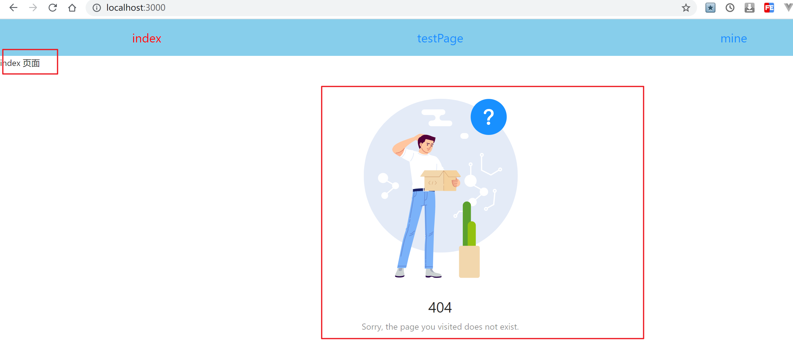

所以，需要配合 Switch 使用，Switch 的作用：只要匹配到了第一个，那么后面的就不再继续匹配了

```js
import { BrowserRouter, Route, Switch } from 'react-router-dom'

<Switch>
   <Route exact path="/" component={Index}/>
   <Route exact path="/testPage" component={TestPage}/>
   <Route exact path="/mine" component={Mine}/>

   <Route component={noMatch} />
</Switch>
```


#### 2-4、路由嵌套

在开发中，路由之间是存在嵌套关系的。

例如，在 about 页面，还有两个页面内容。


实现：

在 index.js 中：

```js
<BrowserRouter>
      <div className={style['router-link']}>
        <NavLink exact className={style['link-item']} activeStyle={{ color: 'red' }} to="/">index</NavLink>
        <NavLink className={style['link-item']} activeStyle={{ color: 'red' }} to="/about">about</NavLink>
      </div>
      <Switch>
        <Route exact path="/" component={Index}/>
        <Route path="/about" component={About}/>
        <Route component={NoMatch} />
      </Switch>
</BrowserRouter>
```

> 注意：当有嵌套路由的时候，我晕是 NavLink 还是 Route 中都不应该再使 exact 进行精确匹配

在 about.js 中：

```js
<div>
      <NavLink exact activeClassName={style['navlink-active']} to="/about">理念</NavLink>
      <NavLink exact activeClassName={style['navlink-active']} to="/about/culture">文化</NavLink>

      <Switch>
        <Route exact path="/about" component={Culture} />
        <Route exact path="/about/culture" component={Idea} />
        <Route component={NoMatch} />
      </Switch>
</div>
```

这就实现了路由的嵌套。


#### 2-5、手动进行路由跳转

在这之前，实现路由跳转都是通过 Link 或者 NavLink 标签进行跳转的，实际上也可以通过 JavaScript 代码进行跳转。

而在 react-router 中，使用 js 代码进行跳转，就需要**获取到 history 对象**


获取 history 对象的方式：

- 如果该组件是**通过路由 Route 的 component 创建并渲染出来的**，那么可以直接通过 props 获取 history、location、match 对象

  ```js
  import React from 'react'
  import { Button } from 'antd';
  
  export default function NoMatch(props) {
    const goHome = () => {
      // 通过路由跳转过来，可以直接在 props 中获取 history
      console.log(props.history)
      console.log(props.location)
      console.log(props.match)
      // props.history.push('/')
    }
  
    return (
      <div>
        <Button type="primary" onClick={goHome}>Back Home</Button>
      </div>
    )
  }
  
  ```

  - props.history 得到的是：

        

  - props.location 得到的是：

        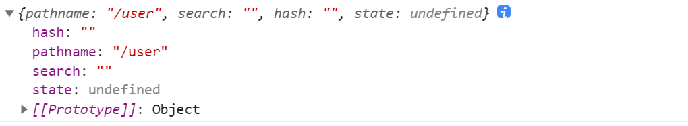

  - props.match 得到的是：

        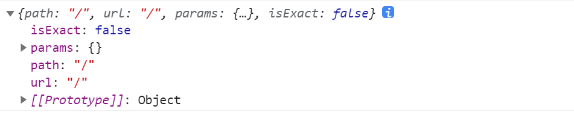

- 如果该组件是**一个普通渲染的组件**，那么不可以通过 props 获取 history、location、match 对象；需要**通过高阶组件**，在组件中添加想要的属性，react-router 也是通过高阶组件为我们的组件添加相关的属性的

  使用 react-route 提供的 withRouter 包裹，并且在渲染组件的时候需要包裹在 `<Router>` 里面，因为一些属性是通过 ``<Router>` ` c传递进来了

  ```js
  import { BrowserRouter, NavLink, Route, Switch, withRouter } from 'react-router-dom'
  
  const App = () => {
    return (
      <BrowserRouter>
        <div className={style['router-link']}>
          <NavLink exact to="/">index</NavLink>
          <NavLink to="/about">about</NavLink>
        </div>
        <Switch>
          <Route exact path="/" component={Index}/>
          <Route path="/about" component={About}/>
  
          <Route component={NoMatch} />
        </Switch>
      </BrowserRouter>
    )
  }
  
  export default withRouter(App)
  ```

  在使用的时候：

  ```js
  <BrowserRouter>
      <App />
  </BrowserRouter>
  ```

  这样包裹了之后，其实 App 中就不需要包裹在 BrowserRouter 中了，最外层包裹就好了，可以改为：

  ```js
  import { NavLink, Route, Switch, withRouter } from 'react-router-dom'
  
  const App = () => {
    return (
      <>
        <div className={style['router-link']}>
          <NavLink exact to="/">index</NavLink>
          <NavLink to="/about">about</NavLink>
        </div>
        <Switch>
          <Route exact path="/" component={Index}/>
          <Route path="/about" component={About}/>
  
          <Route component={NoMatch} />
        </Switch>
      </>
    )
  }
  
  export default withRouter(App)
  ```

- 还有一种方法，就是自己创建 history 对象

  ```js
  import createHistory from 'history/createBrowserHistory';
  export default createHistory();
  ```

  然后就可以在使用的地方导入即可：

  ```js
  import history from './utils/history'
  
  history.push('/')
  ```

  为什么可以这样子创建呢？在 react-router-dom 源码中：

  ```js
  var history = require('history');
  
  var BrowserRouter = function (_React$Component) {
  
    function BrowserRouter() {
      // ...
  
      _this.history = history.createBrowserHistory(_this.props);
      return _this;
    }
  
    // ...
    
    return BrowserRouter;
  }(React.Component)
  ```

  BrowserRouter 的 history 实例也是通过 history 这个库的 createBrowserHistory 创建的。


#### 2-6、路由传参

在 react-router 中，传递参数的方式有三种：

- 动态路由传参
- search 方式
- Link 中 to 传对象的方式


**1、动态路由传参**

- 在设置路由的时候

  ```js
  <Route exact path="/detail/:id" component={Detail} />
  ```

- 在跳转的时候

  ```js
  const Index = (props) => {
  
    const { history } = props
  
    const goToDetail = (id) => {
      history.push(`/detail/${id}`)
    }
  
    return (
      <div>
        <h1>首页</h1>
        <br />
        <ul style={{ paddingLeft: 30 }}>
          {
            arr.map(item => (
              <li key={item.id} onClick={() => goToDetail(item.id)}>{item.text}</li>
            ))
          }
        </ul>
      </div>
    )
  }
  ```

- 然后就可以在详情页面通过 match 获取到参数

  ```js
  const Detail = (props) => {
    const { match } = props
  
    return (
      <div>
        <p>详情：{match.params.id}</p>
      </div>
    )
  }
  ```

   match 对象是：

   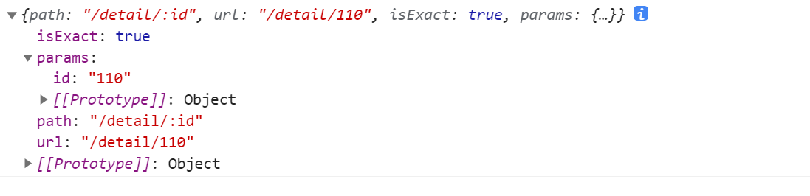


**2、search 方式**

这种就是在 url 拼接成 `detail?name=jack&age=18` 这种形式

> 其实， react-router 不太推荐这种做法

- 声明路由

  ```js
  <Route path="/detail" component={Detail} />
  ```

- 跳转

  ```js
  history.push(`/detail?id=${id}`)
  ```

- 获取参数

  ````js
  const Detail = (props) => {
    const { location } = props
    console.log(location)
  
    return (
      <div>
        <p>详情：{location.search}</p>
      </div>
    )
  }
  ````

   location 对象是：

   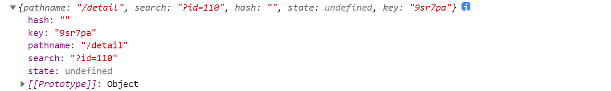


**3、Link 中 to 传对象的方式**

- 传递参数

  ```js
  <Link to={{
    pathname: 'detail',
    search: '?id=123',
    state: { name: 'jack', age: 18 }
  }}>
  </Link>
  ```

  to 如果传的是一个对象，那么可以有四个属性：

  - pathname：路径
  - search：search 参数
  - hash
  - state：参数对象，保留到 location 中，可以在 location 中获取

  或者使用：

  ```js
  history.push('/detail', { name: 'jack', age: 18 })
  ```

- 获取参数

  ```js
  const Detail = (props) => {
    const { location } = props
    console.log(location)
  
    return (
      <div>
        <div>
          详情：
          <p>姓名：{location.state.name}</p>
          <p>年龄：{location.state.age}</p>
        </div>
      </div>
    )
  }
  ```

  location 对象：

   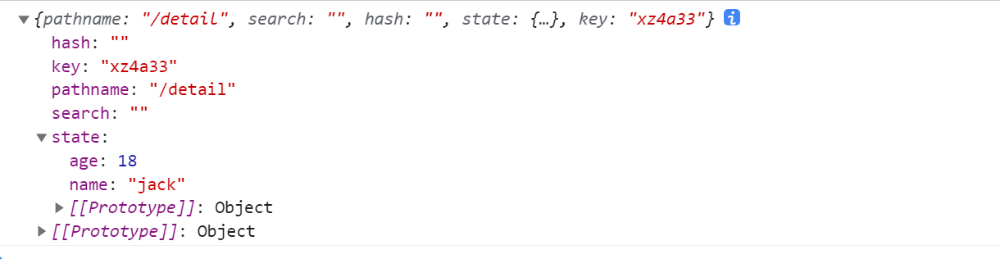


#### 2-7、react-router-config

就上面而言，所有的路由定义都是直接使用 Route 组件，并且添加属性来完成的；这样的方式会让路由变得非常混乱，理想的状态是所有的路由配置放到一个地方进行集中管理，这个时候可以使用 react-router-config 来完成

安装：

```js
yarn add react-router-config
```


使用：

- 配置路由映射表

  > routes.js

  ```js
  import Index from '../pages/index'
  import About from '../pages/about'
  import Culture from '../pages/about/components/culture'
  import Idea from '../pages/about/components/idea'
  import TestPage from '../pages/testPage'
  import Mine from '../pages/mine'
  import NoMatch from '../pages/noMatch'
  import Detail from '../pages/detail'
  
  const routes = [
    {
      path: '/',
      exact: true,
      component: Index
    },
    {
      path: '/about',
      component: About,
      routes: [
        {
          path: '/about',
          exact: true,
          component: Idea
        },
        {
          path: '/about/culture',
          exact: true,
          component: Culture
        },
        {
          component: NoMatch
        }
      ]
    },
    {
      path: '/testPage',
      component: TestPage
    },
    {
      path: '/mine',
      component: Mine
    },
    {
      path: '/detail',
      component: Detail
    },
    {
      component: NoMatch
    }
  ]
  
  export default routes
  ```

- 然后在使用的时候：

  ```js
  import { renderRoutes } from 'react-router-config'
  
  import routes from './router'
  
  const App = () => {
    return (
      <>
        <div className={style['router-link']}>
          <NavLink exact to="/">index</NavLink>
          <NavLink to="/about">about</NavLink>
          <NavLink to="/testPage">testPage</NavLink>
          <NavLink to="/mine">mine</NavLink>
        </div>
  
        {renderRoutes(routes)}
      </>
    )
  }
  ```

  就可以通过 renderRoutes(routes) 的方式

- 对于子路由，也是一样的

  ```js
  export default function About(props) {
    return (
      <div>
        <NavLink exact to="/about">理念</NavLink>
        <NavLink exact to="/about/culture">文化</NavLink>
  
        {renderRoutes(props.route.routes)}
      </div>
    )
  }
  ```

  但是需要注意的是，子路由，不是直接使用一整个路由表，而是当前路由配置下的 routes，可以通过 props.route.routes 获取

  > props.route：是只有使用了 react-router-config 这个库的 renderRoutes，才会添加这么一个属性


简单阅读一下 renderRoutes 源码：

```js
function renderRoutes(routes, extraProps, switchProps) {

  // 先判断，有没有传过来 routes，有就 React.createElement 创建 reactRouter 的 Switch 标签
  return routes ? React.createElement(reactRouter.Switch, switchProps, routes.map(function (route, i) {
    // 遍历 routes，创建 reactRouter.Route 标签
    return React.createElement(reactRouter.Route, {
      key: route.key || i,
      path: route.path,
      exact: route.exact,
      strict: route.strict,
      render: function render(props) {
        // 如果传了 render，那么就调用传过来的 render，没有就根据 route.component 创建
        // { path: '/about', component: About }
        // 最后会使用 _extends 合并一个 route，这也就是为什么使用了 renderRoutes 之后，会挂载上一个 route 对象
        return route.render ? route.render(_extends({}, props, {}, extraProps, {
          route: route
        })) : React.createElement(route.component, _extends({}, props, extraProps, {
          route: route
        }));
      }
    });
  })) : null;
}
```


#### 2-8、hook 形式处理路由

在 React Router v5 版本之后，更加推荐在函数组件中使用 hook 操作路由

- 通过 `history.push({pathname: '/home', state: {id: id}}) ` 方式跳转

  ```js
  // 路由跳转
  import { useHistory } from "react-router";
  
  function HomeButton() {  
    const history = useHistory();  
    let id = 1;
    function handleClick() {    
      history.push({pathname: '/home', state: {id: id}}) 
    }  
  
    return (
      <button type="button" onClick={handleClick}>      Go home    </button>  
    );
  }
  
  
  // 获取路由参数
  import { useLocation } from 'react-router';
  
  function Test() {  
    const location = useLocation()
    console.log(location.state.id)
  }
  ```

- 通过 `history.push(`/home/${id}`)`

  ```js
  // 跳转
  import { useHistory } from "react-router";
  
  function HomeButton() {  
    const history = useHistory();  
    let id = 1;
    function handleClick() {
      const id = '110'
      history.push(`/home/${id}`)
    }  
  
    return (
      <button type="button" onClick={handleClick}>      Go home    </button>  
    );
  }
  
  
  // 获取参数
  import { useParams } from 'react-router';
  
  function Test() {  
    const { id } = useParams()
    console.log(id)
  }
  ```


